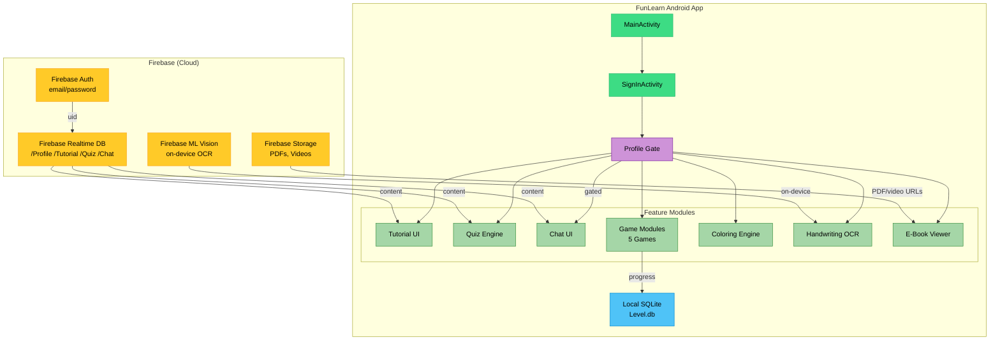
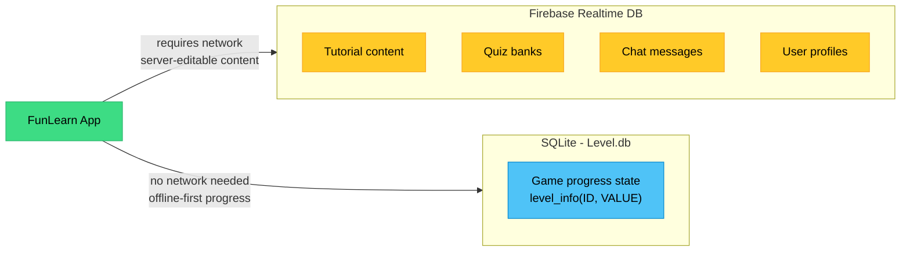
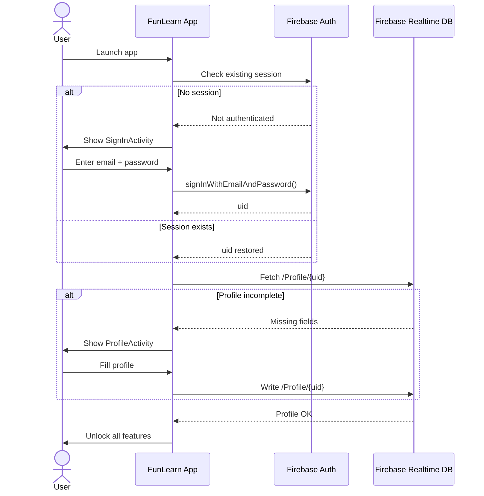
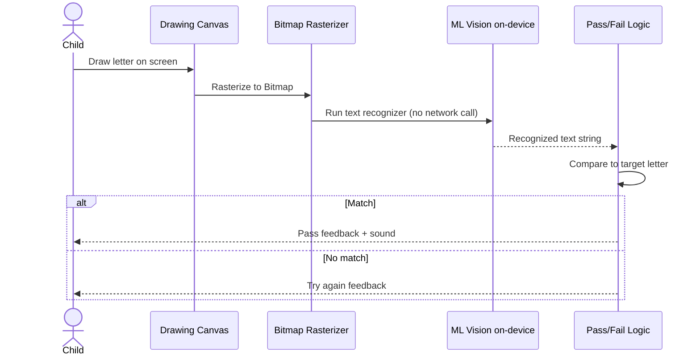
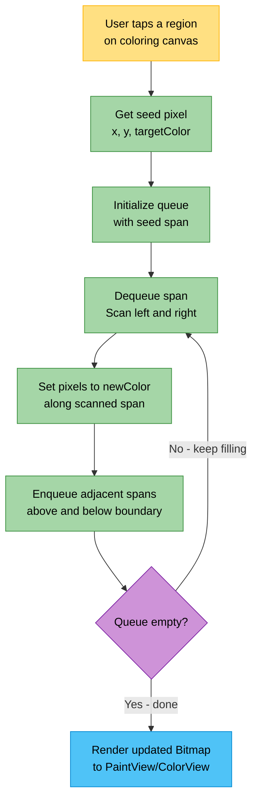
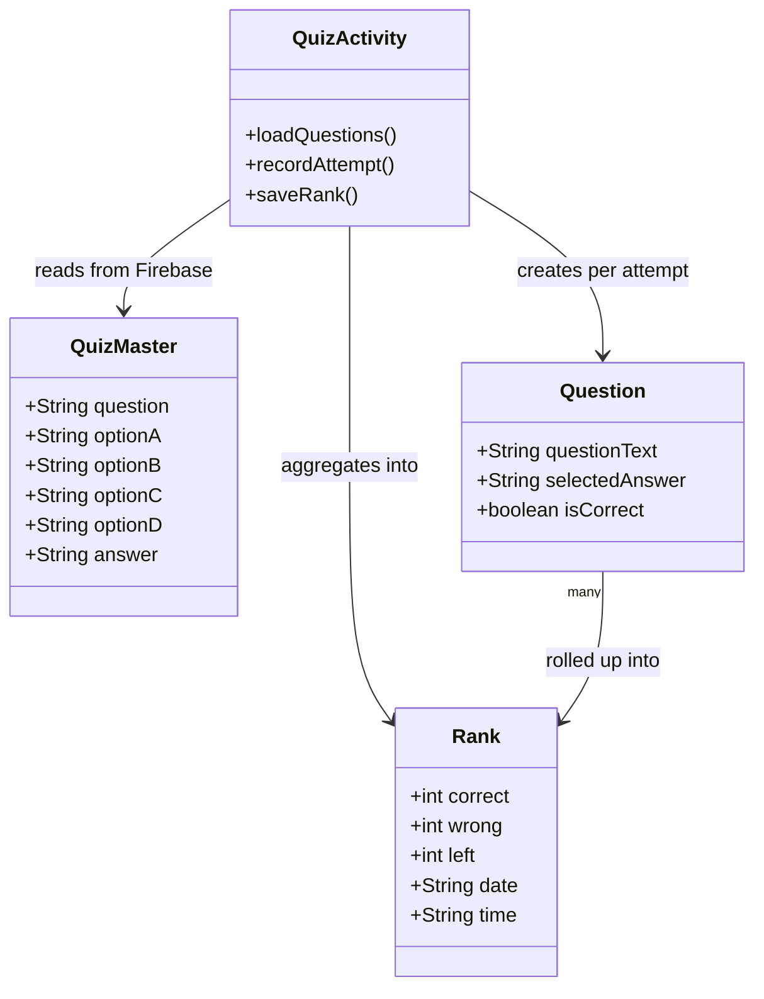
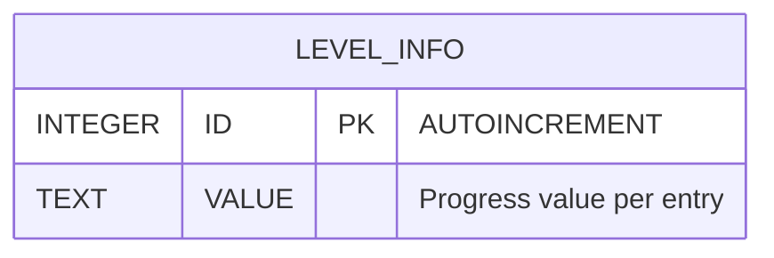
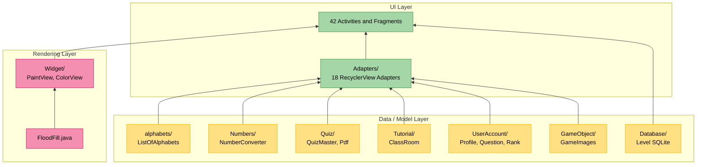
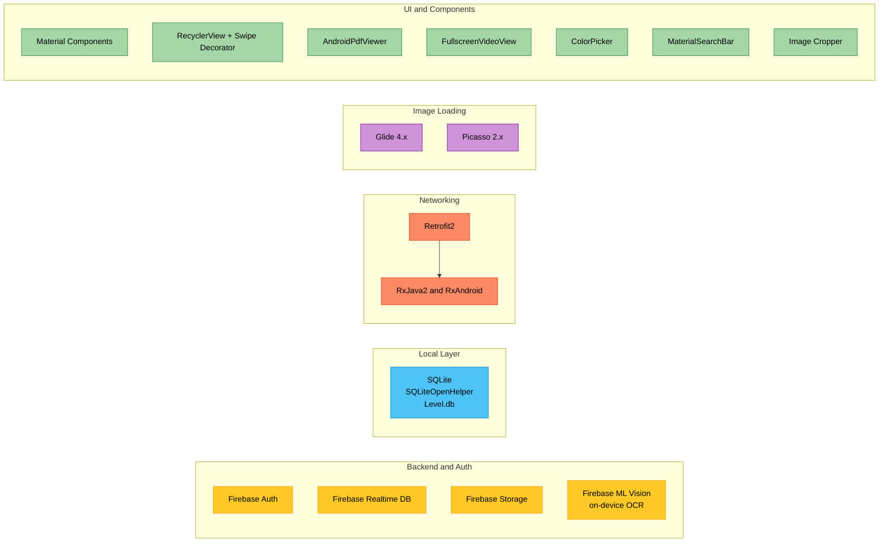

# FunLearn


**FunLearn** is an Android learning app for children - tutorials, quizzes, handwriting practice with on-device OCR, a custom coloring engine, and a lightweight community chat, backed by Firebase with a local SQLite layer for offline progress.

This was my first complete, end-to-end software project, built solo. This README documents what was built, why, and what I'd still change - plainly, not as a highlight reel.

---

## Visual Preview

<table>
<tr>
<td><br/><sub>Loading Screen content preview</sub></td>
<td><br/><sub>One of 20 coloring-book line-art assets used by the flood-fill engine (§3.2)</sub></td>
</tr>
</table>

---

## Table of Contents

1. [Problem Statement & Product Scope](#1-problem-statement--product-scope)
2. [System Architecture](#2-system-architecture)
3. [Feature Notes](#3-feature-notes)
   - [3.1 Handwriting Practice - On-Device OCR](#31-handwriting-practice--on-device-ocr)
   - [3.2 Coloring Engine - Flood Fill](#32-coloring-engine--flood-fill)
   - [3.3 Quiz Engine & Ranking](#33-quiz-engine--ranking)
   - [3.4 Chat, Gated on Profile Completion](#34-chat-gated-on-profile-completion)
   - [3.5 Local Progress Persistence](#35-local-progress-persistence)
4. [Module Reference](#4-module-reference)
5. [Tech Stack](#5-tech-stack)
6. [What's Next](#6-whats-next)
7. [Getting Started](#7-getting-started)
8. [License & Contributing](#8-license--contributing)

---

## 1. Problem Statement & Product Scope

Most early-learning apps are either static content viewers (flashcards, e-books) or single-purpose game shells. FunLearn tries to cover more of the loop a classroom actually has - content, practice, testing, and a bit of social reinforcement - as four separate domains rather than one monolith:

| Domain | Package | Why it's separate |
|---|---|---|
| Alphabets | [`alphabets/`](app/src/main/java/com/pradeep/funlearn/alphabets) | `ListOfAlphabets` is a flat content lookup with no game/quiz coupling |
| Numbers | [`Numbers/`](app/src/main/java/com/pradeep/funlearn/Numbers) | `NumberConverter` is a stateless digit⇄word utility shared across 6 number activities instead of duplicated per screen |
| Drawing / Coloring | [`Pattern/`](app/src/main/java/com/pradeep/funlearn/Pattern), [`Widget/`](app/src/main/java/com/pradeep/funlearn/Widget), [`FloodFill.java`](app/src/main/java/com/pradeep/funlearn/FloodFill.java) | Custom rendering code stays out of the data-model layer |
| Quiz | [`Quiz/`](app/src/main/java/com/pradeep/funlearn/Quiz) | `QuizMaster`/`Pdf` are content POJOs, kept apart from `UserAccount/Question` and `UserAccount/Rank`, which hold outcomes - see [§3.3](#33-quiz-engine--ranking) |

This package-per-domain layout is referenced throughout the doc; the canonical index is [§4 Module Reference](#4-module-reference).

---

## 2. System Architecture



**Data split:** Firebase holds *content* (tutorials, quiz banks, chat messages) so it can update without an app release. SQLite holds *progress state* locally so gameplay doesn't stall if the network drops mid-session. It's a simple split, but it's the reason progress works offline while content stays server-editable - detailed in [§3.5](#35-local-progress-persistence).



**Navigation:** Activity-per-screen, parameters passed via `Intent` extras (e.g. `TutorialActivity` takes an `int tut` flag to branch between Alphabet/Drawing/Numbers content instead of three near-duplicate Activities). **42 Activities** are registered in [`AndroidManifest.xml`](app/src/main/AndroidManifest.xml).

**Authentication & profile flow:**



---

## 3. Feature Notes

### 3.1 Handwriting Practice - On-Device OCR

`AlphabetWriteAcitivity` uses `com.google.firebase.ml.vision.DEPENDENCIES` (`ocr` bundle, declared in the manifest):

1. Child draws a letter on a custom canvas.
2. The canvas is rasterized to a `Bitmap`.
3. Firebase ML Vision's on-device text recognizer runs against the bitmap - no network call.
4. Recognized text is compared to the target letter for pass/fail feedback.

On-device inference was picked over cloud OCR because a handwriting loop needs to respond per stroke attempt without waiting on a network round trip, and should still work offline.



### 3.2 Coloring Engine - Flood Fill

The coloring feature runs on a scanline flood-fill implementation ([`FloodFill.java`](app/src/main/java/com/pradeep/funlearn/FloodFill.java)) driving a custom canvas ([`Widget/PaintView.java`](app/src/main/java/com/pradeep/funlearn/Widget/PaintView.java) + [`ColorView.java`](app/src/main/java/com/pradeep/funlearn/Widget/ColorView.java)), applied to a library of 20 line-art assets ([`coloring1.png`](app/src/main/res/drawable/coloring1.png)–`coloring20.png`):

```java
// Scanline flood fill - walks horizontal spans, queues only span boundaries
while (x < width && bitmap.getPixel(x, y) == targetColor) {
    bitmap.setPixel(x, y, newColor);
    // enqueue adjacent scanline spans above/below
    ...
}
```

A naive per-pixel recursive flood fill risks stack overflow on any reasonably sized bitmap; the scanline/queue-based version here avoids that by processing whole horizontal spans and only queuing span boundaries. It's a well-known technique, not novel - but implementing it directly (rather than pulling in a drawing library) meant one shared canvas implementation reused across three coloring activities and the pattern-tracing module (`Pattern/Patterns.java`).



### 3.3 Quiz Engine & Ranking

Three models with distinct responsibilities:

- [`Quiz/QuizMaster`](app/src/main/java/com/pradeep/funlearn/Quiz/QuizMaster.java) - question, options, answer (content, Firebase-sourced)
- [`UserAccount/Question`](app/src/main/java/com/pradeep/funlearn/UserAccount/Question.java) - a single attempt record
- [`UserAccount/Rank`](app/src/main/java/com/pradeep/funlearn/UserAccount/Rank.java) - an aggregated session result (`correct`, `wrong`, `left`, `date`, `time`)

Keeping quiz content separate from per-user results means the same question bank supports repeated attempts without mutating content, and any future leaderboard would just aggregate over `Rank` rows rather than re-deriving from raw answers.



### 3.4 Chat, Gated on Profile Completion

`ChatFragment` checks whether `Profile` (see [`UserAccount/Profile.java`](app/src/main/java/com/pradeep/funlearn/UserAccount/Profile.java)) is filled in before unlocking `ChatActivity`. It's a single conditional check, not a moderation system - but for a children's chat feature, requiring a filled-out profile before participating is a cheap, sensible floor to have in place before considering anything more involved.

### 3.5 Local Progress Persistence

[`Database/Level.java`](app/src/main/java/com/pradeep/funlearn/Database/Level.java) is a `SQLiteOpenHelper` around one table:

```sql
CREATE TABLE level_info (ID INTEGER PRIMARY KEY AUTOINCREMENT, VALUE TEXT)
```

It doesn't mirror the Firebase schema - it's a flat local ledger tracking progress per device, not per account. That was enough for the offline-continuity requirement at the time, but it's also the reason progress doesn't currently follow a user across devices (see [§6](#6-whats-next)).



---

## 4. Module Reference

```
app/src/main/java/com/pradeep/funlearn/
├── Adapters/        18 RecyclerView adapters - one per list-backed screen
├── Database/        Level.java - local progress ledger (§3.5)
├── GameObject/       GameImages.java - game asset/image model (§3.2)
├── Numbers/          NumberConverter.java - shared digit⇄word utility (§1)
├── Pattern/          Patterns.java - tracing/pattern game model (§3.2)
├── Quiz/             QuizMaster.java, Pdf.java - Firebase-sourced content models (§3.3)
├── Tutorial/         ClassRoom.java - tutorial content model (§2)
├── UserAccount/      Profile, Question, Rank, Users - identity & outcome models (§3.3, §3.4)
├── Widget/           PaintView.java, ColorView.java - shared coloring canvas (§3.2)
├── alphabets/        ListOfAlphabets.java - alphabet content model (§1)
├── FloodFill.java    Scanline flood-fill algorithm (§3.2)
└── 42 Activities / Fragments - full inventory in AndroidManifest.xml
```

**Package dependency graph:**



**Activity navigation map:**

```mermaid
flowchart TD
    classDef coreStyle fill:#3DDC84,stroke:#2db870,color:#000
    classDef tutStyle fill:#FFE082,stroke:#FFB300,color:#000
    classDef drawStyle fill:#F48FB1,stroke:#C2185B,color:#000
    classDef quizStyle fill:#CE93D8,stroke:#7B1FA2,color:#000
    classDef gameStyle fill:#FF8A65,stroke:#E64A19,color:#000

    MAIN["MainActivity"]:::coreStyle
    SIGNIN["SignInActivity"]:::coreStyle
    PROFILE["ProfileActivity"]:::coreStyle
    MAIN2["Main2Activity Home Hub"]:::coreStyle

    subgraph Tutorials["Tutorial Domain"]
        TUT["TutorialActivity"]:::tutStyle
        AI["AlphabetInfoActivity"]:::tutStyle
        AW["AlphabetWordsActivity"]:::tutStyle
        AM["AlphabetMatchActivity"]:::tutStyle
        AWR["AlphabetWriteActivity"]:::tutStyle
        NI["NumberInfoActivity"]:::tutStyle
        NW["NumberWriteActivity"]:::tutStyle
        NF["NumberFillup"]:::tutStyle
        WA["WordActivity"]:::tutStyle
    end

    subgraph Drawing["Drawing Domain"]
        CL["ColouringListActivity"]:::drawStyle
        P1["PaintingOneActivity"]:::drawStyle
        P2["PaintingTwoActivity"]:::drawStyle
        P3["PaintingThreeActivity"]:::drawStyle
    end

    subgraph QuizD["Quiz Domain"]
        QA["QuizActivity"]:::quizStyle
        ANS["AnswerActivity"]:::quizStyle
        PL["PdfListActivity"]:::quizStyle
        PV["PdfViewActivity"]:::quizStyle
    end

    subgraph Games["Games Domain"]
        G1["GameOneActivity"]:::gameStyle
        G1P["GameOnePlay"]:::gameStyle
        G2["GameTwoActivity"]:::gameStyle
        G3["GameThreeActivity"]:::gameStyle
        G5["GameFiveActivity"]:::gameStyle
    end

    MAIN --> SIGNIN --> PROFILE --> MAIN2
    MAIN2 --> TUT & CL & QA & G1 & PL
    TUT --> AI & AW & AM & AWR & NI & NW & NF & WA
    CL --> P1 & P2 & P3
    QA --> ANS
    PL --> PV
    G1 --> G1P
```



## 5. Tech Stack

| Concern | Choice | Notes |
|---|---|---|
| Backend | Firebase Realtime DB + Auth | Realtime listeners map directly onto tutorial/chat/quiz content needs |
| On-device ML | Firebase ML Vision (OCR) | Latency + offline requirement, §3.1 |
| Local persistence | SQLite (`SQLiteOpenHelper`) | Offline-first progress ledger, §3.5 |
| Networking | Retrofit2 + RxJava2 | Non-Firebase HTTP (file/PDF retrieval) |
| Image loading | Glide, Picasso | Both currently present - see consolidation note in §6 |
| Document & Media | AndroidPdfViewer, FullscreenVideoView | In-app e-book rendering and tutorial video playback |
| UI toolkit | Material Components, ConstraintLayout, RecyclerView + swipe decorator | Standard Android UI stack for the SDK versions targeted |
| Utility Libraries | Image Cropper, MaterialSearchBar, ColorPicker | Profile avatars, search inputs, and custom coloring palettes |

Full dependency list: [`app/build.gradle`](app/build.gradle).




## 6. What's Next

- **Navigation Component / single-Activity architecture** - replace the 42-Activity, `Intent`-extra model with a nav graph for type-safe transitions and shared back-stack handling.
- **Extract game logic out of Activities** - `GameThreeActivity` and a few others currently mix view code, Firebase calls, and game state directly. Moving this into a `ViewModel`/`Repository` layer is the prerequisite for any real unit testing of game rules.
- **Consolidate Glide and Picasso** into one image-loading library.
- **Sync progress across devices** - move the `Level` ledger (§3.5) into Firebase, keyed by `uid`, matching how content already syncs.
- **Finish the AndroidX migration** - some `com.android.support:*` artifacts are still pinned alongside AndroidX equivalents in `build.gradle`.
- **Add unit tests** - `FloodFill` and `NumberConverter` are both side-effect-free and are the easiest starting points for a JUnit suite.
- **Capture real screenshots/screen recordings** of the running app to replace the placeholder assets above.

## 7. Getting Started

```bash
git clone https://github.com/PRADEEPERIYASAMY/FunLearn.git
cd FunLearn
```

1. Create a Firebase project; enable Realtime Database, Authentication (email/password), and ML Vision.
2. Download `google-services.json` into `app/`.
3. Open in Android Studio (Gradle + `com.google.gms.google-services` plugin) and sync.
4. Build:

```bash
./gradlew build
```

## 8. License & Contributing

Licensed under [MIT](LICENSE).

FunLearn was originally hosted as an open source project for **Delta Winter of Code** - a program organized by [Delta](https://delta.nitt.edu/), the technical club of NIT Trichy, during COVID. No external contributors joined during the program period; the project was built entirely solo. A second iteration, **FunLearnV2**, was subsequently developed incorporating lessons from this version.

Pull requests are welcome for bug fixes or improvements. Please read [CONTRIBUTING.md](CONTRIBUTING.md) before opening one.

### Project Documents

| Document | Purpose |
|---|---|
| [LICENSE](LICENSE) | MIT License |
| [CONTRIBUTING.md](CONTRIBUTING.md) | How to contribute, commit format, ground rules |
| [CODEOFCONDUCT.md](CODEOFCONDUCT.md) | Expected behavior for anyone interacting with the repo |
| [SECURITY.md](SECURITY.md) | How to report a security vulnerability |
| [SUPPORT.md](SUPPORT.md) | Where to ask questions and get help |
| [CHANGELOG.md](CHANGELOG.md) | Full project history and feature log |

---

Made with ❤️ by Pradeep Periyasamy

