# FunlearnV2

[](https://developer.android.com)
[](https://kotlinlang.org)
[](https://github.com/JetBrains/kotlin/releases/tag/v1.4.21)
[](https://developer.android.com/studio/releases/platforms)
[](https://developer.android.com/studio/releases/platforms)
[](https://firebase.google.com)
[](https://dagger.dev/hilt)
[](https://gradle.org)
[](https://developers.google.com/ml-kit)
[](LICENSE)
[](CONTRIBUTING.md)

**FunlearnV2** is a from-scratch Kotlin rebuild of the original [FunLearn](https://github.com/PRADEEPERIYASAMY/FunLearn): a two-sided (parent/child) Android learning platform covering tutorials, quizzes, handwriting OCR, a custom coloring engine, and public/private/group chat, built on a dual Firebase backend (Firestore + Realtime Database) with Hilt-driven dependency injection.

Where V1 proved the product concept end-to-end as a solo build, V2 is a deliberate architecture upgrade: DI, a layered repository/ViewModel structure, typed local storage, and role-based navigation replacing V1's single-Activity-per-screen model. The core data layer, auth/role system, chat, and coloring engine are wired and working; several game and quiz screens are still stubs pending the full migration. See [Roadmap](#6-roadmap).

## Table of Contents

1. [What Changed from V1](#1-what-changed-from-v1)
2. [System Architecture](#2-system-architecture)
3. [Extended Architecture](#3-extended-architecture)
4. [Tech Stack](#4-tech-stack)
5. [Feature Notes](#5-feature-notes)
   - [User Journeys](#user-journeys)
   - [3.1 Roles: Parent, Child & Authentication](#31-roles-parent-child--authentication)
   - [3.2 Coloring Engine — Flood Fill](#32-coloring-engine--flood-fill)
   - [3.3 Chat — Public, Private & Group](#33-chat--public-private--group)
   - [3.4 Quiz, Classroom & Resources](#34-quiz-classroom--resources)
   - [3.5 Local State — DataStore](#35-local-state--datastore)
   - [Enums Reference](#enums-reference)
6. [Module Reference](#6-module-reference)
7. [Roadmap](#7-roadmap)
8. [Getting Started](#8-getting-started)
9. [Firebase Setup](#9-firebase-setup)
10. [Local Development Guide](#10-local-development-guide)
11. [Contributing & Community](#11-contributing--community)

## Asset Preview

Static art assets from `res/drawable/`.

<table>
<tr>
<td align="center"><br/><sub>Tic-Tac-Toe game board asset</sub></td>
<td align="center"><br/><sub>Game background</sub></td>
<td align="center">


<br/><sub>Chess piece set (GameFourFragment)</sub></td>
</tr>
</table>

## Origin

FunlearnV2 began as a proposed project for **Delta Winter of Code (DWoC)**, an initiative run by [Delta](https://delta.nitt.edu), NIT Trichy's software development club, to get students contributing to real, ongoing codebases in the open-source model. Turnout that cycle was light (this was during COVID) so I took the project forward independently and used the opportunity to scope it well beyond the original: Hilt for DI, a backend split between Firestore and Realtime Database by access pattern, typed DataStore in place of raw SQLite, and a role-scoped navigation model built around 4 host Activities instead of 42 flat ones.

## 1. What Changed from V1

| Concern | FunLearn V1 | FunlearnV2 | Why it matters |
|---|---|---|---|
| Language | Java | Kotlin, full rewrite | Coroutines/Flow-native repository layer |
| Navigation | 42 Activities, `Intent`-extra passing | 4 host Activities + Fragments, Navigation Component + Safe Args | Type-safe transitions, shared back-stack handling per role |
| Dependency management | Manual wiring | Hilt across ViewModels, repositories, Firebase sources (`FirebaseModules.kt`) | Testable, swappable dependencies |
| Backend | Realtime DB only | Realtime DB for presence/light data + Firestore for structured, queryable collections (chat, classes, quizzes, orders) | Firestore's query model fits chat/classroom/quiz data better than flat key lookups |
| Local storage | Raw `SQLiteOpenHelper` | Jetpack DataStore (`DataStoreRepository.kt`), coroutine-native typed preferences | Cleaner reads/writes, no manual cursor handling |
| Account model | No parent/child distinction | Explicit `Roles` enum + separate `ParentActivity`/`ChildActivity` entry points, phone-verified parent accounts | Matches how the product is actually used |
| Async | RxJava2 | Kotlin Coroutines + `kotlinx-coroutines-play-services`, `Flow`-based repositories | Idiomatic Kotlin, sealed `viewmodels/actions` state contracts |
| Image loading | Glide + Picasso both present | Glide only | One dependency, one caching behavior |

## 2. System Architecture

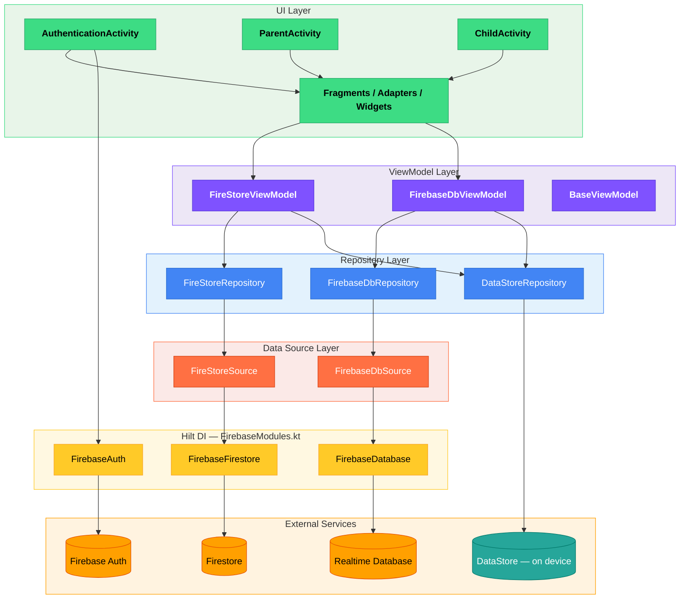

---

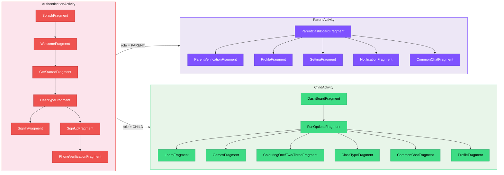

---

**Data split:** Firestore holds structured content and social data that benefits from querying (`Users`, `Messages`, `ClassRoom`, `Questions`, `Requests`, `Orders`); Realtime Database is reserved for lightweight, frequently-updated key/value data such as online presence. DataStore replaces the old SQLite `Level` table as the local cache for profile fields, score, and cash so the UI has something to render immediately while Firestore/RTDB catch up.

**DI:** `FirebaseModules.kt` provides `FirebaseAuth`, `FirebaseFirestore`, and `FirebaseDatabase` instances via Hilt; repositories and ViewModels (`FireStoreViewModel`, `FirebaseDbViewModel`, `BaseViewModel`) receive them by constructor injection rather than constructing clients themselves.

## 3. Extended Architecture

This document describes the architectural decisions in FunlearnV2 in more detail than the README overview. It is intended as a reference for contributors and as a record of why the system is structured the way it is.

### Background

FunlearnV2 is a from-scratch Kotlin rewrite of [FunLearn V1](https://github.com/PRADEEPERIYASAMY/FunLearn), a Java Android app. V1 proved the feature set end-to-end but accumulated structural debt typical of a first solo build: 42 Activities, no DI, dual image-loading libraries, raw SQLite, and RxJava mixed with ad-hoc threading. V2 is a deliberate structural reset that keeps the same features while replacing the scaffolding.

### Layers

```
UI (Activities / Fragments / Adapters / Widgets)
        ↕  observes / calls
ViewModels (FireStoreViewModel, FirebaseDbViewModel, BaseViewModel)
        ↕  injected via Hilt
Repositories (FireStoreRepository, FirebaseDbRepository, DataStoreRepository)
        ↕  injected via Hilt
Data Sources (FireStoreSource, FirebaseDbSource)  +  Local (DataStore)
        ↕
Firebase (Firestore, Realtime Database, Auth)  +  On-device (DataStore Preferences)
```

Each layer has a single responsibility. No layer reaches past its immediate neighbour. ViewModels never hold a reference to a `Context`. Fragments never call Firebase directly.

### Entry Points

The app has four Activity-level entry points, all gated by authentication state:

| Activity | Role | Hosted Fragments |
|----------|------|-----------------|
| `AuthenticationActivity` | Unauthenticated launcher | `SignInFragment`, `SignUpFragment`, `UserTypeFragment` |
| `ParentActivity` | Authenticated, role = PARENT | `ParentDashBoardFragment`, `ParentVerificationFragment`, settings, chat |
| `ChildActivity` | Authenticated, role = CHILD | `DashBoardFragment`, games, tutorials, coloring, chat, quiz |
| `BaseActivity` | Shared base | Not navigated to directly — provides common setup |

`AuthenticationActivity` writes a `Users` document with a `Roles` enum (`PARENT` or `CHILD`) on signup, then routes to the appropriate host Activity. The `Roles` enum is the single decision point for all role-based routing.

### Dependency Injection

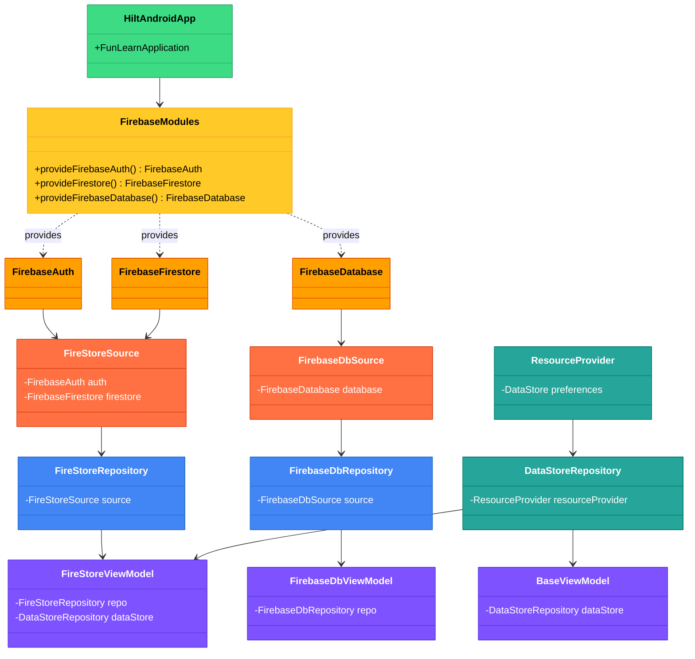

---

Hilt is the DI framework. `FirebaseModules.kt` is the only place Firebase client instances are constructed:

```kotlin
@Module
@InstallIn(SingletonComponent::class)
object FirebaseModules {
    @Provides @Singleton fun provideFirebaseAuth(): FirebaseAuth = FirebaseAuth.getInstance()
    @Provides @Singleton fun provideFirestore(): FirebaseFirestore = FirebaseFirestore.getInstance()
    @Provides @Singleton fun provideFirebaseDatabase(): FirebaseDatabase = FirebaseDatabase.getInstance()
}
```

Repositories receive these instances by constructor injection. ViewModels receive repositories by constructor injection via `@HiltViewModel`. No component constructs its own dependencies.

### Firebase Backend Split

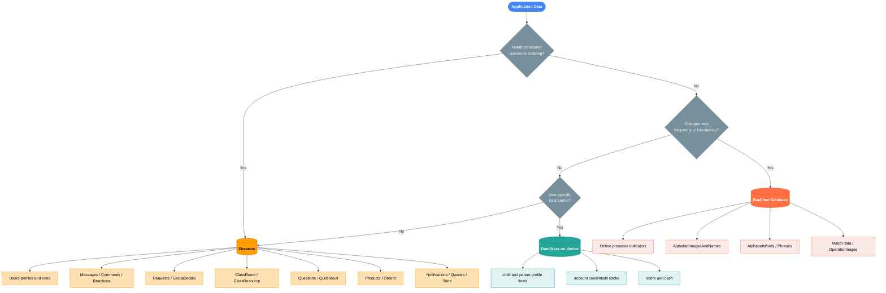

---

Two Firebase services are used intentionally for different data patterns:

#### Firestore (structured, queryable)

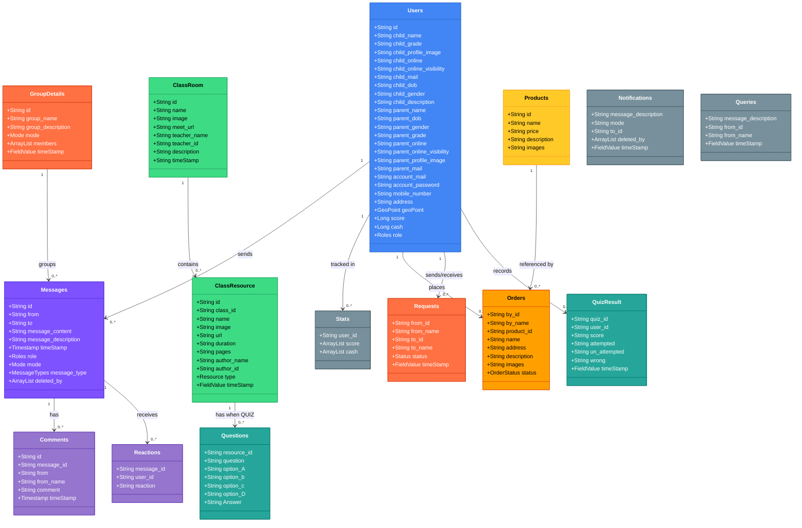

---

Used for all data that benefits from a query model — compound queries, ordered collections, secondary-key lookups:

- `Users` — user profiles and role data
- `Messages`, `Comments`, `Reactions` — chat
- `Requests`, `GroupDetails` — group chat management
- `ClassRoom`, `Questions`, `QuizResult` — classroom and quiz content
- `Orders` — in-app purchases / rewards

#### Realtime Database (lightweight, low-latency)

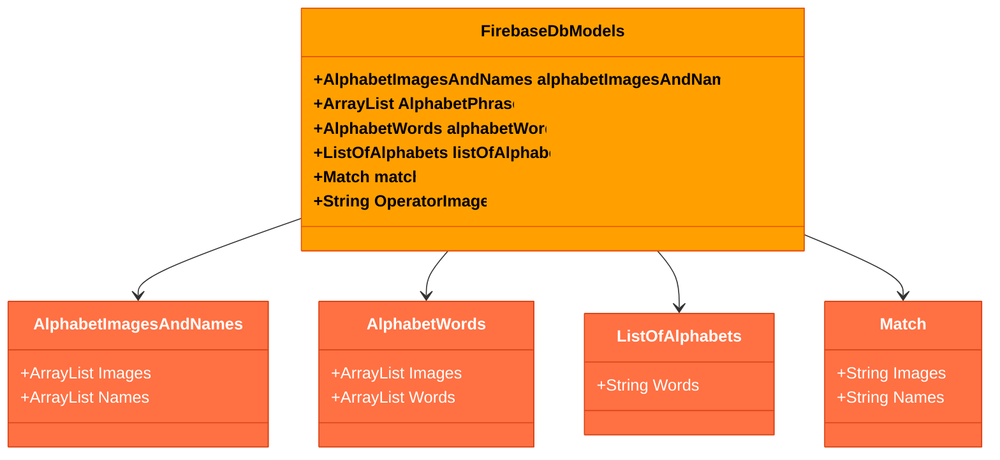

---

Used for data that changes frequently and does not need queries:

- Online presence indicators
- Counters
- Simple key/value flags

The split keeps Firestore costs predictable (fewer reads on frequently-changing data) and keeps the Realtime Database schema flat and fast.

### Local State — DataStore

`DataStoreRepository` wraps a single `androidx.datastore.preferences.DataStore` instance. Every profile field — both parent and child — plus `score` and `cash` is stored as a typed preference. The DataStore is provided by `ResourceProvider` and injected via Hilt.

This replaces V1's raw `SQLiteOpenHelper` `Level` table. The key benefit is coroutine-native access: every field is a `Flow<String>` that can be observed, or read once with `.first()` for suspend-style one-shot access.

**Read path:** UI starts rendering immediately from DataStore. Firestore/RTDB catch up in the background and update the DataStore, which propagates to the UI via Flow.

**Write path:** User action → ViewModel → Repository → Firestore write + DataStore write. The DataStore write ensures the local cache reflects the latest state immediately.

### ViewModel Contracts

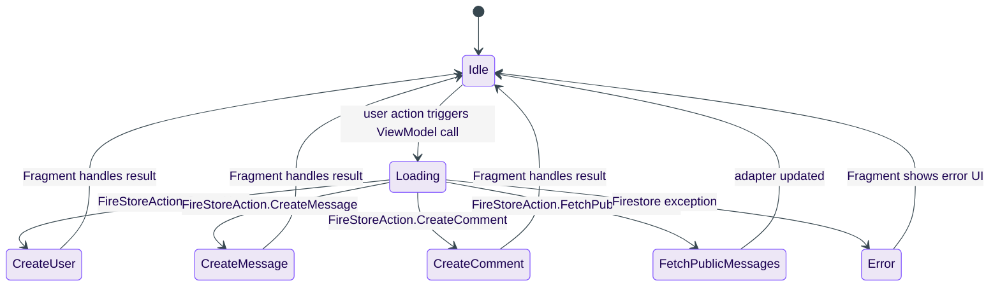

---

ViewModels expose state via sealed action classes in `viewmodels/actions/`:

- `FireStoreAction` — all Firestore-related states (loading, success variants, error)
- `FirebaseDbAction` — all Realtime Database-related states

Fragments observe a `LiveData<FireStoreAction>` (or `FirebaseDbAction`) and handle each state in a `when` expression. This avoids boolean flags scattered across the Fragment and makes the full set of possible states explicit at compile time.

### Navigation

Each host Activity owns a NavHost. Navigation Component handles Fragment back-stack within a host Activity. There are no cross-Activity Fragment transactions.

Safe Args generates typed argument classes from the navigation graph. No `Bundle` keys are hardcoded as strings anywhere in the Fragment code.

Role-based routing (Parent vs. Child) is done with an explicit `startActivity` call after authentication, not within the Navigation graph. This keeps the four host Activities as hard boundaries.

### Coloring Engine

`FloodFill.kt` is an `object` singleton implementing a scanline span-queue flood-fill algorithm. It operates directly on a `Bitmap`, walking horizontal spans and queuing only the upper and lower boundaries of each span — avoiding the recursive call stack overflow that a naive recursive fill would hit on large bitmaps.

It is shared across three coloring Fragments (`ColouringOneFragment`, `ColouringTwoFragment`, `ColouringThreeFragment`) and the pattern-tracing game (`Patterns.kt`). `PaintView` and `ColorView` are the custom View classes that host the `Bitmap` and forward touch events to `FloodFill`.

### Chat Architecture

Chat uses a single set of Firestore collections with a `Mode` enum to distinguish conversation types:

```kotlin
enum class Mode { PRIVATE, PUBLIC, GROUP }
```

`Messages` documents carry a `mode` field. Queries filter by mode. This avoids parallel collection schemas that would drift independently. `CommonChatFragment` contains shared list and composer logic; `PublicChatFragment`, `PrivateChatFragment`, and `GroupChatFragment` override the parts that differ.

`ChatStatusFragment` handles real-time presence by writing to Realtime Database on foreground/background transitions.

### What V2 Does Not Have Yet

- Unit or integration tests. `FloodFill` and `DataStoreRepository` are the best starting points — both are side-effect-isolated.
- A complete offline-first strategy. DataStore provides an instant-render local cache, but there is no background sync queue for writes made while offline.
- Formal data-ownership documentation for every Firestore collection.
- Feature-complete stub screens (several game and quiz Fragments are navigation-wired but not fully implemented).

See [CHANGELOG.md](../CHANGELOG.md) and the [Roadmap section in the README](../README.md#6-roadmap) for current status.

---

## 4. Tech Stack

| Concern | Choice | Notes |
|---|---|---|
| Language | Kotlin | Full rewrite of the Java V1 codebase |
| DI | Hilt (`hilt-android`, `hilt-compiler`) | Wires Firebase clients, repositories, ViewModels |
| Async | Kotlin Coroutines + `kotlinx-coroutines-play-services` | `Flow`-based repository layer (`DataStoreRepository`) |
| Backend — structured data | Firestore (`firebase-firestore-ktx`) | Users, chat, classes, quizzes, orders — see [§2](#2-system-architecture) |
| Backend — realtime/light data | Firebase Realtime Database (`firebase-database-ktx`) | Presence-style, low-latency key/value data |
| Auth | Firebase Auth (`firebase-auth-ktx`) | Email/password + phone verification (`PhoneVerificationFragment`) |
| On-device ML | ML Kit (`ocr`), `play-services-mlkit-text-recognition` | Handwriting recognition, offline |
| Local persistence | Jetpack DataStore (Preferences) | Typed local cache, replaces V1's SQLite table — see [§3.5](#35-local-state--datastore) |
| Navigation | Android Navigation Component (`navigation-fragment-ktx`, `navigation-ui-ktx`, Safe Args) | Type-safe Fragment transitions inside 4 host Activities |
| Networking | Retrofit2 + Gson converter | Non-Firebase HTTP needs |
| Maps/Location | `play-services-maps`, `play-services-location`, Google Places | Location-aware features |
| Image loading | Glide | Single library (Picasso dropped from V1) |
| Biometric | `androidx.biometric` | Optional local auth gate |
| Crash/Analytics | Firebase Crashlytics, Analytics | |
| UI toolkit | Material Components, ConstraintLayout, ViewBinding, RecyclerView | `viewBinding = true` enabled at module level |

Full dependency list: [`app/build.gradle`](app/build.gradle).

## 5. Feature Notes

### User Journeys

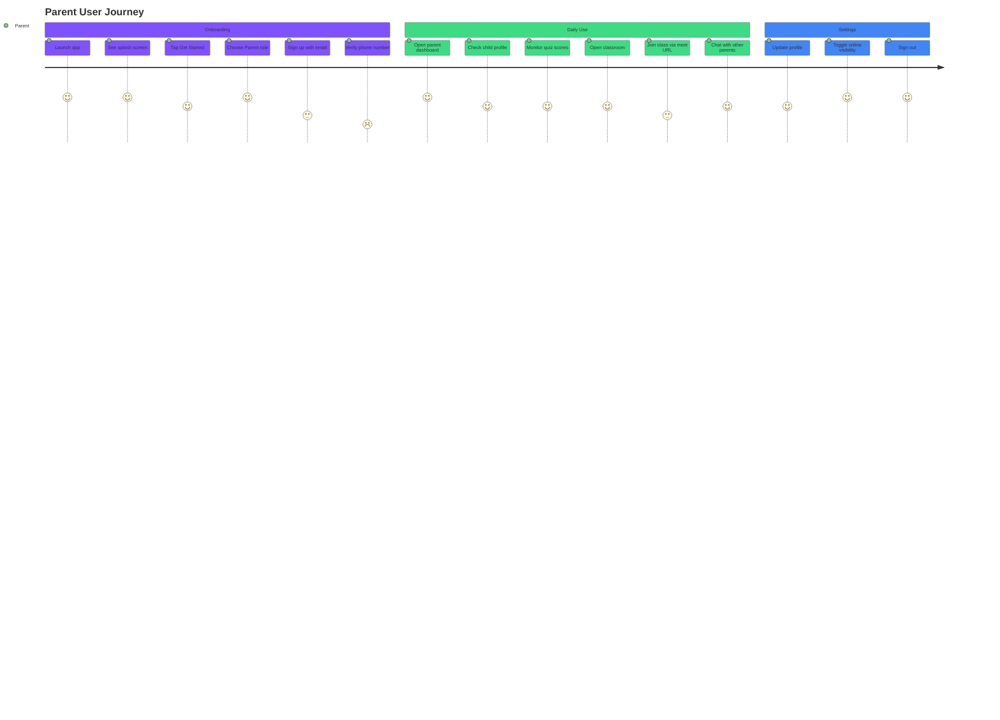

---

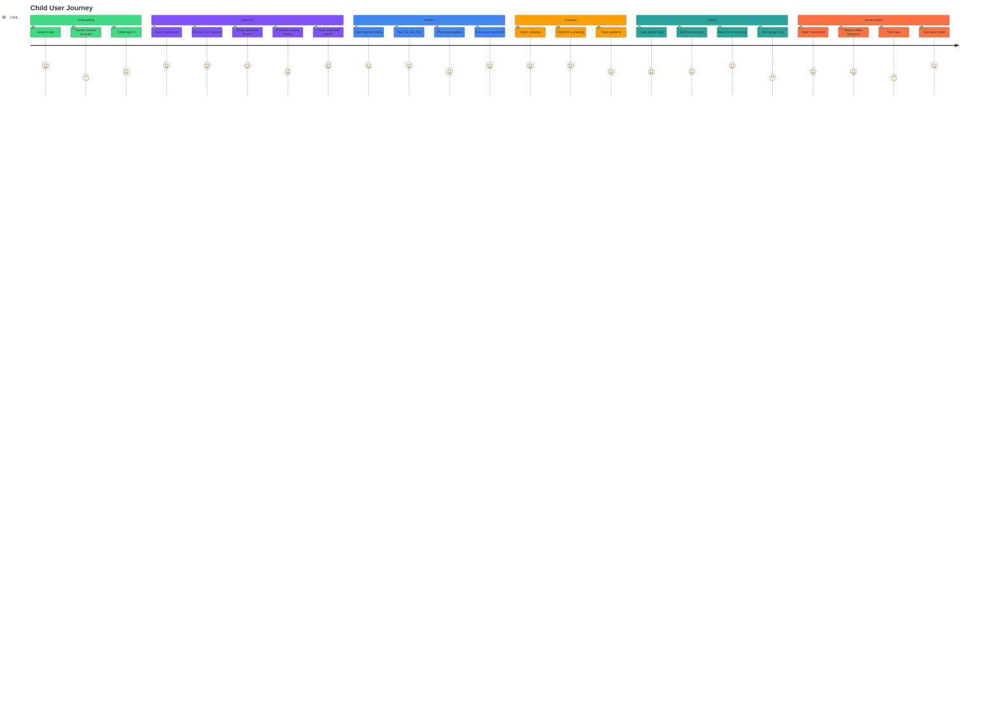

---

### 3.1 Roles: Parent, Child & Authentication

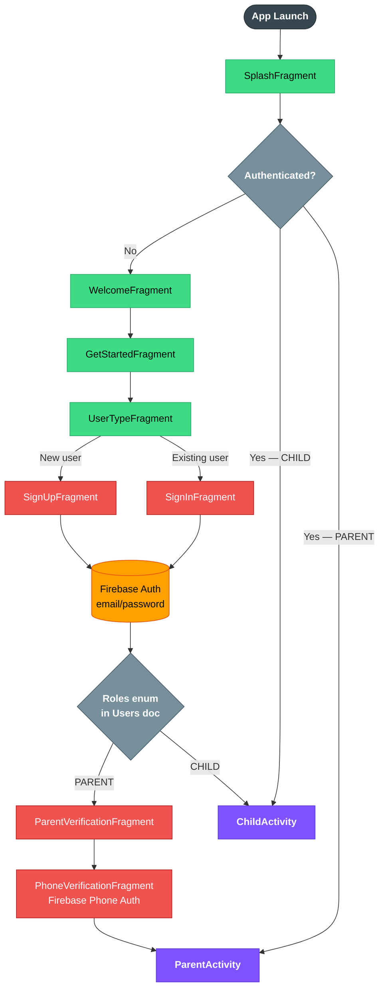

---

`AuthenticationActivity` is the single launcher Activity (see [`AndroidManifest.xml`](app/src/main/AndroidManifest.xml)), fronting `SignInFragment` / `SignUpFragment` / `UserTypeFragment`. Account data is modeled as one `Users` document (see [`models/FirestoreModels.kt`](app/src/main/java/com/example/funlearnv2/models/FirestoreModels.kt)) carrying **both** child and parent fields (`child_name`, `child_grade`, `parent_name`, `parent_grade`, etc.) plus a `Roles` enum, rather than separate user tables. `ParentVerificationFragment` and `PhoneVerificationFragment` gate access before handing off to `ParentActivity` or `ChildActivity`.

### 3.2 Coloring Engine — Flood Fill

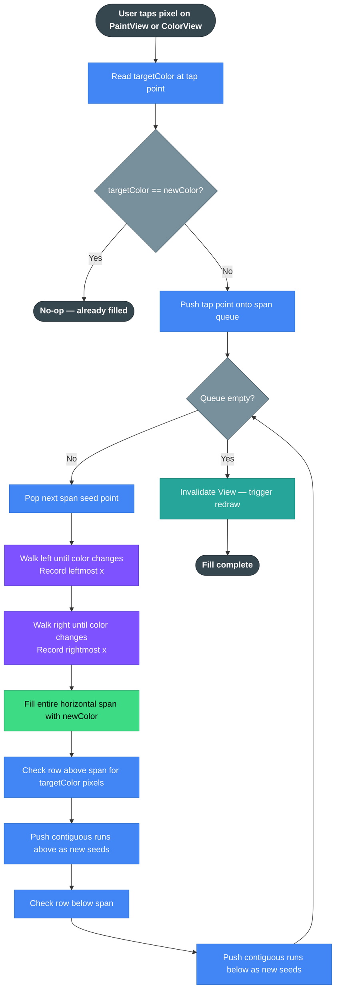

---

The scanline flood-fill from V1 was ported to Kotlin as an `object` singleton ([`views/widgets/FloodFill.kt`](app/src/main/java/com/example/funlearnv2/views/widgets/FloodFill.kt)), preserving the same span-queue algorithm to avoid recursive stack overflow on large bitmaps:

```kotlin
object FloodFill {
    fun floodFill(bitmap: Bitmap, point: Point, targetColor: Int, newColor: Int) {
        // walks horizontal spans, queues only span boundaries above/below
        ...
    }
}
```

It drives `PaintView.kt` / `ColorView.kt` and is shared across `ColouringOneFragment`, `ColouringTwoFragment`, and `ColouringThreeFragment`, plus the tracing game in `Patterns.kt` — the same one-implementation-many-consumers structure as V1's `Pattern/` module.

### 3.3 Chat — Public, Private & Group

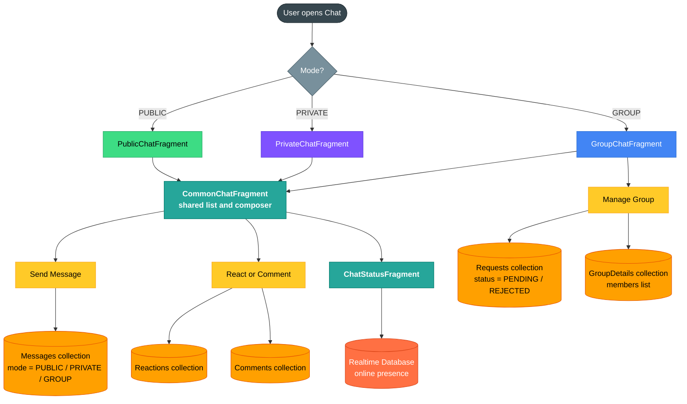

---

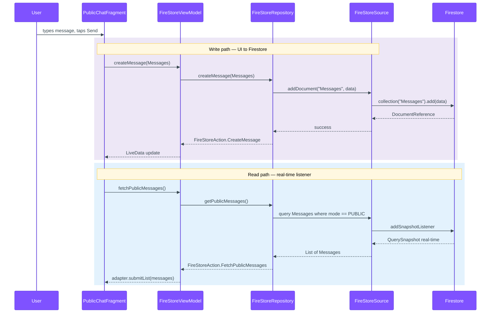

---

Chat is modeled directly in Firestore via `Messages`, `Comments`, `Reactions`, `Requests`, and `GroupDetails` (all in [`FirestoreModels.kt`](app/src/main/java/com/example/funlearnv2/models/FirestoreModels.kt)), with a `Mode` enum (`PRIVATE`, `PUBLIC`, `GROUP`) distinguishing conversation types on the same collections rather than separate schemas per mode. Fragments split by mode: `PublicChatFragment`, `PrivateChatFragment`, `GroupChatFragment`, `CommonChatFragment` (shared list/composer logic), `CommentFragment`, and `ChatStatusFragment` for presence.

### 3.4 Quiz, Classroom & Resources

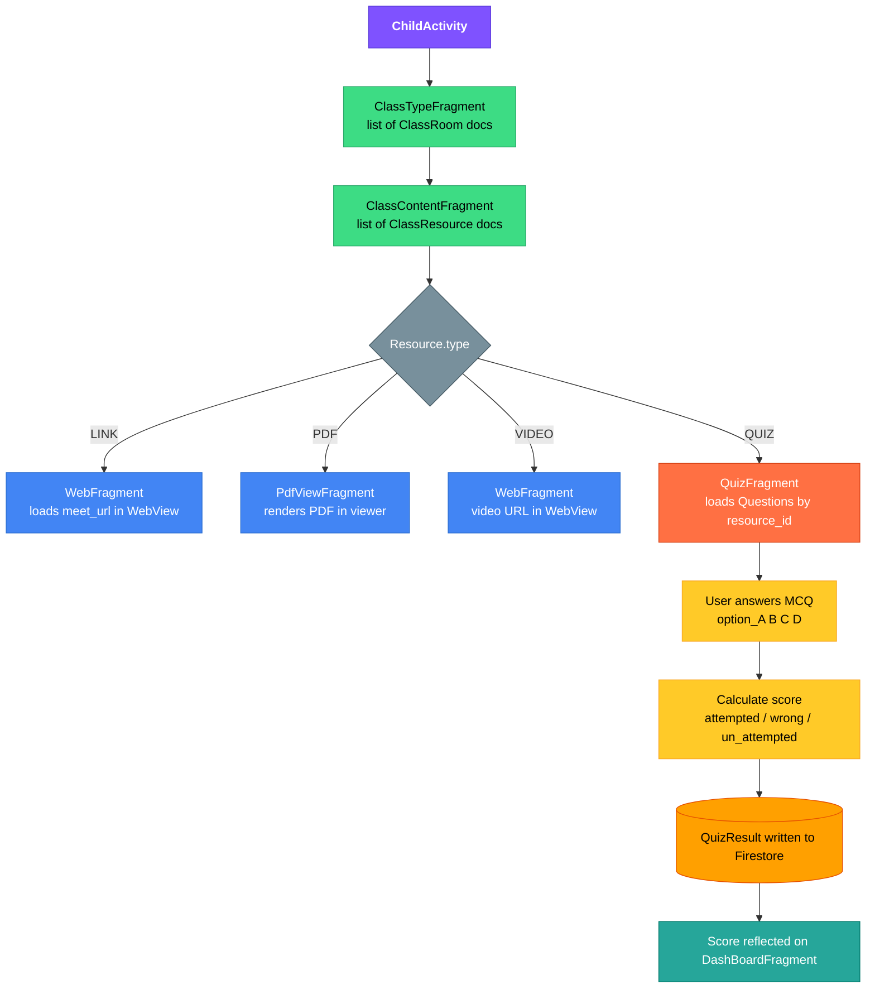

---

- `ClassRoom` / `ClassResource` — a class has a `meet_url`, `teacher_id`, and a list of `Resource` items typed as `LINK`, `PDF`, `VIDEO`, or `QUIZ`.
- `Questions` — flat MCQ shape (`option_A`..`option_D`, `Answer`) tied to a `resource_id`.
- `QuizResult` — per-attempt outcome (`score`, `attempted`, `un_attempted`, `wrong`), mirroring V1's separation of quiz content from quiz outcomes (`QuizMaster` vs `Rank` in the original app).
- UI: `ClassTypeFragment` → `ClassContentFragment` → `QuizFragment` / `PdfViewFragment` / `WebFragment`, depending on `Resource` type.

### 3.5 Local State — DataStore

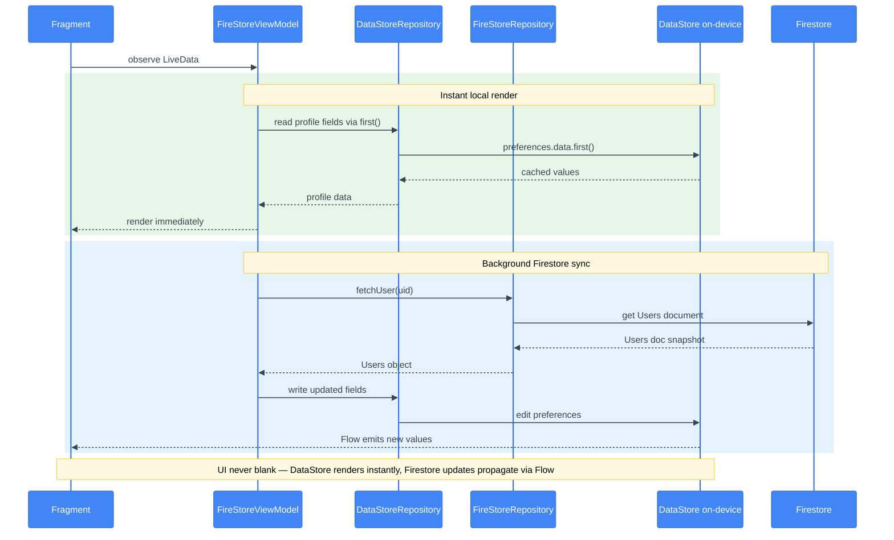

---

[`repository/DataStoreRepository.kt`](app/src/main/java/com/example/funlearnv2/repository/DataStoreRepository.kt) wraps a single `androidx.datastore.preferences` instance (provided by `ResourceProvider`) with typed getters/setters for every profile field (child + parent), account credentials cache, `score`, and `cash`. Each field is exposed as a `Flow<String>` internally and read via `.first()` for one-shot suspend access — replacing V1's raw `SQLiteOpenHelper` table with a coroutine-friendly, type-checked key-value store.

### Enums Reference

```mermaid
classDiagram
    class Roles {
        <<enumeration>>
        TEACHER
        CHILD
        PARENT
        ADMIN
    }

    class Mode {
        <<enumeration>>
        PRIVATE
        PUBLIC
        GROUP
    }

    class Resource {
        <<enumeration>>
        LINK
        PDF
        VIDEO
        QUIZ
    }

    class MessageTypes {
        <<enumeration>>
        TEXT
        IMAGE
        PDF
        VIDEO
    }

    class Status {
        <<enumeration>>
        PENDING
        REJECTED
    }

    class OrderStatus {
        <<enumeration>>
        PENDING
        DELIVERED
    }

    class Grade {
        <<enumeration>>
        PREKG
        LKG
        UKG
    }

    class ParentGrade {
        <<enumeration>>
        SCHOOL
        COLLEGE
        NOCOMMENTS
    }

    class OnlineVisibility {
        <<enumeration>>
        ONLINE
        OFFLINE
    }

    class Gender {
        <<enumeration>>
        MALE
        FEMALE
        NOTOSAY
    }

    style Roles fill:#EF5350,stroke:#b71c1c,color:#fff
    style Mode fill:#7F52FF,stroke:#5a3adb,color:#fff
    style Resource fill:#3DDC84,stroke:#2ba86a,color:#000
    style MessageTypes fill:#4285F4,stroke:#2c6fd1,color:#fff
    style Status fill:#FF7043,stroke:#d84315,color:#fff
    style OrderStatus fill:#FFA000,stroke:#e65100,color:#000
    style Grade fill:#26A69A,stroke:#00796B,color:#fff
    style ParentGrade fill:#26A69A,stroke:#00796B,color:#fff
    style OnlineVisibility fill:#78909C,stroke:#455A64,color:#fff
    style Gender fill:#FFCA28,stroke:#f9a825,color:#000
```

---

## 6. Module Reference

```
app/src/main/java/com/example/funlearnv2/
├── FirebaseSource/     FirebaseDbSource, FireStoreSource, FirebaseModules, Collections — data-source layer (§2)
├── models/             DataModel, FirebaseDbModels, FirestoreModels, chatModel, Result — data/DTO layer (§3.3, §3.4)
├── repository/         DataStoreRepository (§3.5), FireStoreRepository, FirebaseDbRepository
├── viewmodels/         BaseViewModel, FireStoreViewModel, FirebaseDbViewModel
│   └── actions/         FireStoreAction, FirebaseDbAction — sealed action/state contracts for ViewModels
├── utils/              CallUtil, ContextUtil, DateUtil, DialogUtil, DimensionUtil,
│                        FileUtil, FileSaveUtil, GlideUtil, HideKeyboardUtil, InputTextUtil,
│                        ProgressBarUtil, QueryUtil, SnackbarUtil, ViewGroupUtil, ViewUtil
│   ├── constants/        Constant, ButtonStatus, FunType, OperatorTypes
│   └── resourceProvider/ ResourceProvider — DataStore + resource access wrapper
├── views/
│   ├── activities/      AuthenticationActivity, BaseActivity, ParentActivity, ChildActivity (§2, §3.1)
│   ├── fragments/        45 Fragments across:
│   │                      - Onboarding: SplashFragment, WelcomeFragment, GetStartedFragment
│   │                      - Auth: SignInFragment, SignUpFragment, UserTypeFragment,
│   │                               PhoneVerificationFragment, ParentVerificationFragment
│   │                      - Dashboard: DashBoardFragment, ParentDashBoardFragment, FunOptionsFragment
│   │                      - Learn: LearnFragment, AlphabetListFragment, AlphabetCountFragment,
│   │                               AlphabetWordsFragment, AlphabetMatchFragment, AlphabetWriteFragment,
│   │                               NumberInfoFragment, NumberCountFragment, NumberOperationFragment,
│   │                               NumberWriteFragment, TutorialFragment
│   │                      - Games: GamesFragment, GameOnePlayFragment, GameTwoFragment,
│   │                               GameThreeFragment, GameFourFragment (chess)
│   │                      - Coloring: ColouringOneFragment, ColouringTwoFragment, ColouringThreeFragment
│   │                      - Chat: CommonChatFragment, PublicChatFragment, PrivateChatFragment,
│   │                               GroupChatFragment, CommentFragment, ChatStatusFragment
│   │                      - Classroom/Quiz: ClassTypeFragment, ClassContentFragment, QuizFragment,
│   │                                        PdfViewFragment, WebFragment, ListFilesFragment
│   │                      - Profile/Settings: ProfileFragment, SettingFragment, NotificationFragment
│   │                      Several of the above are navigation-wired stubs pending full V1 migration
│   ├── adapters/         16 adapters (15 RecyclerView + 1 ViewPager2) — one per list-backed screen
│   │                      ItemAlphabetAdapter, ItemAlphabetWordAdapter, ItemChessAdapter,
│   │                      ItemCommentAdapter, ItemDeadChessAdapter, ItemGameOneAdapter,
│   │                      ItemMatchAdapter, ItemNumbersInfoAdapter, ItemOperatorAdapter,
│   │                      ItemPatternAdapter, ItemPublicChatMessageAdapter, ItemSearchAdapter,
│   │                      ItemTemplateAdapter, ItemWordAdapter, ItemWordExampleAdapter,
│   │                      chatViewPagerAdapter
│   └── widgets/          FloodFill, PaintView, ColorView, Patterns, GameImages (§3.2)
└── FunLearnApplication.kt   @HiltAndroidApp entry point
```

## 7. Roadmap

- Finish stub screens (a subset of Fragments across games/quiz/settings are wired for navigation but not yet feature-complete) and confirm full V1 to V2 parity, then retire the legacy Java module.
- Extend `DataStoreRepository` into a full offline-first cache layer, with Firestore as the sync source of truth across devices.
- Formalize the `FirebaseDbSource` / `FireStoreSource` boundary into a documented data-ownership map as more collections are added.
- Add unit tests, starting with `FloodFill` and `DataStoreRepository` — both are side-effect-isolated and straightforward to unit test; no test suite exists yet.
- Continue extracting game logic into ViewModels (in progress for the larger game Fragments) to keep game rules testable independent of the view layer.
- Replace the Asset Preview section with real screenshots and screen recordings of the running app.

## 8. Getting Started

```bash
git clone https://github.com/PRADEEPERIYASAMY/FunLearnV2.git
cd FunLearnV2
```

1. Create a Firebase project; enable **Firestore**, **Realtime Database**, **Authentication** (email/password + phone), **Crashlytics**, and **ML Kit Text Recognition**.
2. Download `google-services.json` into `app/` (a placeholder already exists in this repo; replace it with your own project's file).
3. Open the repository root folder in Android Studio (Gradle + `com.google.gms.google-services` + Hilt + Navigation Safe Args plugins) and let Gradle sync.
   - The project uses **JitPack** (`https://jitpack.io`) as a Maven repository for some dependencies (see `build.gradle` root). Android Studio adds this automatically; no manual step needed.
4. Build:

```bash
./gradlew build
```

For a full walkthrough of Firebase service configuration, see [Firebase Setup](#11-firebase-setup). For build environment details, see [Local Development Guide](#10-local-development-guide).

## 9. Firebase Setup

This guide walks through configuring Firebase for a local development build of FunlearnV2. The app depends on five Firebase services: Authentication, Firestore, Realtime Database, Crashlytics, and ML Kit Text Recognition.

### Prerequisites

- A Google account
- Android Studio (Arctic Fox or later recommended)
- The repository cloned locally

### Step 1 — Create a Firebase Project

1. Go to [console.firebase.google.com](https://console.firebase.google.com) and click **Add project**.
2. Name the project (e.g. `FunlearnV2-Dev`). Analytics can be enabled or disabled — it does not affect core functionality.
3. Wait for the project to be provisioned.

### Step 2 — Register the Android App

1. In the Firebase Console, click the Android icon to add an Android app.
2. Enter the package name: `com.example.funlearnv2`
3. App nickname is optional. SHA-1 is required for phone authentication (see Step 5).
4. Click **Register app**.
5. Download `google-services.json` and place it at `app/google-services.json` in the repo, replacing the placeholder file already there.

> The placeholder `google-services.json` committed to this repository contains dummy values. It will not connect to any real Firebase project. Replace it with your own.

### Step 3 — Enable Authentication

1. In the Firebase Console, go to **Authentication** > **Sign-in method**.
2. Enable **Email/Password**.
3. Enable **Phone** (required for `PhoneVerificationFragment` and `ParentVerificationFragment`).
4. For phone authentication in debug builds, go to **Authentication** > **Sign-in method** > **Phone** and add a test phone number and verification code under **Phone numbers for testing**.

#### SHA-1 for Phone Auth

Phone authentication requires the app's signing certificate SHA-1 to be registered in the Firebase project.

For the debug keystore:

```bash
keytool -list -v -keystore ~/.android/debug.keystore -alias androiddebugkey -storepass android -keypass android
```

On Windows:

```bash
keytool -list -v -keystore %USERPROFILE%\.android\debug.keystore -alias androiddebugkey -storepass android -keypass android
```

Copy the SHA-1 fingerprint and add it under **Project settings** > **Your apps** > **SHA certificate fingerprints**.

### Step 4 — Set Up Firestore

1. Go to **Firestore Database** and click **Create database**.
2. Choose **Start in test mode** for local development (allows open reads/writes for 30 days — tighten rules before any production use).
3. Select a region close to you.

#### Firestore Collections

The app expects the following top-level collections:

| Collection | Used by | Key fields |
|------------|---------|-----------|
| `Users` | Auth, profile, roles | `uid`, `role` (`PARENT`/`CHILD`), `child_name`, `child_grade`, `parent_name`, `parent_grade` |
| `Messages` | Chat | `mode` (`PRIVATE`/`PUBLIC`/`GROUP`), `sender_id`, `receiver_id`, `text`, `timestamp` |
| `Comments` | Chat | `message_id`, `sender_id`, `text` |
| `Reactions` | Chat | `message_id`, `user_id`, `type` |
| `Requests` | Group chat | `sender_id`, `receiver_id`, `status` |
| `GroupDetails` | Group chat | `group_id`, `name`, `members` |
| `ClassRoom` | Classroom | `teacher_id`, `meet_url`, `resources` |
| `Questions` | Quiz | `resource_id`, `question`, `option_A`..`option_D`, `Answer` |
| `QuizResult` | Quiz | `user_id`, `resource_id`, `score`, `attempted`, `wrong` |
| `Orders` | Shop/rewards | `user_id`, `item_id`, `status` |

Collections are created automatically when the app first writes to them. You do not need to create them manually.

### Step 5 — Set Up Realtime Database

1. Go to **Realtime Database** and click **Create database**.
2. Choose **Start in test mode** for development.
3. Select a region.

Realtime Database is used for lightweight, frequently-updated data: online presence indicators and counters. The data structure is created on first write from the app.

### Step 6 — Enable ML Kit Text Recognition

ML Kit Text Recognition runs on-device and does not require a separate Firebase configuration step. The dependency `play-services-mlkit-text-recognition` downloads the model on first use.

If you want the model bundled with the APK (to avoid a first-run download), add the following to your `AndroidManifest.xml`:

```xml
<meta-data
    android:name="com.google.mlkit.vision.DEPENDENCIES"
    android:value="ocr" />
```

This is already present in the app manifest.

### Step 7 — Enable Crashlytics

1. In the Firebase Console, go to **Crashlytics** and click **Enable Crashlytics**.
2. No additional configuration is needed — the `google-services.json` and `firebase-crashlytics` plugin handle the rest.
3. To generate a test crash, call `throw RuntimeException("Test Crash")` from any Activity and confirm it appears in the Crashlytics dashboard.

### Step 8 — Sync and Build

1. Open the repo root in Android Studio.
2. Let Gradle sync complete (it will download all dependencies declared in `app/build.gradle`).
3. Build and run:

```bash
./gradlew build
```

Or run directly from Android Studio using the Run button.

### Firestore Security Rules (Production)

Before deploying to production, replace the permissive test rules with real rules. A starting point:

```
rules_version = '2';
service cloud.firestore {
  match /databases/{database}/documents {

    // Users can only read and write their own document
    match /Users/{userId} {
      allow read, write: if request.auth != null && request.auth.uid == userId;
    }

    // Messages: authenticated users only
    match /Messages/{messageId} {
      allow read, write: if request.auth != null;
    }

    // Add rules per collection as the app matures
  }
}
```

> Start strict and open up. The test-mode default (allow all) is not safe for production.

### Realtime Database Security Rules (Production)

```json
{
  "rules": {
    ".read": "auth != null",
    ".write": "auth != null"
  }
}
```

This restricts all reads and writes to authenticated users. Tighten per node as needed.

### Troubleshooting

**`google-services.json` errors at sync time**
Make sure the file is placed at `app/google-services.json`, not the repo root. The file must match the package name `com.example.funlearnv2`.

**Phone auth — SMS not received**
Add the device's test phone number in Firebase Console under Authentication > Sign-in method > Phone > Test phone numbers.

**ML Kit model not found**
Clean the build (`./gradlew clean`) and rebuild. On first launch, the model is downloaded; a network connection is needed.

**Crashlytics not reporting crashes**
Crashlytics is disabled during debug builds by default. To force-enable it for testing, add `FirebaseCrashlytics.getInstance().setCrashlyticsCollectionEnabled(true)` in `FunLearnApplication.kt`.

---

## 10. Local Development Guide

Everything you need to set up a local development environment for FunlearnV2 beyond what `git clone` and Android Studio handle automatically.

### Prerequisites

| Tool | Version | Notes |
|------|---------|-------|
| Android Studio | Arctic Fox (2020.3.1) or later | Hedgehog or later recommended |
| JDK | 8 (Java 1.8) | Set in `compileOptions` and `kotlinOptions` |
| Android SDK | API 30 (compile + target) | API 23 minimum for device/emulator |
| Kotlin | Check `build.gradle` (root) for `kotlin_version` | kapt used for annotation processing |
| Gradle | Wrapper included — use `./gradlew` | Do not use a system Gradle installation |

### Initial Setup

```bash
git clone https://github.com/PRADEEPERIYASAMY/FunLearnV2.git
cd FunLearnV2
```

Then follow [docs/FIREBASE_SETUP.md](FIREBASE_SETUP.md) to configure Firebase before your first build.

### Building

```bash
# Debug build
./gradlew assembleDebug

# Release build (APK unsigned, requires signing config for distribution)
./gradlew assembleRelease

# Full build with tests
./gradlew build
```

On Windows, use `gradlew.bat` instead of `./gradlew`, or run via Android Studio's built-in Gradle panel.

### Running on a Device or Emulator

Use Android Studio's Run button, or:

```bash
./gradlew installDebug
```

The minimum supported API level is 23 (Android 6.0 Marshmallow). For emulators, an API 23+ AVD is required.

### Plugins and Build Configuration

```mermaid
flowchart LR
    SRC["Kotlin Source\n.kt files"]
    KAPT[kotlin-kapt\nAnnotation Processing]
    HILT_GEN["Hilt Generated Code\nDagger components"]
    GLIDE_GEN["Glide Generated\nGlideApp"]
    NAV_ARGS["Safe Args Generated\nDirections and Args classes"]
    KOTLIN[kotlin-android\nKotlin compilation]
    ANDROID["com.android.application\nDex and resource merge"]
    GMS["com.google.gms.google-services\nInjects Firebase config"]
    CRASHLYTICS["com.google.firebase.crashlytics\nInjects build ID"]
    HILT_PLUGIN["dagger.hilt.android.plugin\nbytecode transform"]
    APK[APK\ndebug / release]

    SRC --> KAPT
    KAPT --> HILT_GEN & GLIDE_GEN & NAV_ARGS
    SRC --> KOTLIN
    HILT_GEN & GLIDE_GEN & NAV_ARGS --> KOTLIN
    KOTLIN --> ANDROID --> GMS --> CRASHLYTICS --> HILT_PLUGIN --> APK

    classDef source fill:#37474F,stroke:#263238,color:#fff,font-weight:bold
    classDef kapt fill:#FFCA28,stroke:#f9a825,color:#000,font-weight:bold
    classDef generated fill:#FFF9C4,stroke:#FFCA28,color:#000
    classDef compile fill:#7F52FF,stroke:#5a3adb,color:#fff
    classDef android fill:#3DDC84,stroke:#2ba86a,color:#000
    classDef gms fill:#FFA000,stroke:#e65100,color:#000
    classDef crash fill:#EF5350,stroke:#b71c1c,color:#fff
    classDef hilt fill:#4285F4,stroke:#2c6fd1,color:#fff
    classDef artifact fill:#26A69A,stroke:#00796B,color:#fff,font-weight:bold

    class SRC source
    class KAPT kapt
    class HILT_GEN,GLIDE_GEN,NAV_ARGS generated
    class KOTLIN compile
    class ANDROID android
    class GMS gms
    class CRASHLYTICS crash
    class HILT_PLUGIN hilt
    class APK artifact
```

---

*All diagrams reflect the codebase as of the current `main` branch. Update this file when models, navigation graphs, or the architecture changes.*

---

Made with ❤️ by Pradeep Periyasamy

The project uses the following Gradle plugins — all are applied in `app/build.gradle`:

| Plugin | Purpose |
|--------|---------|
| `com.android.application` | Android app module |
| `kotlin-android` | Kotlin support |
| `kotlin-kapt` | Annotation processing (Hilt, Glide compiler) |
| `com.google.gms.google-services` | Firebase configuration |
| `dagger.hilt.android.plugin` | Hilt DI |
| `androidx.navigation.safeargs.kotlin` | Navigation Safe Args |
| `com.google.firebase.crashlytics` | Crashlytics build integration |

Plugin versions are declared in the root `build.gradle`.

### Key Build Flags

| Flag | Value | Notes |
|------|-------|-------|
| `minSdkVersion` | 23 | Android 6.0 |
| `targetSdkVersion` | 30 | Android 11 |
| `compileSdkVersion` | 30 | |
| `viewBinding` | true | All view access goes through generated binding classes |
| `multiDexEnabled` | true | Required due to method count exceeding 64K |

### Project Structure

```
FunLearnV2/
├── app/
│   ├── build.gradle              # App-level dependencies and build config
│   ├── google-services.json      # Firebase config (placeholder — replace with your own)
│   ├── proguard-rules.pro        # ProGuard rules for release builds
│   └── src/
│       └── main/
│           ├── AndroidManifest.xml
│           ├── java/com/example/funlearnv2/
│           │   ├── FirebaseSource/    # Data-source layer
│           │   ├── models/            # Data models and DTOs
│           │   ├── repository/        # Repository layer
│           │   ├── viewmodels/        # ViewModels and action contracts
│           │   ├── utils/             # Extension helpers and utilities
│           │   ├── views/             # Activities, Fragments, adapters, widgets
│           │   └── FunLearnApplication.kt
│           └── res/
├── build.gradle                  # Root build file (plugin versions, classpath)
├── gradle.properties             # Gradle and project-wide properties
├── settings.gradle               # Module inclusion
└── docs/                         # Extended documentation
```

### Code Conventions

- **Language:** Kotlin throughout. No new Java files.
- **View access:** ViewBinding only. No `findViewById`.
- **Dependency injection:** Hilt. Do not construct Firebase clients, repositories, or ViewModels manually.
- **Async:** Kotlin Coroutines and Flow. No RxJava, no raw threads, no `AsyncTask`.
- **Image loading:** Glide only. Picasso was removed from V1 and is not re-introduced.
- **Navigation:** Navigation Component + Safe Args for all Fragment transitions within a host Activity. No `Intent` extras for passing typed data between Fragments.

### Running Lint

```bash
./gradlew lint
```

The lint report is generated at `app/build/reports/lint-results-debug.html`.

### Running Tests

```bash
# Unit tests
./gradlew test

# Instrumented tests (requires a connected device or running emulator)
./gradlew connectedAndroidTest
```

Note: as of the current state of the project, test coverage is minimal. `FloodFill` and `DataStoreRepository` are the best candidates for new unit tests since both are side-effect-isolated.

### Common Issues

**Gradle sync fails with `google-services.json` error**
The placeholder `google-services.json` will not cause a sync failure on its own, but building or running will fail without valid Firebase credentials. See [FIREBASE_SETUP.md](FIREBASE_SETUP.md).

**kapt errors during build**
Ensure `kapt { correctErrorTypes true }` is present in `app/build.gradle` (it is). If kapt errors persist after a code change, try `./gradlew clean` before rebuilding.

**Navigation Safe Args not generating**
Clean and rebuild: `./gradlew clean assembleDebug`. If the generated `Directions` classes are missing, confirm the `androidx.navigation.safeargs.kotlin` plugin is applied in `app/build.gradle`.

**Hilt injection failures at runtime**
All Activities and Fragments using Hilt must extend `ComponentActivity` / `Fragment` (not the legacy support versions) and the Application class must be annotated with `@HiltAndroidApp`. Both are already configured in this project.

**MultiDex issues on API 21 and above**
`multiDexEnabled true` is set and `androidx.multidex:multidex` is included. The `FunLearnApplication` class inherits from `MultiDexApplication` indirectly via Hilt's generated Application. No additional configuration is needed.

### IDE Tips

- Enable **auto-import** for Kotlin in Android Studio to avoid manual import management.
- Use **Layout Inspector** (View > Tool Windows > Layout Inspector) to inspect the Fragment/View hierarchy at runtime.
- The Navigation graph is at `app/src/main/res/navigation/` — open it in the Navigation Editor for a visual overview of Fragment transitions per host Activity.

---

## 11. Contributing & Community

Contributions, bug reports, and feature requests are welcome.

- Read [CONTRIBUTING.md](CONTRIBUTING.md) before opening a pull request.
- Review the [Code of Conduct](CODE_OF_CONDUCT.md) — all interactions in this project follow it.
- Report security issues privately via [SECURITY.md](SECURITY.md).
- Need help? See [SUPPORT.md](SUPPORT.md).
- Use the issue templates when filing bugs or feature requests.

This project is primarily a solo build. If you want to contribute, open an issue first to discuss scope before writing code.

Licensed under [MIT](LICENSE).


---

---

Made with ❤️ by Pradeep Periyasamy
