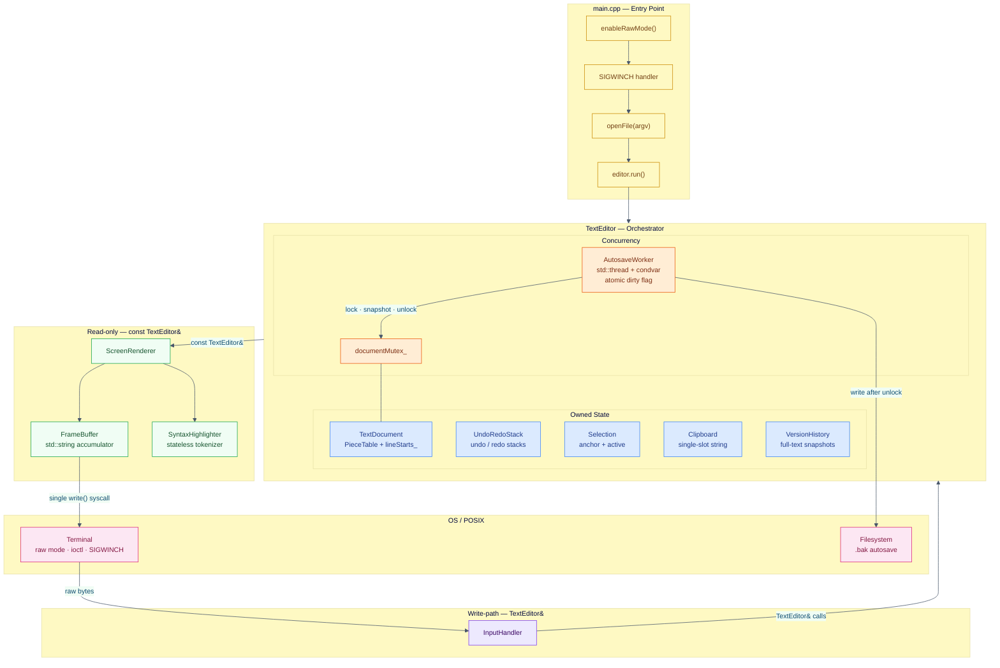
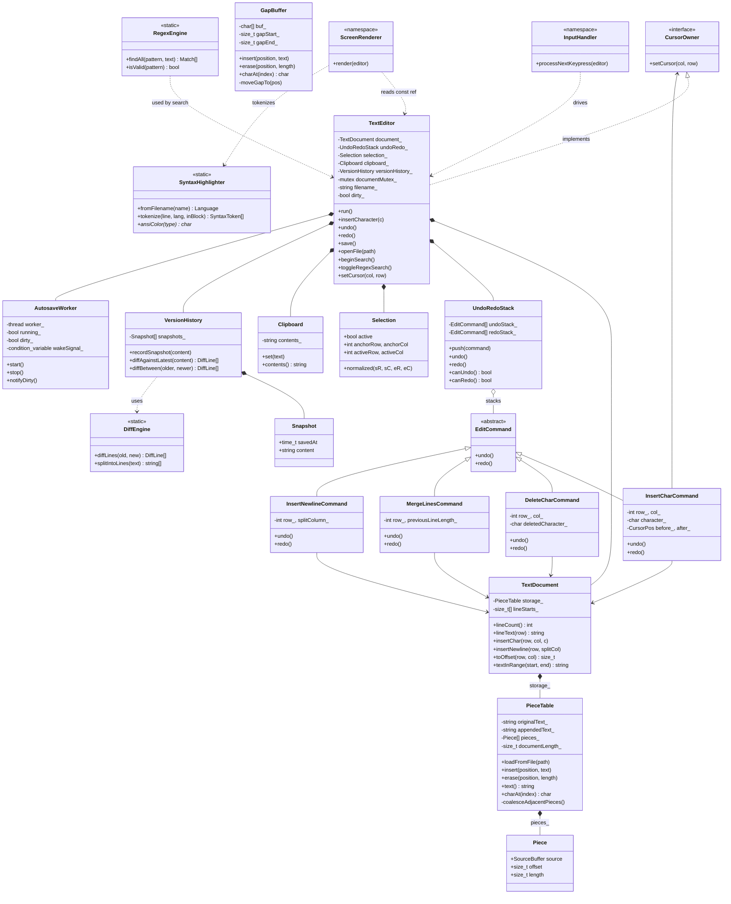
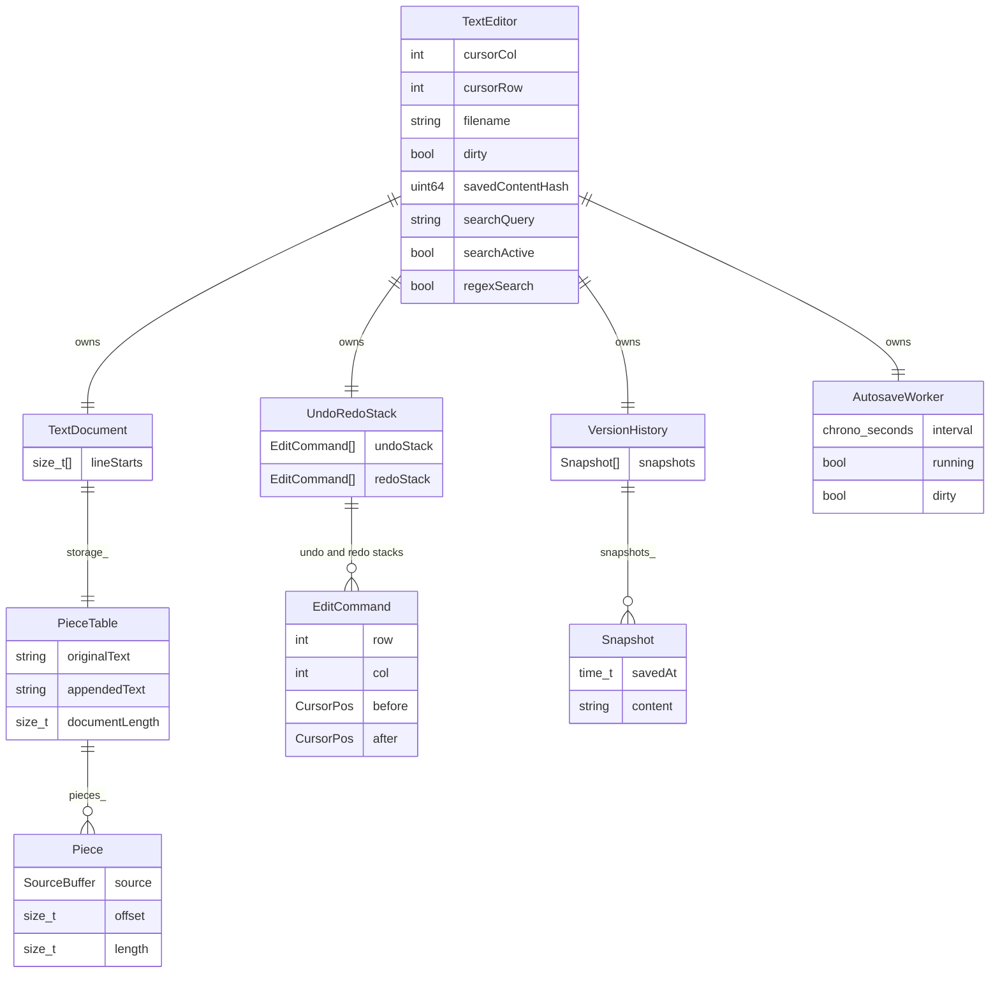
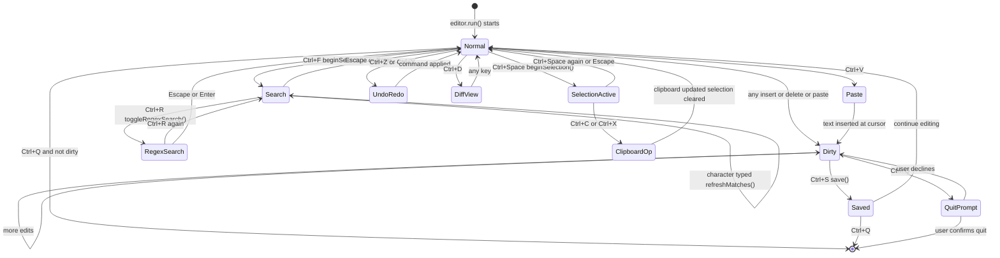
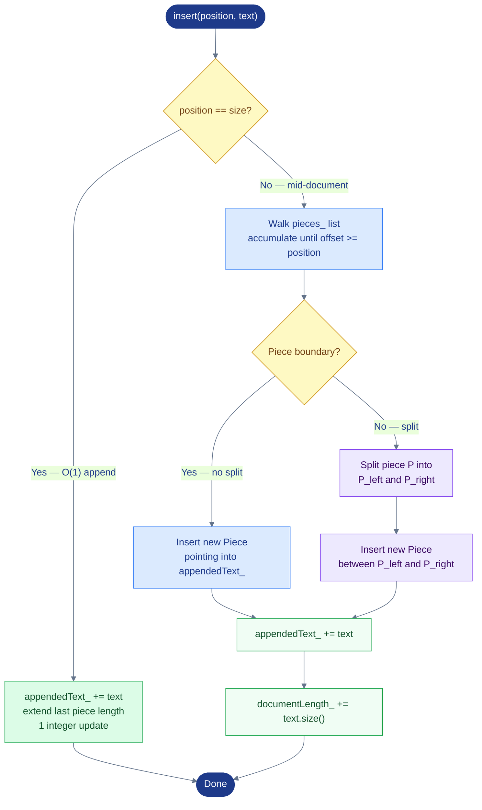
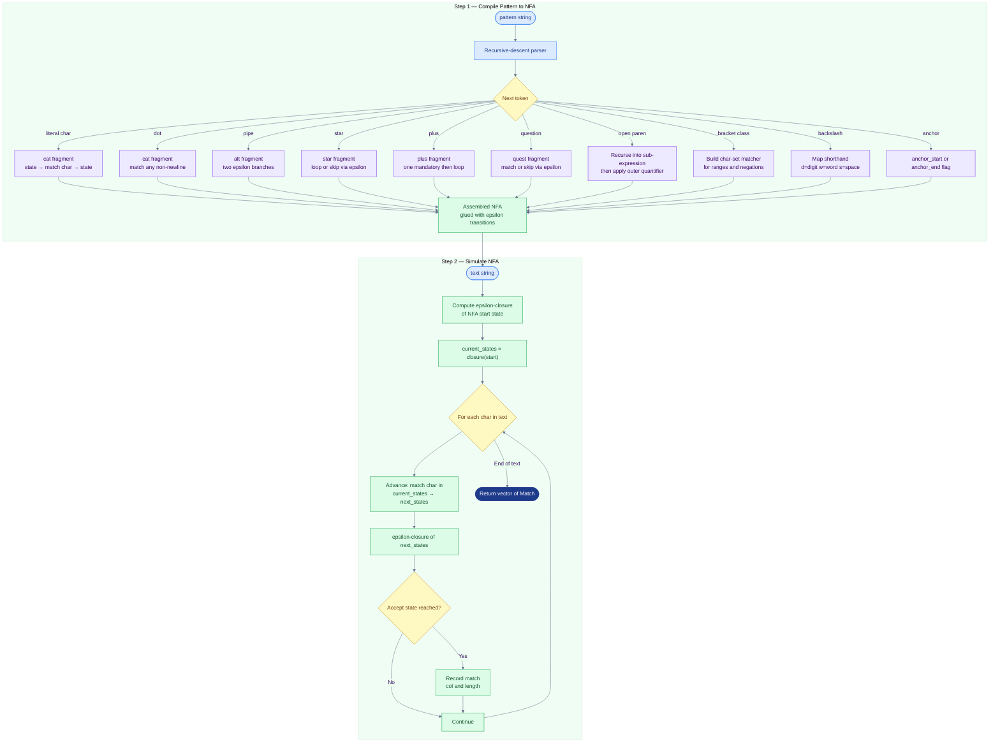
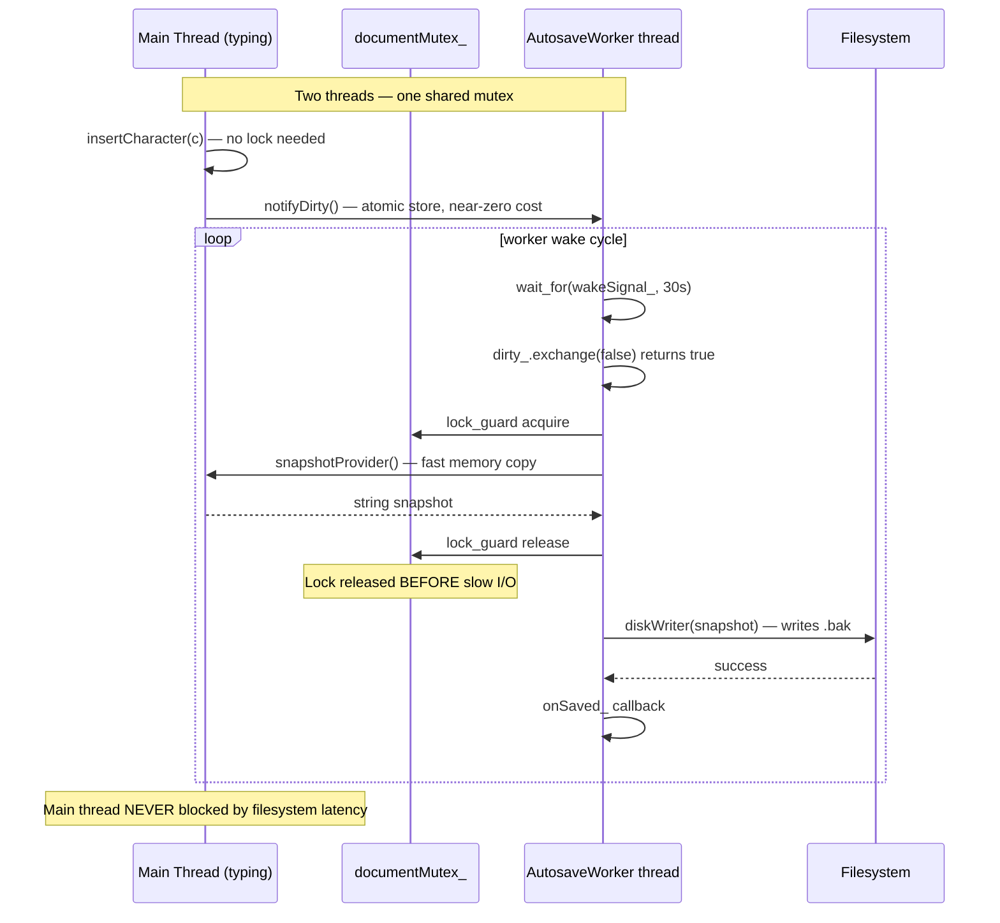
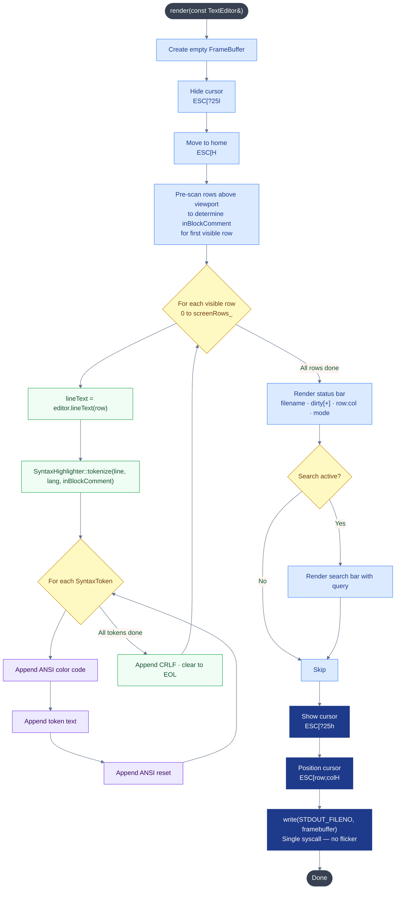
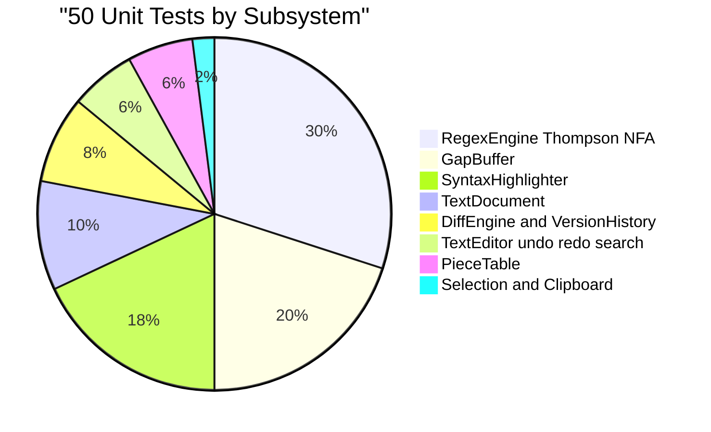
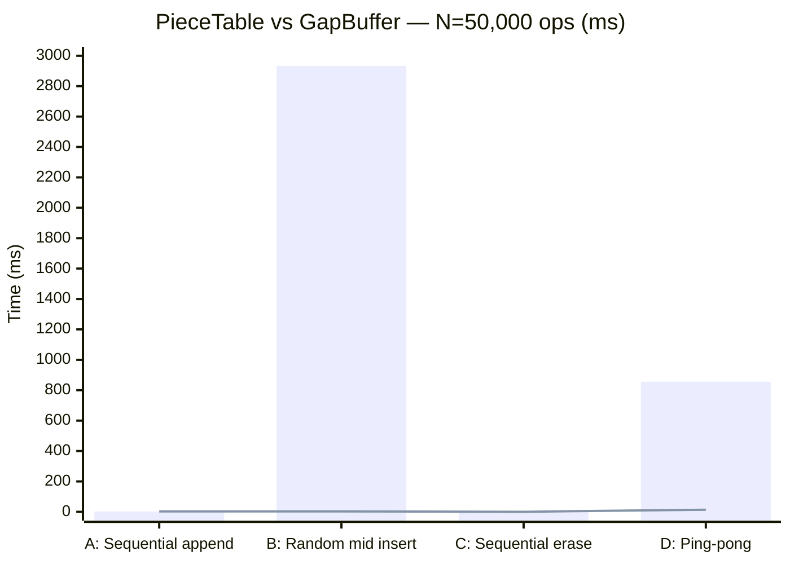

# PieceTable Editor

> A high-performance, feature-complete terminal text editor built from scratch in modern C++17 — no external dependencies, no runtime libraries, no shortcuts.

<div align="center">

[](LICENSE)
[](https://en.cppreference.com/w/cpp/17)
[](Makefile)
[](tests/tests.cpp)
[](#build--run)
[](#build--run)
[](#memory-safety)
[](#build--run)
[](#6-background-autosave--concurrency-design)
[](CONTRIBUTING.md)
[](CHANGELOG.md)
[](CITATION.cff)

</div>

---

Every component was engineered deliberately: algorithmic trade-offs are documented, benchmarked, and justified; every class has a single clearly-defined responsibility enforced by the type system; and the concurrency model is explicit about what is shared and what is not.

---

## Table of Contents

1. [Features](#features)
2. [Project Structure](#project-structure)
3. [Architecture](#architecture)
4. [Component Reference](#component-reference)
5. [Engineering Design Notes](#engineering-design-notes)
6. [Tests & Performance](#tests--performance)
7. [Keybindings](#keybindings)
8. [Build & Run](#build--run)
9. [Memory Safety](#memory-safety)
10. [Community & Contributing](#community--contributing)
11. [Changelog](#changelog)
12. [Citation](#citation)
13. [License](#license)

---

## Features

| Category | Capability |
|---|---|
| **File I/O** | Open, edit, and save any plain-text or source-code file; `Ctrl+A` prompts for a new filename |
| **Undo / Redo** | Per-keystroke undo/redo via the Command pattern — O(edit) memory, not O(document) |
| **Incremental search** | Live match highlighting across every visible line as you type (`Ctrl+F`) |
| **Regex search** | Toggle with `Ctrl+R`; Thompson NFA — O(|pattern|×|text|) worst-case, no catastrophic backtracking |
| **Syntax highlighting** | C, C++, and Python: keywords, strings, line/block comments, preprocessor directives, numbers |
| **Selection & clipboard** | Mark a range with `Ctrl+Space`; copy/cut/paste across line boundaries via offset-based range API |
| **Version history** | Every save snapshotted with a `std::time_t` timestamp; `Ctrl+D` shows LCS diff since the last save |
| **Background autosave** | Dedicated `std::thread`; disk write happens **after** mutex release — zero typing latency impact |
| **Dirty tracking** | FNV-based content hash — the editor knows precisely whether anything changed since the last save |
| **Viewport scrolling** | Soft-wrapped viewport follows the cursor; terminal resize handled via `SIGWINCH` |
| **Flicker-free rendering** | Entire frame accumulated in a `FrameBuffer` and flushed in a single `write()` syscall |
| **No external deps** | Zero dependencies beyond the C++17 standard library and POSIX |

---

## Project Structure

```
piecetable-editor/
│
├── include/                      # One header per class / module
│   ├── AutosaveWorker.hpp        #   Background autosave thread (condition variable wake)
│   ├── Clipboard.hpp             #   In-process single-slot string store
│   ├── DiffEngine.hpp            #   O(n·m) LCS line diff; DiffOp / DiffLine types
│   ├── EditCommand.hpp           #   CursorOwner interface + abstract EditCommand + 4 concrete subclasses
│   ├── GapBuffer.hpp             #   Contiguous-array editor backend (benchmark comparator)
│   ├── InputHandler.hpp          #   Raw-byte → TextEditor call mapper (namespace, no state)
│   ├── PieceTable.hpp            #   Two-buffer piece-list text store; Piece / SourceBuffer types
│   ├── RegexEngine.hpp           #   Thompson NFA regex engine; Match type
│   ├── ScreenRenderer.hpp        #   ANSI escape emitter (namespace); FrameBuffer type
│   ├── Selection.hpp             #   Value-type selection (anchor + active + normalized())
│   ├── SyntaxHighlighter.hpp     #   Stateless per-line tokenizer; TokenType / SyntaxToken / Language
│   ├── Terminal.hpp              #   POSIX raw mode + SIGWINCH (namespace, no state)
│   ├── TextDocument.hpp          #   Row/col abstraction + incremental lineStarts_ vector
│   ├── TextEditor.hpp            #   Orchestrator; CursorOwner impl; all editor state
│   ├── UndoRedoStack.hpp         #   Two std::vector<unique_ptr<EditCommand>> stacks
│   └── VersionHistory.hpp        #   Full-snapshot history; Snapshot struct with savedAt timestamp
│
├── src/                          # Implementations (one .cpp per .hpp)
│   ├── AutosaveWorker.cpp
│   ├── DiffEngine.cpp
│   ├── EditCommand.cpp
│   ├── GapBuffer.cpp
│   ├── InputHandler.cpp
│   ├── PieceTable.cpp
│   ├── RegexEngine.cpp           # ~400 lines: NFA parser + simulator
│   ├── ScreenRenderer.cpp        # ~330 lines: syntax-aware ANSI frame builder
│   ├── SyntaxHighlighter.cpp     # ~280 lines: C/C++/Python tokenizer
│   ├── Terminal.cpp
│   ├── TextDocument.cpp
│   ├── TextEditor.cpp            # ~560 lines: all editor operations
│   ├── UndoRedoStack.cpp
│   ├── VersionHistory.cpp
│   └── main.cpp                  # 18 lines: raw mode, SIGWINCH, openFile, run()
│
├── tests/
│   └── tests.cpp                 # 660 lines: 50 unit tests + benchmark harness
│
├── Makefile
├── CHANGELOG.md
├── CITATION.cff
├── CODE_OF_CONDUCT.md
├── CONTRIBUTING.md
├── LICENSE
├── SECURITY.md
└── SUPPORT.md
```

**Source-file sizes at a glance:**

| File | Size |
|---|---|
| `src/RegexEngine.cpp` | ~12.6 KB |
| `src/TextEditor.cpp` | ~17.8 KB |
| `src/ScreenRenderer.cpp` | ~10.5 KB |
| `src/SyntaxHighlighter.cpp` | ~8.8 KB |
| `src/InputHandler.cpp` | ~4.8 KB |
| `src/PieceTable.cpp` | ~6.9 KB |
| `src/GapBuffer.cpp` | ~3.7 KB |
| `tests/tests.cpp` | ~24.2 KB |

---

## Architecture

The three top-level boundaries are enforced by the **type system**, not convention:

- `ScreenRenderer::render` takes `const TextEditor&` — the compiler rejects any write.
- `InputHandler` has no `FrameBuffer` in scope — it structurally cannot emit output.

### Diagram 1 — Component Architecture



### Diagram 2 — Full Class Hierarchy



### Diagram 3 — Data Model (ER)



**Editor lifecycle — from launch to quit:**

| Phase | Event | Details |
|---|---|---|
| **Startup** | Terminal raw mode enabled | `enableRawMode()` saves `termios`; `SIGWINCH` handler registered |
| | File opened | `PieceTable` loads `originalText_`; `lineStarts_` built by full scan (once); `savedContentHash_` computed |
| | AutosaveWorker started | `std::thread` launched; `condition_variable` initialized; 30-second timer begins |
| **Interactive Editing** | First frame rendered | `ScreenRenderer` builds `FrameBuffer`; single `write()` syscall flushes frame |
| | Character typed | `InputHandler` reads raw byte; `InsertCharCommand` pushed to undo stack; `lineStarts_` shifted O(lines after cursor); `notifyDirty()` flips atomic flag |
| | `Ctrl+S` Save | File written to disk; `Snapshot{savedAt, content}` recorded; `savedContentHash_` updated |
| | Autosave fires | Worker wakes after 30 s; mutex locked → text copied → mutex released; `.bak` written **after** mutex release |
| | `Ctrl+Z` Undo | `EditCommand::undo()` reverses edit; cursor restored to `CursorPos before_` |
| | `Ctrl+F` Search | `refreshMatches()` called per keystroke; `RegexEngine::findAll()` if regex mode |
| | `Ctrl+D` Diff | `DiffEngine::diffLines()` over saved snapshot; LCS DP O(n×m) over line vectors |
| **Shutdown** | `Ctrl+Q` pressed | `QuitPrompt` shown if `dirty_ == true` |
| | User confirms | `AutosaveWorker::stop()` joins thread; `disableRawMode()` restores `termios`; process exits |

### Diagram 4 — Editor Mode State Machine



---

## Component Reference

### PieceTable

`include/PieceTable.hpp` · `src/PieceTable.cpp`

The same technique used by VS Code and Atom. Two immutable-ish backing buffers plus an ordered list of `Piece` values; editing means editing the list, not copying characters.

**Types:**
```cpp
enum class SourceBuffer { Original, Appended };

struct Piece {
    SourceBuffer source;
    size_t offset;   // start offset within the source buffer
    size_t length;   // number of characters this piece contributes
};
```

**Public API:**
```cpp
class PieceTable {
public:
    void        loadFromFile(const std::string& filePath);
    void        insert(size_t position, const std::string& text);
    void        erase(size_t position, size_t length);
    std::string text()                              const;
    size_t      size()                              const;
    char        charAt(size_t index)                const;
    std::string substring(size_t start, size_t len) const;
};
```

### Diagram 5 — PieceTable Insert Algorithm



---

### GapBuffer

`include/GapBuffer.hpp` · `src/GapBuffer.cpp`

Not used at runtime. Implemented as a benchmark comparator. `kDefaultGap = 1 << 12` (4 KB).

**Physical layout:**
```
[ pre-gap text (gapStart_ bytes) ] [ gap — 4KB unused capacity ] [ post-gap text ]
```

**Complexity:**

| Operation | Cost |
|---|---|
| Insert at gap | O(k) amortized — no memory movement |
| Insert elsewhere | O(dist_to_gap) reposition + O(k) copy |
| Erase at gap | O(dist_to_gap) reposition, then O(1) |
| `charAt` / `text()` | O(1) / O(n) |

**Public API** (mirrors `PieceTable` for transparent swap):
```cpp
class GapBuffer {
public:
    void        insert(size_t position, const std::string& text);
    void        erase(size_t position, size_t length);
    std::string text()                              const;
    size_t      size()                              const;
    char        charAt(size_t index)                const;
    std::string substring(size_t start, size_t len) const;
};
```

---

### TextDocument

`include/TextDocument.hpp` · `src/TextDocument.cpp`

Row/column abstraction over `PieceTable`. The key contribution: **incremental `lineStarts_` maintenance** — no full rescan per keystroke.

**Incremental update cost:**

| Edit | Cost |
|---|---|
| Insert non-`\n` character | O(lines after cursor) |
| Insert `\n` | O(lines after cursor) |
| Backspace at column 0 (merge) | O(lines after cursor) |
| Multi-line paste / cut | O(total lines) — full rescan (rare) |

**Public API:**
```cpp
class TextDocument {
public:
    int         lineCount()                                        const;
    std::string lineText(int row)                                  const;
    int         lineLength(int row)                                const;
    std::string fullText()                                         const;
    void        appendLine(const std::string& text);
    void        insertChar(int row, int col, char c);
    void        deleteChar(int row, int col);
    void        insertNewline(int row, int splitCol);
    void        mergeWithNextLine(int row);
    size_t      toOffset(int row, int col)                         const;
    std::string textInRange(size_t startOffset, size_t endOffset)  const;
    void        eraseRange(size_t startOffset, size_t endOffset);
    void        insertAt(size_t offset, const std::string& text);
    void        replaceAllText(const std::string& newText);
};
```

---

### EditCommand Hierarchy

`include/EditCommand.hpp` · `src/EditCommand.cpp`

> Command subclasses depend only on `CursorOwner` and `TextDocument&`. They cannot reach into search state, clipboard, autosave, or any other editor concern. Adding a new command type requires **zero changes to `TextEditor`**.

**Interfaces:**
```cpp
class CursorOwner {
public:
    virtual void setCursor(int col, int row) = 0;
};

struct CursorPos { int col, row; };

class EditCommand {
public:
    virtual void undo() = 0;
    virtual void redo() = 0;
};
```

**Concrete subclasses:**

| Class | Records | Undo action |
|---|---|---|
| `InsertCharCommand` | `(row, col, char, before, after)` | Delete `char`; restore `before` cursor |
| `DeleteCharCommand` | `(row, col, deletedChar, before, after)` | Re-insert `deletedChar`; restore `before` cursor |
| `MergeLinesCommand` | `(row, prevLineLength, before, after)` | Re-split the merged line; restore `before` cursor |
| `InsertNewlineCommand` | `(row, splitColumn, before, after)` | Merge the two lines back; restore `before` cursor |

---

### UndoRedoStack

`include/UndoRedoStack.hpp` · `src/UndoRedoStack.cpp`

Uses `std::vector<std::unique_ptr<EditCommand>>` (not `std::stack`) for both stacks, giving `reserve` semantics. Pushing a new command clears the redo stack.

```cpp
class UndoRedoStack {
public:
    void push(std::unique_ptr<EditCommand> command);
    void undo();
    void redo();
    bool canUndo() const;
    bool canRedo() const;
};
```

---

### Selection

`include/Selection.hpp`

A pure value type — no virtual methods, no editor logic. `normalized()` handles backward selections.

```cpp
struct Selection {
    bool active = false;
    int anchorRow = 0, anchorCol = 0;
    int activeRow = 0, activeCol = 0;

    void clear();
    void begin(int row, int col);
    void moveTo(int row, int col);
    bool isEmpty() const;
    void normalized(int& startRow, int& startCol,
                    int& endRow,   int& endCol) const;
};
```

---

### Clipboard

`include/Clipboard.hpp`

In-process single-slot store. OS clipboard integration (`xclip`/`pbcopy`) would be added here.

```cpp
class Clipboard {
public:
    void              set(const std::string& text);
    const std::string& contents() const;
    bool              empty()     const;
};
```

---

### DiffEngine

`include/DiffEngine.hpp` · `src/DiffEngine.cpp`

O(n·m) LCS dynamic program over `std::vector<std::string>` of lines.

```cpp
enum class DiffOp { Unchanged, Added, Removed };
struct DiffLine { DiffOp op; std::string text; };

class DiffEngine {
public:
    static std::vector<DiffLine> diffLines(
        const std::vector<std::string>& oldLines,
        const std::vector<std::string>& newLines);
    static std::vector<std::string> splitIntoLines(const std::string& text);
};
```

---

### VersionHistory

`include/VersionHistory.hpp` · `src/VersionHistory.cpp`

Full-text snapshots per save. `diffBetween` enables arbitrary historical comparisons.

```cpp
struct Snapshot {
    std::time_t savedAt;
    std::string content;
};

class VersionHistory {
public:
    void                   recordSnapshot(const std::string& content);
    size_t                 snapshotCount()              const;
    const Snapshot&        snapshotAt(size_t index)     const;
    bool                   hasHistory()                 const;
    std::vector<DiffLine>  diffAgainstLatest(const std::string& current) const;
    std::vector<DiffLine>  diffBetween(size_t older, size_t newer)       const;
};
```

---

### SyntaxHighlighter

`include/SyntaxHighlighter.hpp` · `src/SyntaxHighlighter.cpp`

Stateless per-line tokenizer. The caller (`ScreenRenderer`) threads `inBlockComment` state across rows.

```cpp
enum class TokenType { Normal, Keyword, Preprocessor, String, Number, Comment };

struct SyntaxToken {
    int start;    // 0-indexed column
    int length;
    TokenType type;
};

class SyntaxHighlighter {
public:
    enum class Language { None, Cpp, Python };
    static Language         fromFilename(const std::string& filename);
    static std::vector<SyntaxToken> tokenize(const std::string& line,
                                             Language lang,
                                             bool& inBlockComment);
    static const char*      ansiColor(TokenType type);
};
```

| Language | Extensions |
|---|---|
| `Cpp` | `.cpp` `.cc` `.cxx` `.hpp` `.hxx` `.h` `.c` |
| `Python` | `.py` |
| `None` | anything else |

---

### RegexEngine

`include/RegexEngine.hpp` · `src/RegexEngine.cpp`

Thompson NFA construction + simulation. Guarantees O(|pattern| × |text|) worst-case.

```cpp
struct Match { int col; int length; };

class RegexEngine {
public:
    static std::vector<Match> findAll(const std::string& pattern,
                                      const std::string& text);
    static bool isValid(const std::string& pattern);
};
```

| Syntax | Meaning |
|---|---|
| `.` | Any character except newline |
| `*` `+` `?` | Greedy quantifiers |
| `\|` | Alternation |
| `(...)` | Grouping |
| `[abc]` `[a-z]` `[^abc]` | Character classes |
| `^` `$` | Start/end anchors |
| `\d` `\w` `\s` | Shorthands; `\D \W \S` negated |

### Diagram 6 — Thompson NFA Compile & Simulate



> Reference: Russ Cox — *"Regular Expression Matching Can Be Simple And Fast"* — <https://swtch.com/~rsc/regexp/regexp1.html>

---

### AutosaveWorker

`include/AutosaveWorker.hpp` · `src/AutosaveWorker.cpp`

**Concurrency primitives:**

| Primitive | Purpose |
|---|---|
| `documentMutex_` (ref) | Guards document during snapshot copy |
| `running_` (`atomic<bool>`) | Stop signal from `stop()` |
| `dirty_` (`atomic<bool>`) | Flip from `notifyDirty()` — cost ≈ one atomic store |
| `wakeSignal_` (`condition_variable`) | Wakes worker early when dirty |

**Injected callbacks:**
```cpp
using SnapshotProvider = std::function<std::string()>;    // called under lock
using DiskWriter       = std::function<bool(const std::string&)>; // called after unlock
using SaveNotifier     = std::function<void(const std::string&)>; // on success
```

**Constructor:**
```cpp
AutosaveWorker(std::mutex& documentMutex,
               SnapshotProvider snapshotProvider,
               DiskWriter diskWriter,
               SaveNotifier onSaved,
               std::chrono::seconds interval = std::chrono::seconds(10));
```

### Diagram 7 — Autosave Concurrency



---

### Terminal

`include/Terminal.hpp` · `src/Terminal.cpp`

Free functions with no state beyond the saved `termios` struct.

```cpp
namespace Terminal {
    void enableRawMode();
    void disableRawMode();
    int  windowSize(int& rows, int& cols);
    void clearScreen();
    void moveCursorTo(int row, int col);
    int  cursorPosition(int& row, int& col);
}
```

---

### FrameBuffer & ScreenRenderer

`include/ScreenRenderer.hpp` · `src/ScreenRenderer.cpp`

```cpp
struct FrameBuffer {
    std::string data;
    void append(const char* s, size_t len);
    void appendStr(const std::string& s);
};

namespace ScreenRenderer {
    void render(const TextEditor& editor); // const — cannot mutate editor
}
```

### Diagram 8 — ScreenRenderer Frame Pipeline



---

### InputHandler

`include/InputHandler.hpp` · `src/InputHandler.cpp`

No state. Key bindings can change without touching any editing logic.

```cpp
namespace InputHandler {
    void processNextKeypress(TextEditor& editor);
}
```

---

### TextEditor

`include/TextEditor.hpp` · `src/TextEditor.cpp`

The orchestrator. Implements `CursorOwner`. Does not know how to draw or decode a keypress.

**Public API summary:**
```cpp
// Editing
void insertCharacter(char c);
void insertNewline();
void deleteCharacterBeforeCursor();
void undo();
void redo();

// Cursor
void moveCursorLeft(); void moveCursorRight();
void moveCursorUp();   void moveCursorDown();

// Selection / Clipboard
void beginSelection();
void extendSelectionTo(int row, int col);
void clearSelection();
void copySelectionToClipboard();
void cutSelectionToClipboard();
void pasteFromClipboard();

// File I/O
void save();   void saveAs();   void openFile(const std::string& path);

// Search
void beginSearch();   void findNext();   void findPrevious();
void toggleRegexSearch();

// Version history
void showVersionHistory();

// CursorOwner
void setCursor(int col, int row) override;
```

---

## Engineering Design Notes

### 1. Text Storage — Piece Table

**Data structures considered:**

| Structure | Insert | Memory | Notes |
|---|---|---|---|
| `std::string` / `std::vector<char>` | O(n) | Contiguous | Simple; slow for large files |
| Linked list of chars | O(1) insert | Fragmented | Cache-hostile; massive pointer overhead |
| **Piece Table** ✅ | O(1) amortized append; O(k) mid-doc | Low | Two buffers + piece list |
| Gap Buffer | O(k) at gap; O(n) to reposition | Contiguous | Fast sequential; slow random |
| Rope | O(log n) all ops | Tree nodes | Complex; justified at gigabyte scale only |

For sequential typing (dominant workload) Piece Table wins. No text is ever copied or moved on append — one integer update. `coalesceAdjacentPieces()` after each erase prevents unbounded piece-list growth.

---

### 2. Gap Buffer — Benchmark Comparator

The Gap Buffer stores text contiguously with a movable gap at the most recent edit point. Insert-at-gap is O(k) with no memory movement. Reposition-gap is O(distance) — exactly where Piece Table wins on sequential workloads.

---

### 3. TextDocument — Incremental Line Index

`lineStarts_` is updated incrementally — O(lines after cursor) per single-character edit, not O(file size). Only multi-line range operations fall back to a full rescan; they are rare enough that the added complexity of an incremental path is not worthwhile.

---

### 4. Undo / Redo — Command Pattern

Each `EditCommand` stores `CursorPos before_` and `CursorPos after_` so both `undo()` and `redo()` restore the cursor precisely without any additional editor state access. Command subclasses depend on **only** `TextDocument&` and `CursorOwner` — they cannot reach into search state, clipboard, or autosave.

---

### 5. Rendering, Input, Editing — Separated by Type

| Class / namespace | Type constraint | Cannot |
|---|---|---|
| `TextEditor` | Owns all mutable state | Emit ANSI codes; decode raw bytes |
| `ScreenRenderer` | `const TextEditor&` | Mutate the document — compiler rejects it |
| `InputHandler` | `TextEditor&` (write path only) | Access `FrameBuffer`; render anything |

`ScreenRenderer` accumulates ANSI sequences in a `FrameBuffer` and flushes in a **single `write()` syscall** — partial frames never appear on screen.

---

### 6. Background Autosave — Concurrency Design

The critical invariant: `documentMutex_` is held **only** long enough to call `snapshotProvider()` (a fast in-memory copy). The actual `diskWriter()` call happens after the mutex is released. The main thread is **never** blocked by filesystem latency.

---

### 7. Selection and Clipboard

`Selection::normalized()` handles backward selections so callers never need to think about direction. Copy/cut/paste use `TextDocument`'s offset-based range API — multi-line selections work without row-by-row special-casing. `Clipboard` is a single-slot in-process store; OS clipboard integration is a localized change.

---

### 8. Version History and Diff Engine

`DiffEngine` uses the O(n·m) LCS DP rather than Myers' O(ND) — simpler and perfectly adequate at editor-buffer scale. `VersionHistory` stores full-text `Snapshot` objects with `savedAt` timestamps. `diffBetween(older, newer)` enables arbitrary historical comparisons.

---

### 9. Syntax Highlighting

**Stateless per-line API** — `ScreenRenderer` holds `bool inBlockComment` and passes it by reference. Trivially thread-safe. Python triple-quoted strings are deliberately not tracked (cross-line state without proportional benefit). Token coverage is guaranteed: no gaps, no overlaps — verified by `test_syntax_tokens_cover_entire_line`.

---

### 10. Regex Engine — Thompson NFA

`std::regex` uses recursive backtracking — certain patterns cause O(2^n) behaviour, unacceptable for a search-as-you-type UI. The Thompson NFA maintains the **epsilon-closure set** of active states; advancing the entire set per input character guarantees O(|pattern| × |text|) with no catastrophic backtracking.

---

## Tests & Performance

### Unit Tests — 50 / 50 Passing

### Diagram 9 — Test Distribution



#### PieceTable — 3 tests

| Test | Verifies |
|---|---|
| `test_piece_table_insert` | Sequential insert at two offsets builds `"Hello World"` |
| `test_piece_table_erase` | `erase(5,1)` on `"Hello World"` yields `"HelloWorld"` |
| `test_piece_table_midstream_insert_and_erase` | Mid-document split + erase: `ACE` → `ABCDE` → `ABE` |

#### GapBuffer — 10 tests

| Test | Verifies |
|---|---|
| `test_gapbuffer_append_sequential` | Character-by-character sequential append |
| `test_gapbuffer_insert_at_beginning` | Front-of-buffer insert |
| `test_gapbuffer_insert_in_middle` | Mid-buffer insert (`ACE` → `ABCDE`) |
| `test_gapbuffer_erase_front` | `erase(0,6)` on `"Hello World"` yields `"World"` |
| `test_gapbuffer_erase_middle` | `erase(5,1)` removes the space |
| `test_gapbuffer_erase_then_insert` | `"aXb"` → erase `X` → insert `c` → `"acb"` |
| `test_gapbuffer_charAt` | `charAt(0)=='H'`, `charAt(4)=='o'` |
| `test_gapbuffer_size` | Size tracks insert and erase correctly |
| `test_gapbuffer_empty_string_insert` | `insert(0,"")` must not crash or change state |
| `test_gapbuffer_insert_past_end` | Index 9999 clamps to end: `"abc"` → `"abcX"` |

#### TextDocument — 5 tests

| Test | Verifies |
|---|---|
| `test_document_insert_char` | `insertChar(0,5,'!')` appends `!` to line 0 |
| `test_document_newline_split` | `insertNewline(0,5)` on `"HelloWorld"` → `"Hello"` / `"World"` |
| `test_document_merge_lines` | `mergeWithNextLine(0)` on two lines → one merged line |
| `test_document_line_starts_stay_correct_after_many_edits` | `lineStarts_` invariant after mixed inserts and merges |
| `test_row_col_to_offset` | `toOffset(1,2)` returns `6` for `"abc\ndef"` |

#### TextEditor — 3 tests

| Test | Verifies |
|---|---|
| `test_undo_insert` | Two inserts then two undos restores empty buffer |
| `test_undo_then_redo` | Undo then redo restores both characters |
| `test_search_finds_all_matches` | Literal search finds both occurrences of `"world"` across two lines |

#### DiffEngine / VersionHistory — 4 tests

| Test | Verifies |
|---|---|
| `test_diff_detects_pure_addition` | `Added` count == 1 when one line appended |
| `test_diff_detects_pure_removal` | `Removed` count == 1 when one line deleted |
| `test_diff_identical_inputs_are_all_unchanged` | All 3 entries `Unchanged` on identical inputs |
| `test_version_history_diff_against_latest` | Returns 1 `Added` for an appended third line |

#### Selection / Clipboard — 1 test

| Test | Verifies |
|---|---|
| `test_copy_paste_round_trip` | Copy first 5 chars, paste; first 5 chars of result match `"hello"` |

#### SyntaxHighlighter — 9 tests

| Test | Verifies |
|---|---|
| `test_syntax_cpp_keyword` | `int` in `"int main() {"` → `Keyword` |
| `test_syntax_cpp_line_comment` | `//` comment → `Comment` token |
| `test_syntax_cpp_block_comment_span` | `inBlockComment` true after unclosed `/*`; next line all `Comment` |
| `test_syntax_cpp_string_literal` | `"hello"` → `String` token |
| `test_syntax_cpp_preprocessor` | `#include <vector>` → single `Preprocessor` token |
| `test_syntax_python_keyword` | `def` in Python mode → `Keyword` |
| `test_syntax_none_language_passthrough` | `Language::None` covers entire line as `Normal` |
| `test_syntax_tokens_cover_entire_line` | Token lengths sum exactly to `line.size()` |
| `test_syntax_language_detection` | `.cpp`→Cpp, `.hpp`→Cpp, `.py`→Python, `.md`→None |

#### RegexEngine — 15 tests

| Test | Pattern | Input | Expected |
|---|---|---|---|
| `test_regex_literal_match` | `hello` | `"say hello world"` | col=4, len=5 |
| `test_regex_dot_star` | `a.*b` | `"xafoob"` | col=1, len=5 |
| `test_regex_plus_quantifier` | `a+` | `"baaac"` | col=1, len=3 |
| `test_regex_question_quantifier` | `colou?r` | `"The colour and the color"` | 2 matches |
| `test_regex_alternation` | `cat\|dog` | `"I have a cat and a dog"` | 2 matches |
| `test_regex_character_class` | `[0-9]+` | `"abc 42 and 007"` | 2 matches: len 2, len 3 |
| `test_regex_negated_class` | `[^aeiou ]+` | `"cat"` | non-empty match set |
| `test_regex_digit_shorthand` | `\d+` | `"score: 1234 and 56"` | 2 matches: len 4, len 2 |
| `test_regex_word_shorthand` | `\w+` | `"hello world"` | 2 matches |
| `test_regex_no_match` | `xyz` | `"hello world"` | empty vector |
| `test_regex_anchored_start` | `^hello` | `"hello world"` | col=0; `^world` → empty |
| `test_regex_anchored_end` | `world$` | `"hello world"` | 1 match; `hello$` → empty |
| `test_regex_grouping` | `(ab)+` | `"ababab"` | col=0, len=6 |
| `test_regex_validity_check` | `a+b`, `[a-z]+`, `""` | — | all `isValid() == true` |
| `test_regex_string_empty` | `abc` | `""` | empty vector |

---

### Performance Benchmarks

**Setup:** N=50,000 operations each · WSL2 · `g++ -O2` · `std::chrono::high_resolution_clock`. Winner declared when ≥10% faster.

### Diagram 10 — Benchmark Results



> **Bar = PieceTable · Line = GapBuffer** · Lower is faster. Scenario B: PieceTable 2,933 ms vs GapBuffer 2.75 ms (×1,000 slower) — the Y-axis compresses this visually.

| Scenario | PieceTable | GapBuffer | Winner |
|---|---:|---:|---|
| A: Sequential append (cursor always at end) | 2.38 ms | 2.78 ms | **PieceTable** |
| B: Random mid-document insert | 2,933 ms | 2.75 ms | **GapBuffer ×1,000×** |
| C: Sequential erase from front | 2.56 ms | 0.33 ms | **GapBuffer ×8×** |
| D: Alternating front/back insert (ping-pong) | 856 ms | 13.84 ms | **GapBuffer ×62×** |

**Conclusion:** sequential typing (Scenario A) is the dominant workload. Piece Table is the correct choice — no text is ever copied or moved on append.

---

## Keybindings

| Key | Action |
|---|---|
| Arrow keys | Move cursor (bounds-checked) |
| `Enter` | Insert newline |
| `Backspace` | Delete before cursor; merges lines at column 0 |
| `Ctrl+Z` | Undo |
| `Ctrl+Y` | Redo |
| `Ctrl+F` | Open incremental search |
| `Ctrl+R` | Toggle regex search mode (`[regex]` in status bar) |
| `Ctrl+N` | Next search match |
| `Ctrl+B` | Previous search match |
| `Ctrl+Space` | Begin / anchor selection |
| `Ctrl+C` | Copy selection |
| `Ctrl+X` | Cut selection |
| `Ctrl+V` | Paste from clipboard |
| `Ctrl+D` | Show LCS diff vs. last save |
| `Ctrl+S` | Save |
| `Ctrl+A` | Save as |
| `Ctrl+Q` | Quit (prompts if unsaved) |

---

## Build & Run

**Requirements:** Linux or WSL2 · `g++ ≥ 10` · `make`

```bash
git clone https://github.com/PRADEEPERIYASAMY/piecetable-editor.git
cd piecetable-editor

make               # build editor binary
./editor file.cpp  # open a file
./editor           # open with no file — name later with Ctrl+A
make test          # run all 50 tests + benchmark
make debug         # build with ASan + UBSan
make clean
```

| Target | Effect |
|---|---|
| `make` / `make all` | Compile 14 modules + `main.cpp`, link `editor` binary |
| `make debug` | Rebuild with `-g -O0 -fsanitize=address,undefined` |
| `make test` | Compile `tests/tests.cpp`, run 50 unit tests + benchmarks |
| `make clean` | Remove `src/*.o`, `editor`, `tests/run_tests` |

---

## Memory Safety

```bash
make debug
./editor yourfile.cpp   # interactive under sanitizers
./tests/run_tests       # full suite under sanitizers
```

| Sanitizer | Catches |
|---|---|
| ASan | Use-after-free, heap/stack buffer overflows, uninitialized memory |
| UBSan | Signed integer overflow, invalid shifts, null dereference |

Both are especially valuable for `PieceTable` manual offset arithmetic, `RegexEngine` NFA state-set bookkeeping, and `AutosaveWorker` shared-state access. The full test suite passes cleanly with zero sanitizer errors.

---

## Community & Contributing

| Document | Purpose |
|---|---|
| [CONTRIBUTING.md](CONTRIBUTING.md) | Dev setup, coding standards, Conventional Commits, PR process |
| [CODE_OF_CONDUCT.md](CODE_OF_CONDUCT.md) | Contributor Covenant v2.1 and 4-tier enforcement |
| [SECURITY.md](SECURITY.md) | Private vulnerability reporting via GitHub Security Advisories |
| [SUPPORT.md](SUPPORT.md) | Where to get help, build failure checklist, out-of-scope items |
| [CHANGELOG.md](CHANGELOG.md) | Version history following [Keep a Changelog](https://keepachangelog.com) |
| [CITATION.cff](CITATION.cff) | CFF 1.2.0 citation metadata |

GitHub issue templates: [Bug Report](.github/ISSUE_TEMPLATE/bug_report.md) · [Feature Request](.github/ISSUE_TEMPLATE/feature_request.md) · [Pull Request Template](.github/PULL_REQUEST_TEMPLATE.md)

---

## Changelog

All notable changes to this project are documented in [CHANGELOG.md](CHANGELOG.md), following the [Keep a Changelog](https://keepachangelog.com/en/1.0.0/) format and [Semantic Versioning](https://semver.org/).

---

## Citation

If you use this project in academic work, please cite it as:

```bibtex
@software{eriyasamy2025piecetable,
  author    = {Eriyasamy, Pradeep},
  title     = {PieceTable Editor — A High-Performance C++ Terminal Editor},
  year      = {2025},
  url       = {https://github.com/PRADEEPERIYASAMY/piecetable-editor},
  license   = {MIT}
}
```

Full machine-readable metadata is available in [CITATION.cff](CITATION.cff) (CFF 1.2.0).

---

## License

Distributed under the **MIT License**. See [LICENSE](LICENSE) for the full text.

You are free to use, copy, modify, merge, publish, distribute, sublicense, and/or sell copies of this software, provided the original copyright notice and permission notice appear in all copies.

---

## Security

To report a vulnerability privately, please use [GitHub Security Advisories](https://github.com/PRADEEPERIYASAMY/piecetable-editor/security/advisories/new). See [SECURITY.md](SECURITY.md) for the full disclosure policy.

---

## Support

For questions and build help, see [SUPPORT.md](SUPPORT.md) or open a [GitHub Discussion](https://github.com/PRADEEPERIYASAMY/piecetable-editor/discussions).

---

<div align="center">

**Made with ❤️ by [Pradeep Eriyasamy](https://github.com/PRADEEPERIYASAMY)**

*Built from scratch · No dependencies · Pure C++17*

[](LICENSE)
[](https://en.cppreference.com/w/cpp/17)
[](CONTRIBUTING.md)

</div>
