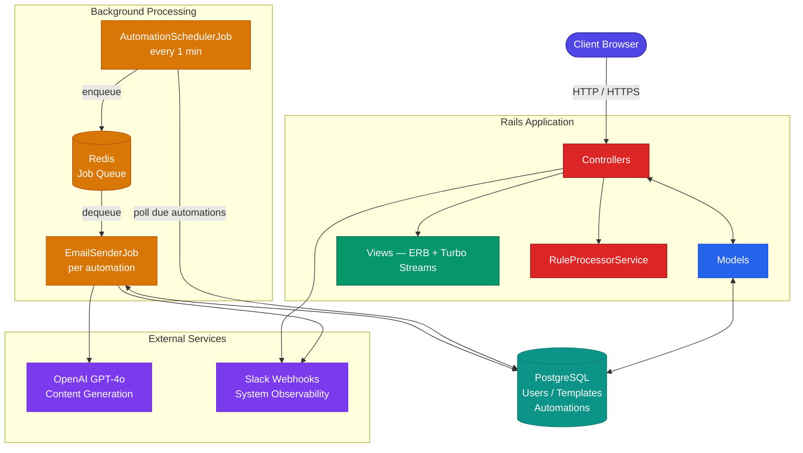
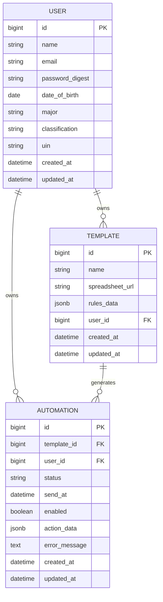
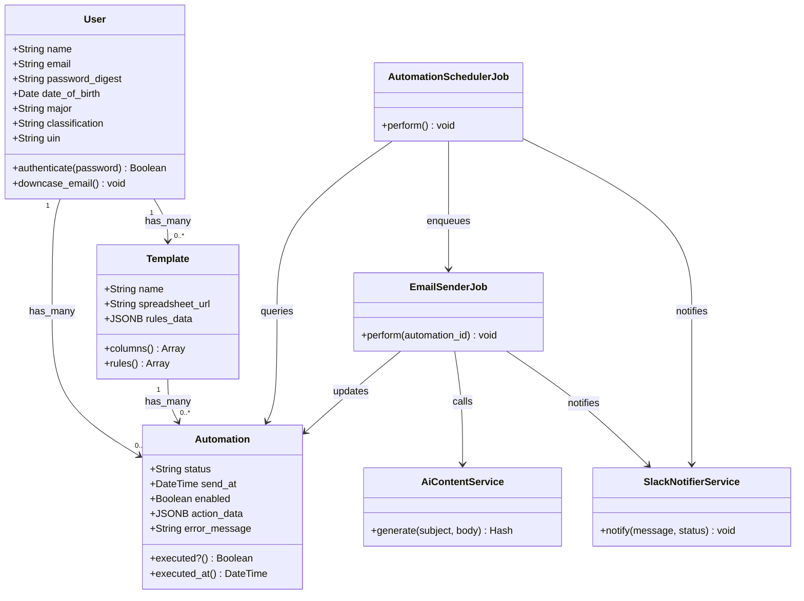
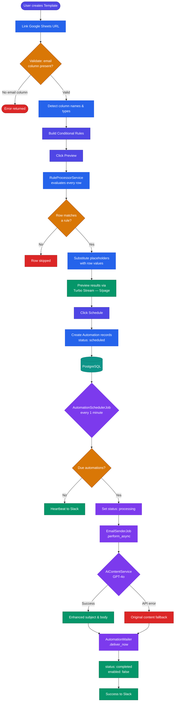
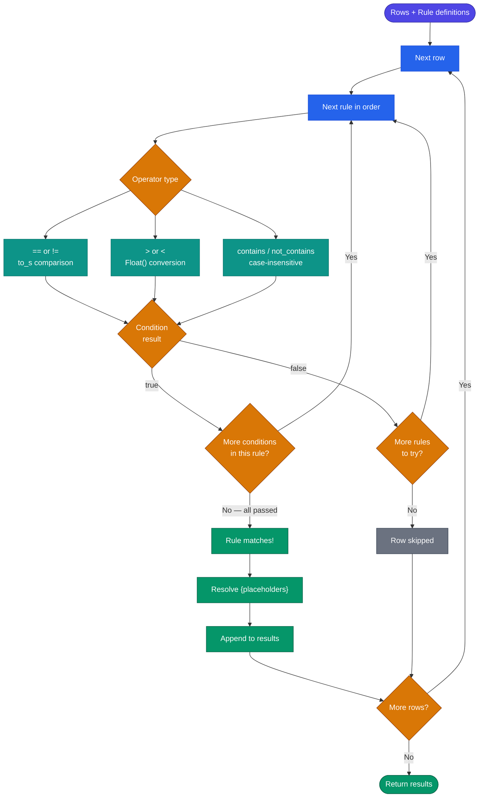
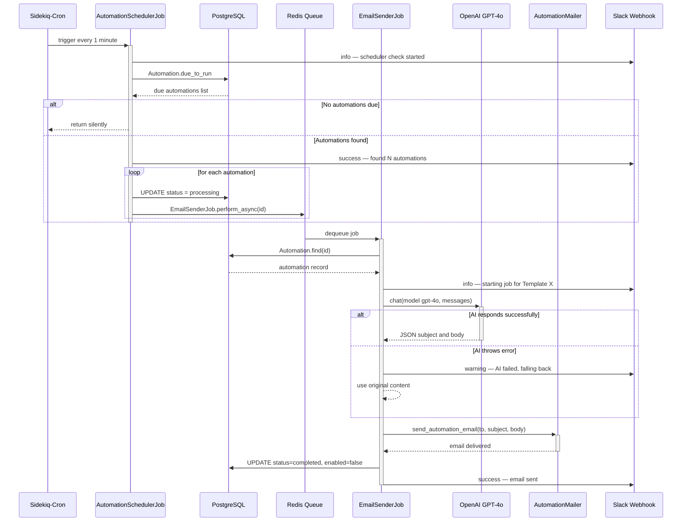
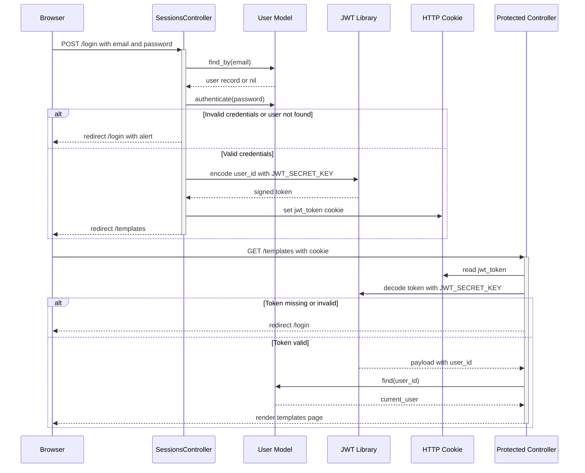
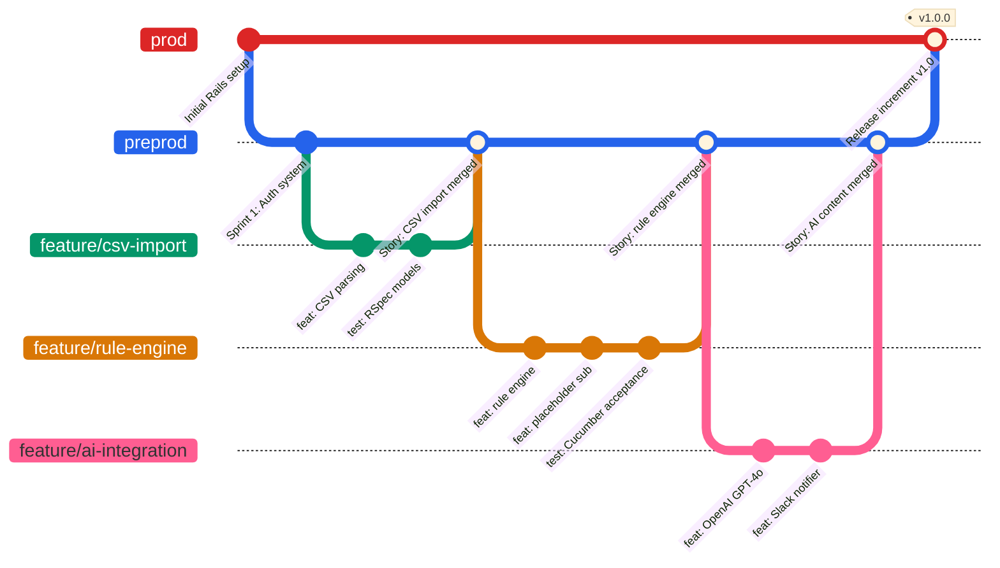

<div align="center">

# ZapMail

### Intelligent Bulk Email Automation for Universities

[](https://www.ruby-lang.org/)
[](https://rubyonrails.org/)
[](https://www.postgresql.org/)
[](https://redis.io/)
[](https://platform.openai.com/)

[](https://github.com/TAMUCSCE-606-Zapmail/ZapMail/actions/workflows/ci.yml)
[](https://github.com/rails/rubocop-rails-omakase)
[](LICENSE)
[](https://zapmail-pradeep-a162d897f0b7.herokuapp.com/)
[](CONTRIBUTING.md)

**[Live Demo](https://zapmail-pradeep-a162d897f0b7.herokuapp.com/) · [User Guide](docs/user_guide.md) · [Technical Docs](docs/technical_documentation.md) · [Report Bug](https://github.com/TAMUCSCE-606-Zapmail/ZapMail/issues/new?template=bug_report.md) · [Request Feature](https://github.com/TAMUCSCE-606-Zapmail/ZapMail/issues/new?template=feature_request.md)**

</div>

---

## Table of Contents

- [Overview](#overview)
- [Key Features](#key-features)
- [Architecture](#architecture)
- [Database Schema](#database-schema)
- [Tech Stack](#tech-stack)
- [Getting Started](#getting-started)
  - [Prerequisites](#prerequisites)
  - [Installation](#installation)
  - [Environment Variables](#environment-variables)
  - [Running Locally](#running-locally)
- [How It Works](#how-it-works)
  - [End-to-End Email Workflow](#end-to-end-email-workflow)
  - [Rule Engine](#rule-engine)
  - [Placeholder Substitution](#placeholder-substitution)
  - [Background Jobs](#background-jobs)
  - [AI Content Generation](#ai-content-generation)
  - [Slack Notifications](#slack-notifications)
  - [Authentication and Session Management](#authentication-and-session-management)
- [Application Routes](#application-routes)
- [Testing](#testing)
- [Deployment](#deployment)
- [Project Structure](#project-structure)
- [Repository Documentation](#repository-documentation)
- [Team](#team)
- [License](#license)

---

## Overview

**ZapMail** is a Ruby on Rails 8 web application that automates bulk email campaigns driven entirely by data from **Google Sheets or CSV files**. Users build conditional rule sets on their spreadsheet data — ZapMail processes every row, applies the matching rule, personalises the email content using `{ColumnName}` placeholder substitution, optionally rewrites the copy with **GPT-4o**, and dispatches the resulting emails as scheduled Sidekiq background jobs.

The project was built for [CSCE 606 Software Engineering](https://engineering.tamu.edu/) at Texas A&M University using **Agile / Scrum** methodology across multiple iterative sprints. All sprint retrospectives, velocity charts, and story artefacts are preserved in [`docs/Scrum-Artifacts/`](docs/Scrum-Artifacts/).

---

## Key Features

| Feature | Description |
|---------|-------------|
| **CSV / Google Sheets Integration** | Connect any public Google Sheet. ZapMail auto-exports it to CSV, parses column names, infers numeric vs. string types, and validates that at least one email column is present. |
| **Visual Rule Engine** | Define multi-condition rules using six operators — `==`, `!=`, `>`, `<`, `contains`, `not_contains` — that map matching rows to personalised email actions. Multiple conditions within a rule are evaluated with logical AND. |
| **Dynamic Placeholder Substitution** | Use `{ColumnName}` tokens anywhere in the subject or body. They are resolved to each row's actual cell values at the time automations are created — not at send time — so the stored `action_data` is fully resolved JSONB. |
| **Scheduled Background Sending** | Each resolved automation record is a Sidekiq job with a precise `send_at` timestamp. A cron scheduler polls every minute and enqueues only the jobs that are due. |
| **AI-Powered Copywriting** | GPT-4o rewrites your subject and body to be more professional and engaging before sending. Falls back silently to the original content if the OpenAI API is unavailable. |
| **Slack Monitoring** | Every significant system event — job start, success, AI fallback warning, and hard failure — posts a colour-coded Slack notification via Incoming Webhooks for real-time observability. |
| **Secure User Accounts** | BCrypt `has_secure_password`, JWT-signed session cookies, email format enforcement restricted to `.com` / `.edu` domains, and unique UIN validation for university users. |
| **Campaign History** | Full audit log of every automation with filterable status view (`scheduled`, `processing`, `completed`, `failed`), error message on failure, and Kaminari pagination (10/page). |
| **Template Management** | Create, edit, duplicate, and delete reusable campaign templates. Preview rule processing results against live spreadsheet data before committing to a schedule. |
| **High Test Coverage** | A quality gate of >= 90% RSpec unit coverage and >= 90% Cucumber acceptance coverage is enforced before any merge to the production branch. |

---

## Architecture

The diagram below shows how all runtime components interact:




The Rails application serves as the central orchestrator. PostgreSQL is the persistence layer, Redis backs Sidekiq's job queues, OpenAI generates enhanced email copy, and Slack provides operator-facing observability for every job lifecycle event.

---

## Database Schema

The schema diagram below illustrates the three core tables and their foreign key relationships:




### Entity Relationships

```
User (1) --< Template (1) --< Automation
```

- A `User` owns many `Template` records (deleted when the user is deleted).
- A `Template` owns many `Automation` records (deleted when the template is deleted).
- An `Automation` belongs to both a `Template` and a `User`.

### Table: `users`

| Column | Type | Constraints | Notes |
|--------|------|-------------|-------|
| `id` | bigint | PK, auto-increment | |
| `name` | string | NOT NULL | Max 50 characters |
| `email` | string | NOT NULL, UNIQUE | Case-insensitive; must end in `.com` or `.edu` |
| `password_digest` | string | NOT NULL | BCrypt hash via `has_secure_password` |
| `date_of_birth` | date | optional | |
| `major` | string | optional | Free text |
| `classification` | string | optional | Enum: Freshman, Sophomore, Junior, Senior, Graduate, Other |
| `uin` | string | UNIQUE, optional | Exactly 9 numeric digits |
| `created_at` | datetime | NOT NULL | |
| `updated_at` | datetime | NOT NULL | |

**Indexes:** `index_users_on_email` (unique), `index_users_on_uin` (unique)

### Table: `templates`

| Column | Type | Constraints | Notes |
|--------|------|-------------|-------|
| `id` | bigint | PK, auto-increment | |
| `name` | string | NOT NULL | Template display name |
| `spreadsheet_url` | string | optional at create, required on update | Google Sheets share URL |
| `rules_data` | jsonb | default: `{}` | Stores column metadata and conditional rules |
| `user_id` | bigint | NOT NULL, FK → users | |
| `created_at` | datetime | NOT NULL | |
| `updated_at` | datetime | NOT NULL | |

**Indexes:** `index_templates_on_user_id`

The `rules_data` JSONB column is accessed via `store_accessor` with two top-level keys:
- `columns` — array of `{ name, type }` objects detected from the spreadsheet
- `rules` — array of rule objects each containing `conditions` (array) and `action` (hash with `subject`, `body`, `toColumn`, `oneTimeSendAt`)

### Table: `automations`

| Column | Type | Constraints | Notes |
|--------|------|-------------|-------|
| `id` | bigint | PK, auto-increment | |
| `template_id` | bigint | NOT NULL, FK → templates | |
| `user_id` | bigint | NOT NULL, FK → users | |
| `status` | string | NOT NULL, default: `scheduled` | `scheduled` / `processing` / `completed` / `failed` |
| `send_at` | datetime | NOT NULL | Scheduled dispatch time |
| `enabled` | boolean | NOT NULL, default: `true` | Set to `false` after execution to prevent re-runs |
| `action_data` | jsonb | NOT NULL | Fully resolved `{ to, subject, body }` at schedule time |
| `error_message` | text | optional | Populated when status is `failed` |
| `created_at` | datetime | NOT NULL | |
| `updated_at` | datetime | NOT NULL | |

**Indexes:** `index_automations_on_enabled`, `index_automations_on_send_at`, `index_automations_on_status`, `index_automations_on_template_id`, `index_automations_on_user_id`

**Key scopes defined on the model:**

```ruby
scope :scheduled,    -> { where(status: "scheduled", enabled: true) }
scope :due_to_run,   -> { scheduled.where("send_at <= ?", Time.current) }
scope :completed,    -> { where(status: ["completed"]) }
scope :failed,       -> { where(status: "failed") }
scope :recent,       -> { order(send_at: :desc) }
scope :for_user,     ->(user) { where(user: user) }
```



---

## Tech Stack

### Core Application

| Layer | Technology | Version / Details |
|-------|-----------|-------------------|
| Language | Ruby | 3.4.5 |
| Framework | Rails | 8.0.2 |
| Database | PostgreSQL | 16 (multi-DB: primary, cache, queue, cable) |
| Web Server | Puma | 3 worker threads |
| Job Queue | Sidekiq + Sidekiq-Cron | Redis-backed; cron polling every 1 minute |
| Frontend | Hotwire (Turbo + Stimulus) | Turbo Streams for live preview updates |
| Asset Pipeline | Import Maps + Propshaft | No Node.js build step required |
| CSS | Tailwind CSS | Via `tailwindcss-rails` gem |
| Authentication | `has_secure_password` (BCrypt) + JWT | JWT secret stored in environment variable |
| AI Integration | OpenAI Ruby gem | GPT-4o, `json_object` response format, temperature 0.7 |
| Notifications | `slack-notifier` gem | Incoming Webhooks with colour-coded attachments |
| Pagination | Kaminari | Templates: 6/page; Automations: 10/page; Preview: 5/page |
| CSV Processing | Ruby stdlib `csv` + `open-uri` | Google Sheets auto-converted to CSV export URL |
| File Storage | Active Storage | Local disk in development; configurable for S3/GCS/Azure |
| Email Previewing | Letter Opener Web | Development-only; mounted at `/letter_opener` |

### Testing and Quality

| Tool | Purpose |
|------|---------|
| RSpec + `rails-controller-testing` | Unit tests and controller tests |
| Cucumber + Capybara | Acceptance and integration tests |
| Selenium WebDriver + `webdrivers` | Browser-driven feature tests |
| `database_cleaner-active_record` | Database isolation between test runs |
| SimpleCov | Code coverage reporting (HTML + terminal) |
| RuboCop (`rubocop-rails-omakase`) | Style enforcement — zero offenses required for production |
| Brakeman | Static analysis for Rails security vulnerabilities |

### DevOps and Infrastructure

| Tool | Purpose |
|------|---------|
| GitHub Actions (`ci.yml`) | CI pipeline: RuboCop lint, Brakeman scan, Ruby/JS security scans |
| Dependabot | Daily automated updates for Bundler gems and GitHub Actions |
| Heroku | Production hosting with PostgreSQL and Redis add-ons |
| Docker | Containerised builds (`Dockerfile` present) |
| Kamal | Rails-standard deployment toolchain (`.kamal/` config present) |
| `dotenv-rails` | Local `.env` file loading for environment variables |

---

## Getting Started

### Prerequisites

The following must be installed on your local machine:

- **Ruby 3.4.5** — recommended via [rbenv](https://github.com/rbenv/rbenv) or [rvm](https://rvm.io/)
- **PostgreSQL 12 or higher**
- **Redis** — required by Sidekiq for job queuing
- **Bundler** — `gem install bundler`

You will also need the following credentials:

| Credential | Required | Notes |
|-----------|----------|-------|
| OpenAI API key | Yes | For AI email content generation. Get one at [platform.openai.com](https://platform.openai.com/) |
| JWT secret key | Yes | Generate with `rails secret` |
| Slack Incoming Webhook URL | No | For system event notifications. Create at [api.slack.com/apps](https://api.slack.com/apps) |

### Installation

```bash
# 1. Clone the repository
git clone https://github.com/TAMUCSCE-606-Zapmail/ZapMail.git
cd ZapMail

# 2. Install Ruby gems
bundle install

# 3. Create your environment file (see Environment Variables below)
touch .env

# 4. Create the PostgreSQL databases and run all migrations
bin/rails db:create
bin/rails db:migrate

# 5. Optional: seed sample data for local development
bin/rails db:seed
```

### Environment Variables

Create a `.env` file in the project root. This file is already listed in `.gitignore` and must never be committed.

```env
# Required — generate a secure random value with: rails secret
JWT_SECRET_KEY=your_jwt_secret_key_here

# Required — your OpenAI platform API key
OPENAI_API_KEY=sk-...

# Optional — Slack Incoming Webhook URL for job monitoring
SLACK_WEBHOOK_URL=https://hooks.slack.com/services/...
```

If `SLACK_WEBHOOK_URL` is absent or the endpoint is blank, `SlackNotifierService` falls back to writing events to the standard Rails logger — no errors are raised.

### Running Locally

ZapMail uses `foreman` to run all processes defined in `Procfile.dev` (web server + Tailwind CSS watcher):

```bash
# One-time: install foreman
gem install foreman

# Start web server and CSS watcher together
foreman start -f Procfile.dev
```

Sidekiq must be started in a separate terminal for background jobs to process:

```bash
bundle exec sidekiq -C config/sidekiq.yml
```

Once all processes are running:

| URL | Purpose |
|-----|---------|
| `http://localhost:3000` | Main application |
| `http://localhost:3000/sidekiq` | Sidekiq + Sidekiq-Cron dashboard (development only) |
| `http://localhost:3000/letter_opener` | Sent email preview (development only) |
| `http://localhost:3000/up` | Rails health check endpoint |

---

## How It Works

### End-to-End Email Workflow



### Rule Engine

The `RuleProcessorService` class is defined inline within `TemplatesController`. It accepts the rule definitions and the parsed CSV data, then evaluates each row:

- Each row is tested against each rule in order.
- The **first rule whose all conditions are satisfied** wins for that row.
- Rows that match no rule are silently skipped.

**Supported comparison operators:**

| Operator | Applicable Types | Behaviour |
|----------|-----------------|-----------|
| `==` | String, Number | String equality (`to_s` comparison) |
| `!=` | String, Number | String inequality |
| `>` | Number | Numeric greater-than (via `Float()`) |
| `<` | Number | Numeric less-than (via `Float()`) |
| `contains` | String | Case-insensitive substring match |
| `not_contains` | String | Case-insensitive substring non-match |

For `>` and `<`, both the row value and the condition value are converted with `Float()` before comparison; if conversion fails, the original string value is used.



### Placeholder Substitution

Placeholders follow the syntax `{ColumnName}` and are resolved by `RuleProcessorService#substitute_placeholders` at scheduling time using a regex substitution:

```ruby
text.gsub(/\{([a-zA-Z0-9_]+)\}/) { |match| row.fetch($1, match) }
```

If a column name in the placeholder does not exist in the row, the original `{ColumnName}` token is preserved verbatim. The resolved values are stored in the `action_data` JSONB column of the Automation record.

### Background Jobs

#### `AutomationSchedulerJob`

Registered as a recurring Sidekiq-Cron job. Runs every minute.

```
Responsibilities:
  1. Post a Slack "heartbeat" info message to confirm the scheduler is alive
  2. Query Automation.due_to_run (scoped to scheduled + enabled + send_at <= now)
  3. If no automations are due, exit silently
  4. If automations are found:
     a. Post a Slack success message with the count
     b. For each: set status = "processing", call EmailSenderJob.perform_async(id)
  5. On StandardError: post a critical Slack error and re-raise
```

The immediate `status = "processing"` update before enqueueing is an intentional anti-race-condition measure — it ensures the same automation cannot be picked up by a subsequent scheduler tick before the worker starts.

#### `EmailSenderJob`

A standard Sidekiq job processing one automation at a time.

```
Responsibilities:
  1. Load Automation by ID; if not found, post Slack warning and exit
  2. Post Slack info: "Starting email job for Template '{name}'"
  3. Call AiContentService.new.generate(subject:, body:) with a rescue wrapper
     - On AI failure: log Slack warning, fall back to original content
  4. Call AutomationMailer.send_automation_email(user:, to:, subject:, body:).deliver_now
  5. Update automation: enabled = false, status = "completed"
  6. Post Slack success
  7. On outer StandardError:
     - Update: status = "failed", error_message = e.message
     - Post Slack error block with automation ID, template name, user email, error
     - Re-raise (allows Sidekiq to retry if retry policy is configured)
```



### AI Content Generation

`AiContentService` wraps the `ruby-openai` gem.

**Configuration:**

| Parameter | Value |
|-----------|-------|
| Model | `gpt-4o` |
| Temperature | `0.7` |
| Response format | `json_object` (structured output) |
| API key env var | `OPENAI_API_KEY` |

**Prompt sent to GPT-4o:**

```
You are an expert copywriter for a university. Your task is to take a template
for an email subject and body and rewrite them to be more professional,
engaging, and friendly.

Return your response as a single JSON object with two keys: "subject" and "body".

Here are the templates:
Subject Template: "{subject}"
Body Template: "{body}"
```

The response is parsed from `choices[0].message.content` as JSON. Both `subject` and `body` are stripped of leading/trailing whitespace before being returned.

On any `StandardError`, the service catches the exception, posts a warning to Slack via `SlackNotifierService`, logs to `Rails.logger.error`, and returns the original unmodified `{ subject:, body: }` hash.

### Slack Notifications

`SlackNotifierService` is a plain Ruby service object that wraps the `slack-notifier` gem.

**Notification levels:**

| Level | Slack Color | Prefix | Used For |
|-------|------------|--------|----------|
| `info` | `#439FE0` (blue) | none | Scheduler heartbeat, job start |
| `success` | `good` (green) | none | Email sent, template scheduled |
| `warning` | `warning` (yellow) | none | AI fallback, record not found |
| `error` | `danger` (red) | none | Job failure, scheduler crash |

Each notification posts a Slack message with a colour-coded attachment and a Unix timestamp. If the configured endpoint is blank (i.e. no webhook URL is set), `Rails.logger.info` is used as a fallback so the application functions normally without Slack configured.

### Authentication and Session Management

Authentication is implemented without any third-party auth gem.

- **Password storage:** `has_secure_password` on the `User` model uses BCrypt with the Rails-default cost factor.
- **Session tokens:** On login, a JWT is generated with `JWT_SECRET_KEY` and stored in a cookie. Each authenticated request decodes and verifies the token to identify `current_user`.
- **Authorization:** `ApplicationController` provides a private `authorize` method used as a `before_action` on all protected controllers. Unauthenticated requests are redirected to the login page.
- **Email validation:** A regex `VALID_EMAIL_REGEX` enforces that user emails must match a specific format ending in `.com` or `.edu`. Emails are downcased before saving via a `before_save` callback.
- **UIN validation:** University Identification Numbers are optional but, when provided, must be exactly 9 numeric digits and globally unique.



---

## Application Routes

### Public Routes

| Method | Path | Controller#Action | Description |
|--------|------|--------------------|-------------|
| `GET` | `/` | `pages#home` | Landing / home page |
| `GET` | `/signup` | `users#new` | Registration form |
| `POST` | `/users` | `users#create` | Create new user account |
| `GET` | `/login` | `sessions#new` | Login form |
| `POST` | `/login` | `sessions#create` | Authenticate and create session |
| `DELETE` | `/logout` | `sessions#destroy` | Invalidate session |

### User / Profile Routes (authenticated)

| Method | Path | Controller#Action | Description |
|--------|------|--------------------|-------------|
| `GET` | `/profile` | `users#show` | View own profile |
| `GET` | `/profile/edit` | `users#edit` | Edit profile form |
| `PATCH` | `/profile` | `users#update` | Save profile changes |

### Template Routes (authenticated)

| Method | Path | Controller#Action | Description |
|--------|------|--------------------|-------------|
| `GET` | `/templates` | `templates#index` | List templates; paginated 6/page, ordered by `updated_at desc` |
| `GET` | `/templates/new` | `templates#new` | New template form |
| `POST` | `/templates` | `templates#create` | Create template record |
| `GET` | `/templates/:id/edit` | `templates#edit` | Edit template form |
| `PATCH` | `/templates/:id` | `templates#update` | Update template record |
| `DELETE` | `/templates/:id` | `templates#destroy` | Destroy template and all its automations |
| `POST` | `/templates/:id/preview` | `templates#preview` | Run rule engine; return Turbo Stream partial (5 results/page) |
| `POST` | `/templates/:id/schedule` | `templates#schedule` | Create automation records for all matched rows |
| `POST` | `/templates/:id/duplicate` | `templates#duplicate` | Deep-copy template with name suffix "(Copy)" |
| `POST` | `/templates/verify_spreadsheet` | `templates#verify_spreadsheet` | Validate Google Sheets URL; return JSON column metadata |

### Automation / History Routes (authenticated)

| Method | Path | Controller#Action | Description |
|--------|------|--------------------|-------------|
| `GET` | `/automations` | `automations#index` | Filterable campaign history; paginated 10/page; filter by `status` param |
| `GET` | `/automations/:id` | `automations#show` | Individual automation detail |

### Developer / Utility Routes (development only)

| URL | Purpose |
|-----|---------|
| `/sidekiq` | Sidekiq Web UI and Sidekiq-Cron schedule manager |
| `/letter_opener` | Letter Opener Web — preview all emails sent in the current session |
| `GET /up` | Rails built-in health check (`rails/health#show`) |
| `GET /raise_error_test` | Trigger a test error (test and development environments only) |
| `GET /protected_test` | Test the `authorize` before action (test and development environments only) |

---

## Testing

### Test Suite Overview

ZapMail uses two parallel test suites:

- **RSpec** — unit tests for models, controllers, services, and jobs
- **Cucumber** — end-to-end acceptance tests written in Gherkin, driven by Capybara + Selenium WebDriver

Coverage is measured by **SimpleCov** and reported in HTML format.

### Running Tests

```bash
# Run the full RSpec suite
bundle exec rspec

# Run with SimpleCov coverage report
COVERAGE=true bundle exec rspec
# Open coverage/index.html to view the HTML report

# Run the full Cucumber acceptance suite
bundle exec cucumber

# Run a specific Cucumber feature file
bundle exec cucumber features/templates.feature

# Run RuboCop style checks (zero offenses required for production)
bin/rubocop

# Auto-correct safe RuboCop offenses
bin/rubocop -a

# Run Brakeman static security scan
bin/brakeman --no-pager
```

### CI Pipeline (GitHub Actions)

The CI workflow (`.github/workflows/ci.yml`) runs automatically on every pull request and every push:

| Job | Tool | What it checks |
|-----|------|----------------|
| `scan_ruby` | Brakeman | Common Rails security vulnerabilities (static analysis) |
| `scan_js` | `importmap audit` | Known CVEs in JavaScript dependencies |
| `lint` | RuboCop | Code style conformance to `rubocop-rails-omakase` ruleset |

### Quality Gates by Branch

| Merge target | Requirement |
|-------------|------------|
| Any → `preprod` | All CI checks pass; all RSpec tests pass |
| `preprod` → `prod` | >= 90% Cucumber acceptance coverage + zero RuboCop offenses |

### Pre-generated Coverage Reports

Coverage reports from the latest production run are stored in the repository:

| Path | Contents |
|------|---------|
| [`docs/rspec-coverage/`](docs/rspec-coverage/) | SimpleCov HTML report for unit tests |
| [`docs/cucumber-coverage/`](docs/cucumber-coverage/) | SimpleCov HTML report for acceptance tests |

---

## Deployment

### Live Application

> **[https://zapmail-pradeep-a162d897f0b7.herokuapp.com/](https://zapmail-pradeep-a162d897f0b7.herokuapp.com/)**

### Branch and Deployment Strategy

| Branch | Target Environment | Merge Gate |
|--------|--------------------|------------|
| `prod` | Heroku production | >= 90% Cucumber coverage + zero RuboCop offenses |
| `preprod` | Staging / pre-production | All RSpec tests pass |
| `feature/*` | Local / pull request | CI pipeline must pass |

Changes to `prod` are merged as **increments** rather than complete user stories to minimise production risk. Changes to `preprod` are merged by **full user story**.



### Heroku Setup

```bash
# Authenticate and create the app
heroku login
heroku create zapmail

# Provision required add-ons
heroku addons:create heroku-postgresql:mini
heroku addons:create heroku-redis:mini

# Set all required environment variables
heroku config:set JWT_SECRET_KEY=$(rails secret)
heroku config:set OPENAI_API_KEY=sk-...
heroku config:set SLACK_WEBHOOK_URL=https://hooks.slack.com/services/...

# Deploy the production branch
git push heroku prod:main

# Run database migrations on Heroku
heroku run bin/rails db:migrate

# Open the live app
heroku open
```

Full deployment procedures, Kamal configuration, and Docker details are documented in [`docs/technical_documentation.md`](docs/technical_documentation.md).

---

## Project Structure

```
ZapMail/
|-- app/
|   |-- controllers/
|   |   |-- application_controller.rb     # authorize, current_user, JWT decode
|   |   |-- sessions_controller.rb        # Login / logout (JWT-signed session cookies)
|   |   |-- users_controller.rb           # Registration, profile view and edit
|   |   |-- templates_controller.rb       # Template CRUD, RuleProcessorService, preview, schedule
|   |   |-- automations_controller.rb     # Campaign history index and show
|   |   |-- pages_controller.rb           # Home page
|   |   `-- errors_controller.rb          # Error page handler
|   |-- models/
|   |   |-- user.rb                       # BCrypt auth, validations, associations, email downcase
|   |   |-- template.rb                   # JSONB rules_data store_accessor, associations
|   |   `-- automation.rb                 # Status scopes, due_to_run, executed? helper
|   |-- jobs/
|   |   |-- application_job.rb            # Base Sidekiq job
|   |   |-- automation_scheduler_job.rb   # Cron: polls due automations, enqueues EmailSenderJob
|   |   `-- email_sender_job.rb           # AI enhance → deliver → mark complete / failed
|   |-- services/
|   |   |-- ai_content_service.rb         # OpenAI GPT-4o integration with fallback
|   |   `-- slack_notifier_service.rb     # Colour-coded Slack webhook posts
|   |-- mailers/
|   |   `-- automation_mailer.rb          # ActionMailer: send_automation_email
|   `-- views/
|       |-- templates/                    # Template list, editor, rule builder, preview partial
|       |-- automations/                  # History index, automation show
|       |-- sessions/                     # Login form
|       |-- users/                        # Signup form, profile view and edit
|       |-- shared/                       # Navigation, flash messages
|       `-- layouts/                      # Application layout
|-- config/
|   |-- routes.rb                         # All application URL routes
|   |-- sidekiq.yml                       # Sidekiq concurrency + Sidekiq-Cron schedule
|   |-- database.yml                      # Multi-database PostgreSQL configuration
|   `-- environments/                     # development.rb, test.rb, production.rb
|-- db/
|   |-- schema.rb                         # Canonical schema (ActiveRecord 8.0)
|   |-- migrate/                          # Timestamped migration files
|   |-- seeds.rb                          # Sample users, templates, automations
|   |-- cache_schema.rb                   # Solid Cache schema
|   |-- queue_schema.rb                   # Solid Queue schema
|   `-- cable_schema.rb                   # Action Cable schema
|-- spec/                                 # RSpec unit and controller tests
|-- features/                             # Cucumber feature files and step definitions
|-- docs/
|   |-- ZapMail-Architecture-Diagram.png  # System architecture diagram
|   |-- Zapmail-DB-Schema.png             # Database entity-relationship diagram
|   |-- technical_documentation.md        # Full technical reference (setup, architecture, deploy)
|   |-- user_guide.md                     # End-user guide (campaign creation walkthrough)
|   |-- rspec-coverage/                   # SimpleCov HTML report — RSpec
|   |-- cucumber-coverage/               # SimpleCov HTML report — Cucumber
|   `-- Scrum-Artifacts/                  # Sprint retrospectives, velocity charts, story artefacts
|-- .github/
|   |-- workflows/
|   |   `-- ci.yml                        # GitHub Actions CI (lint, Brakeman, importmap audit)
|   |-- dependabot.yml                    # Daily Bundler + GitHub Actions dependency updates
|   |-- CODEOWNERS                        # Automatic PR review assignment per path
|   |-- PULL_REQUEST_TEMPLATE.md          # PR checklist with CI and coverage gates
|   `-- ISSUE_TEMPLATE/
|       |-- bug_report.md                 # Structured bug report form
|       |-- feature_request.md            # User-story-style feature request form
|       `-- config.yml                    # Disables blank issues; links to docs and security advisory
|-- Dockerfile                            # Docker image definition
|-- .kamal/                               # Kamal deployment configuration
|-- Procfile                              # Production process declarations
|-- Procfile.dev                          # Development: web server + Tailwind CSS watcher
|-- Gemfile                               # Ruby gem dependencies
`-- .rubocop.yml                          # RuboCop configuration (extends rubocop-rails-omakase)
```

---

## Repository Documentation

This repository maintains the following community and technical documents:

| Document | Location | Purpose |
|----------|----------|---------|
| **README** | [`README.md`](README.md) | Project overview, architecture, setup, and technical reference |
| **Technical Documentation** | [`docs/technical_documentation.md`](docs/technical_documentation.md) | Detailed setup, architecture, database schema, deployment, and troubleshooting guide |
| **User Guide** | [`docs/user_guide.md`](docs/user_guide.md) | End-user walkthrough for creating and managing email campaigns |
| **Changelog** | [`CHANGELOG.md`](CHANGELOG.md) | Version history following Keep a Changelog format |
| **Contributing Guide** | [`CONTRIBUTING.md`](CONTRIBUTING.md) | Branch strategy, development setup, coding standards, PR process, and commit conventions |
| **Code of Conduct** | [`CODE_OF_CONDUCT.md`](CODE_OF_CONDUCT.md) | Contributor Covenant v2.1 — expected behaviour and enforcement |
| **Security Policy** | [`SECURITY.md`](SECURITY.md) | Supported versions, responsible disclosure process, and security tooling |
| **Pull Request Template** | [`.github/PULL_REQUEST_TEMPLATE.md`](.github/PULL_REQUEST_TEMPLATE.md) | Checklist for PR authors covering type of change, testing, and review requirements |
| **Bug Report Template** | [`.github/ISSUE_TEMPLATE/bug_report.md`](.github/ISSUE_TEMPLATE/bug_report.md) | Structured template for reporting reproducible bugs |
| **Feature Request Template** | [`.github/ISSUE_TEMPLATE/feature_request.md`](.github/ISSUE_TEMPLATE/feature_request.md) | User-story-style template for proposing new features |
| **CODEOWNERS** | [`.github/CODEOWNERS`](.github/CODEOWNERS) | Maps file paths to required reviewers for automatic PR assignment |
| **CI Workflow** | [`.github/workflows/ci.yml`](.github/workflows/ci.yml) | GitHub Actions pipeline: Brakeman, importmap audit, RuboCop |
| **Dependabot Config** | [`.github/dependabot.yml`](.github/dependabot.yml) | Daily automated dependency updates for Bundler and GitHub Actions |
| **RSpec Coverage Report** | [`docs/rspec-coverage/`](docs/rspec-coverage/) | SimpleCov HTML coverage report for unit tests |
| **Cucumber Coverage Report** | [`docs/cucumber-coverage/`](docs/cucumber-coverage/) | SimpleCov HTML coverage report for acceptance tests |
| **Scrum Artefacts** | [`docs/Scrum-Artifacts/`](docs/Scrum-Artifacts/) | Sprint retrospectives, velocity charts, and story point history |

---

## Team

Built with ❤️ by the ZapMail team for CSCE 606 Software Engineering at Texas A&M University.

| Contributor | GitHub |
|-------------|--------|
| Pradeep Periyasamy | [@PRADEEPPERIYASAMY](https://github.com/PRADEEPPERIYASAMY) |
| Aurora Jitrskul | [@ajitrskul](https://github.com/ajitrskul) |
| Charlie Chiu | [@pinkpig777](https://github.com/pinkpig777) |
| Wang Yifei | [@pwzerus](https://github.com/pwzerus) |

---

## License

This project is licensed under the MIT License — see the [LICENSE](LICENSE) file for details.

---

<div align="center">

Made for **CSCE 606 — Software Engineering** · Texas A&M University

</div>