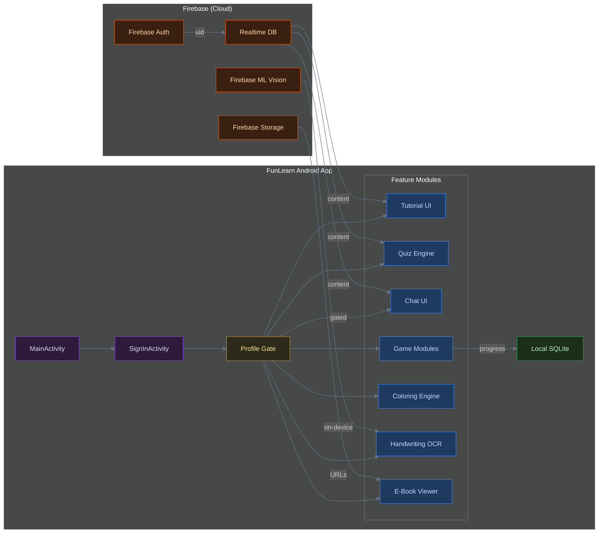

<header>

    Android Systems Deep-Dive

<h1>Engineering FunLearn: Building an Educational Sandbox</h1>

    <i class="far fa-calendar"></i> May 2026
    •
    <i class="far fa-clock"></i> 6 min read
    •
    Java / Android SDK
    SQLite
    Firebase Realtime DB
    On-Device ML
    Custom Views
    •
    <a href="https://github.com/PRADEEPERIYASAMY/FunLearn" target="_blank">
        <i class="fab fa-github"></i> View Source
    </a>

</header>

**FunLearn** is an Android learning app for children encompassing tutorials, quizzes, handwriting practice with on-device OCR, a custom coloring engine, and a lightweight community chat. 

Load the next level in FunLearn, and there's a visible stutter before the screen updates — not from anything fancy, just a raw SQLite query running directly on the UI thread. On a modern device it's invisible. On the older, lower-end Android hardware this app actually targeted (minSdk 21), it was the difference between a game feeling responsive and feeling broken. That gap between "the naive approach works on my dev phone" and "the naive approach drops frames on the phone a real user has" is the thread that runs through this entire project — and it's exactly the debt that later justified rebuilding it from scratch as FunlearnV2.

## Decoupling Content from Progress State

A core requirement for a mobile learning app is that progress shouldn't stall if the network drops mid-session. However, the educational content itself (tutorials, quiz banks) needs to be server-editable so that educators can update lessons without requiring users to download a new APK update from the Play Store.

To solve this, I split the data layer strictly across two systems: Firebase Realtime Database for content, and local SQLite for progress state.

Firebase holds content (tutorials, quiz banks, chat messages) so it can update continuously. SQLite holds the user's progress ledger locally. This is a simple split, but it's the architectural reason progress works offline while content remains server-editable.

*Split your data by who's allowed to change it and how often, not by which feature happens to touch it — content that educators edit and progress that a device tracks locally have nothing in common except that a naive design would store them the same way.*

## Low-Latency Handwriting Practice via On-Device OCR

One of the interactive features is a handwriting practice pad where a child traces a letter. A handwriting loop needs to respond immediately to every stroke attempt without waiting on a network round trip, and it should still work perfectly when the device is offline.

I initially prototyped the handwriting check against a cloud-based OCR API — the same recognized-text-vs-target-letter comparison, just with the inference call happening server-side instead of on-device. It worked, but it made the core interaction loop feel wrong: a child traces a letter, and there's a beat — round-trip latency plus whatever the API's queue looked like that moment — before anything happens. For an adult filling out a form, that's an acceptable delay. For a five-year-old waiting to see if they got the letter right, a network round trip conflicts directly with a feedback loop that needs to feel instant. Firebase ML Vision's on-device recognizer removed the round trip entirely — and, as a side effect, meant the feature kept working with no network at all.

```mermaid
%%{init: {'theme': 'dark', 'themeVariables': {'primaryColor': '#1e3a5f', 'primaryBorderColor': '#3b82f6', 'primaryTextColor': '#e2e8f0', 'secondaryColor': '#1a2e1a', 'tertiaryColor': '#2d2a1a', 'lineColor': '#64748b', 'fontSize': '14px'}}}%%
sequenceDiagram
    actor Child
    participant Canvas as Drawing Canvas
    participant Bitmap as Bitmap Rasterizer
    participant OCR as ML Vision on-device
    participant Logic as Pass/Fail Logic

    Child->>Canvas: Draw letter on screen
    Canvas->>Bitmap: Rasterize to Bitmap
    Bitmap->>OCR: Run text recognizer (no network call)
    
    rect rgb(30, 58, 95)
        OCR-->>Logic: Recognized text string
        Logic->>Logic: Compare to target letter
    end
    
    alt Match
        Logic-->>Child: Pass feedback + sound
    else No match
        Logic-->>Child: Try again feedback
    end
```

The sequence is straightforward but powerful: the child draws a letter on a custom canvas, the canvas is rasterized to a `Bitmap`, the ML model runs inference locally on the device, and the recognized text is instantly compared to the target letter for immediate pass/fail feedback.

## Engineering a Performant Coloring Engine

To build the interactive coloring book, I needed a way to fill regions of line-art assets cleanly. The first version of the coloring engine was the obvious one: recolor this pixel, recurse into its four neighbors. It worked instantly on the small test swatches I was developing against. It crashed with a `StackOverflowError` the first time I ran it against one of the actual line-art assets — a few hundred pixels of contiguous white space is a few hundred stack frames deep, and Android's default thread stack size doesn't have room for that. That crash is the reason `FloodFill.java` exists as a scanline, span-queue implementation instead: walk left and right from a seed point to find the whole horizontal span in one pass, fill it, and queue only the boundary points above and below as new seeds — trading a stack that grows with every pixel for one that grows with every row.

```mermaid
%%{init: {'theme': 'dark', 'themeVariables': {'primaryColor': '#1e3a5f', 'primaryBorderColor': '#3b82f6', 'primaryTextColor': '#e2e8f0', 'secondaryColor': '#1a2e1a', 'tertiaryColor': '#2d2a1a', 'lineColor': '#64748b', 'fontSize': '14px'}}}%%
flowchart LR
    classDef inputStyle fill:#2d2a1a,stroke:#ca8a04,color:#fde68a
    classDef processStyle fill:#1e3a5f,stroke:#3b82f6,color:#bfdbfe
    classDef decisionStyle fill:#3a1a2a,stroke:#db2777,color:#fbcfe8
    classDef outputStyle fill:#1a2e1a,stroke:#16a34a,color:#bbf7d0

    TAP["User taps a region"]:::inputStyle
    SEED["Get seed pixel"]:::processStyle
    QUEUE["Initialize queue"]:::processStyle
    SCAN["Dequeue span\nScan left and right"]:::processStyle
    FILL["Set pixels to newColor"]:::processStyle
    ENQUEUE["Enqueue adjacent spans"]:::processStyle
    CHECK{"Queue empty?"}:::decisionStyle
    DONE["Render updated Bitmap"]:::outputStyle

    TAP --> SEED --> QUEUE --> SCAN --> FILL --> ENQUEUE --> CHECK
    CHECK -->|No - keep filling| SCAN
    CHECK -->|Yes - done| DONE
```

The scanline implementation avoids stack overflows by processing whole horizontal spans and only queuing the span boundaries above and below. This allowed me to create a shared canvas implementation (`PaintView` + `ColorView`) that is highly performant, completely memory-safe, and infinitely reusable across different coloring activities and pattern-tracing modules without any external dependencies.

## Honest Trade-offs & What's Next

As my first complete solo project, FunLearn proved the product concept, but it accumulated massive structural debt:
1. **Activity Bloat:** The app consists of 42 flat Activities calling `startActivity` on each other. Passing typed data between 42 Activities via `Intent` extras is Android's original navigation pattern — it works, but every extra is a stringly-typed key with no compile-time guarantee the receiving Activity reads it correctly. Jetpack's Navigation Component with Safe Args, which FunlearnV2 uses instead, exists specifically to close that gap: extras become generated, typed arguments checked at compile time.
2. **Main Thread Database Queries:** Some raw SQLite queries execute directly on the UI thread, risking dropped frames on older devices.
3. **Zero Dependency Injection:** Without a DI framework, testing is nearly impossible and memory leaks are common during rotation.

These architectural limits inspired the complete rewrite into **FunlearnV2**, which utilizes a strict MVVM pipeline, Hilt DI, Jetpack Navigation, and a dual-backend split to properly scale the feature set. 

    
Full source code and architecture components available on GitHub.

    

        <a href="https://github.com/PRADEEPERIYASAMY/FunLearn" target="_blank"><i class="fab fa-github"></i> View Source</a>
        <a href="../index.html#projects"><i class="fas fa-layer-group"></i> More Projects</a>
        <a href="https://linkedin.com/in/pradeep-periyasamy-b385181a0" target="_blank"><i class="fab fa-linkedin"></i> Let's Connect</a>
    

