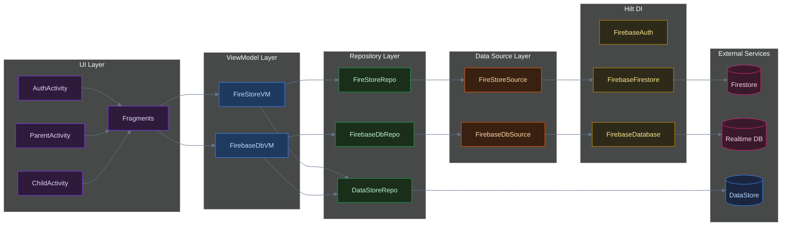
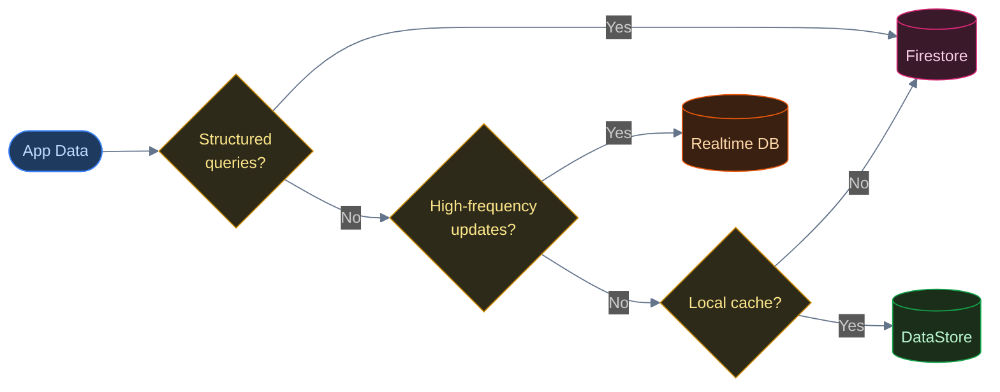
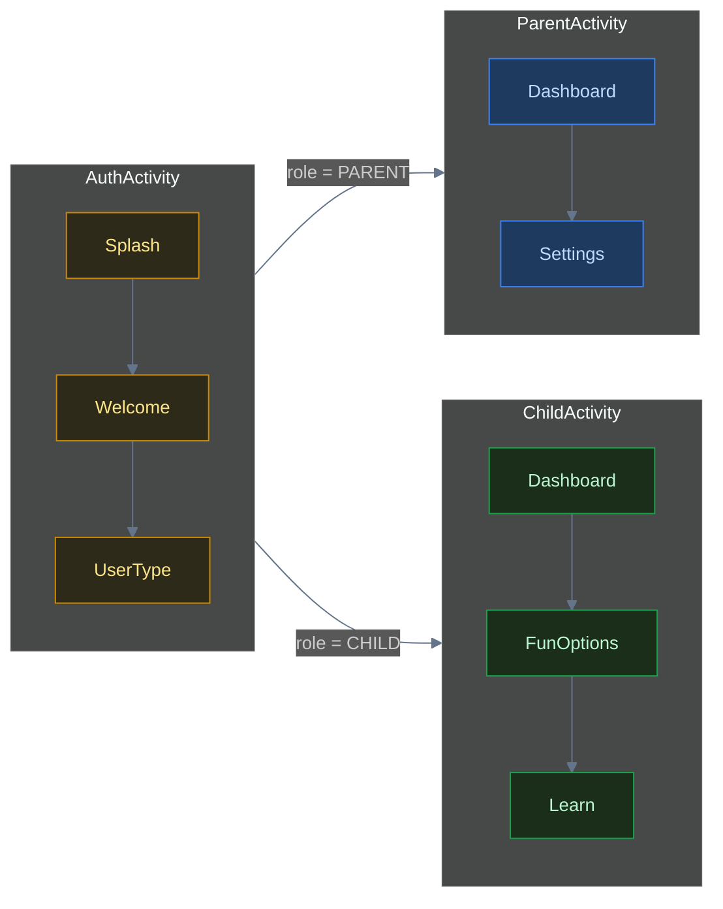

<header>

    Android Systems Deep-Dive

<h1>Engineering FunlearnV2: A Dual-Backend Learning Platform</h1>

    <i class="far fa-calendar"></i> May 2026
    •
    <i class="far fa-clock"></i> 8 min read
    •
    Kotlin
    Hilt DI
    Firebase Dual-Backend
    MVVM Architecture
    Jetpack Navigation
    •
    <a href="https://github.com/PRADEEPERIYASAMY/funlearn_app" target="_blank">
        <i class="fab fa-github"></i> View Source
    </a>

</header>

**FunlearnV2** is a from-scratch Kotlin rebuild of the original FunLearn app: a two-sided (parent/child) Android learning platform covering tutorials, quizzes, handwriting OCR, a custom coloring engine, and public/private/group chat. 

Rotate the phone mid-quiz in V1, and there's a real chance the app leaks memory — not because of a rare edge case, but because the Activity that opened a SQLite connection also owned that connection's lifetime. Every configuration change was a coin flip on whether the garbage collector could actually reclaim it. That's not a hypothetical either; it's the direct, structural consequence of instantiating database helpers inside 42 separate Activities instead of behind a shared, injected layer.

Here is how I designed the V2 rewrite to scale gracefully.

## Strict Layering with Hilt Dependency Injection

In V1, Activities frequently instantiated their own database helpers and network clients. This made unit testing impossible and led to massive memory leaks during rotation, as heavy database connections were bound to the Activity lifecycle. 

In V2, the app is structured in strict layers, wired together by Hilt.

Each layer has a single responsibility. No layer reaches past its immediate neighbor. ViewModels never hold a reference to a `Context`, eliminating the primary source of memory leaks. Fragments never call Firebase directly. Hilt is the DI framework, ensuring that repositories and ViewModels receive dependencies by constructor injection rather than constructing clients themselves.

Exposing state as a sealed class rather than boolean flags borrows the same idea as Redux/Elm-style state containers: the compiler enforces that every `when` branch handles every possible outcome, so a forgotten state is a compile error instead of a bug found three sprints later.

## Iterative Scanline Flood-Fill

The obvious way to write a paint-bucket fill is recursive: color this pixel, then recurse on its four neighbors. It's four lines of code and it's wrong for any image bigger than a small thumbnail — each pixel is a stack frame that doesn't return until all four of its neighbors resolve, so a flood fill on a few hundred pixels of contiguous color reliably blows the call stack. `FloodFill.kt` uses a scanline span-queue approach instead: walk left and right from a seed point to find the full horizontal span of matching color, fill the whole span in one pass, then queue only the *boundary* points above and below that span as new seeds — not every individual pixel. The recursion depth that was previously bounded by image size is now bounded by the number of *rows*, and it's iterative to begin with.

This is a standard scanline flood-fill — the same span-based approach used in most production raster-graphics fill tools, as opposed to the naive per-pixel recursive version taught in most intro algorithms courses. The contribution here isn't the algorithm itself; it's porting the exact span-queue logic from the V1 Java implementation into an idiomatic Kotlin `object` singleton without regressing the stack-safety property that made it correct in the first place.

*An algorithm that's correct on paper can still be wrong in practice if its recursion depth is bounded by the wrong variable — bound it by rows, not pixels.*

## The Dual-Backend Split

A common mistake when using Firebase is forcing all data into either the Realtime Database (RTDB) or Firestore. The reality is that they serve completely different access patterns. 

Our first iteration tried storing live multiplayer cursor data in Firestore. It worked in testing with two players; scaling toward four made the cost and latency pattern obvious fast — Firestore charges and rate-limits per document write, and cursor position updates several times a second per player is exactly the workload it's worst suited for.

I didn't reach for RTDB as a first instinct — I built the multiplayer cursor-sync path against Firestore first because it's the backend everything else in the app already used, and reaching for a second database felt like unnecessary complexity for one feature. That assumption broke under actual multiplayer testing. RTDB isn't a "lesser" database bolted on for cost reasons; it's the correct tool for data that's flat, ephemeral, and doesn't need a query model — which cursor positions and presence flags are, and chat history isn't.

I engineered a dual-backend split to play to both their strengths:

By querying Firestore for heavy document sets and listening to RTDB solely for lightweight presence indicators and rapid cursor movements, the app minimizes both latency and bandwidth consumption, preventing the database bills from skyrocketing.

*Firebase isn't one database with two names — Firestore and RTDB are different tools for different access patterns, and defaulting to "whichever one we're already using" is itself an architectural decision, just an unexamined one.*

## Role-Based Navigation Architecture

In V1, the intent graph was a spaghetti mess of 42 separate Activities calling `startActivity()` on each other. If a child pressed the hardware back button during a quiz, they could accidentally navigate straight back into the parent's dashboard, bypassing authentication. 

In V2, I introduced Jetpack Navigation with a strict role-based routing model constrained to just four host Activities.

The `Roles` enum determines the routing at login, and the Navigation Component manages the back-stack safely within each host Activity. A child literally cannot navigate into the `ParentActivity` back-stack because it exists in a completely isolated container.

## Honest Trade-offs & What's Next

While V2 successfully establishes a scalable foundation, there is still notable technical debt:
1. **Firebase Vendor Lock-in:** By injecting `FirebaseFirestore` and `FirebaseDatabase` directly into the Data Sources via Hilt, the app is deeply coupled to Firebase. If we ever needed to migrate to a standard REST API backend, the entire Source and Repository layer would need a rewrite.
2. **No Offline Write Queue.** DataStore gives the UI something to render instantly, but there's no background sync queue for writes made while offline — a score update made without connectivity doesn't retry once the connection returns, it's just lost.
3. **Stub Screens Behind Working Navigation.** Several game and quiz Fragments are fully wired into the navigation graph — tappable, routable — but not feature-complete behind that. That's a deliberate sequencing choice (get the skeleton right before filling every screen) but it means the app currently has dead ends a user can reach.

Despite this, the structural foundations are massively improved. The next phases involve migrating the remaining mini-games and expanding the chat system to support rich media attachments, bringing the app to full feature parity with V1.

    
Full source code and architecture components available on GitHub.

    

        <a href="https://github.com/PRADEEPERIYASAMY/funlearn_app" target="_blank"><i class="fab fa-github"></i> View Source</a>
        <a href="../index.html#projects"><i class="fas fa-layer-group"></i> More Projects</a>
        <a href="https://linkedin.com/in/pradeep-periyasamy-b385181a0" target="_blank"><i class="fab fa-linkedin"></i> Let's Connect</a>
    

