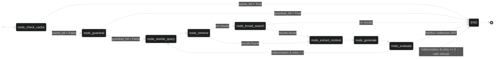
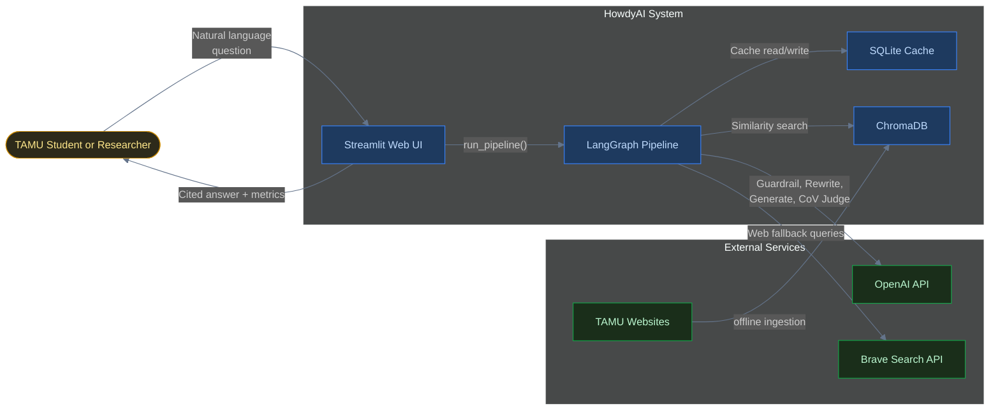

<header>

    AI Systems Deep-Dive

<h1>Engineering HowdyAI: A Hallucination-Free RAG Agent</h1>

    <i class="far fa-calendar"></i> May 2026
    •
    <i class="far fa-clock"></i> 7 min read
    •
    LangGraph
    RAG Architecture
    LLM Agents
    Python
    •
    <a href="https://github.com/PRADEEPERIYASAMY/HowdyAI" target="_blank">
        <i class="fab fa-github"></i> View Source
    </a>

</header>

Ask a naive RAG system "what are the prereqs for CSCE 482?" and there's a real chance it answers confidently, cites a source, and is simply wrong — because the retriever pulled a syllabus PDF that *mentions* CSCE 482 without actually stating its prerequisites, and the LLM filled the gap with something plausible-sounding. That's not a hypothetical; it's the default failure mode of RAG, and it's the one I refused to ship when building an educational assistant for Texas A&M University. Here's how I built HowdyAI: an agent-driven search engine that prioritizes strict multi-stage orchestration over raw generation, guaranteeing a faithful, properly cited answer with zero hallucinations.

*Agent-driven educational assistant and contextual search engine for Texas A&M University (TAMU).*

## Orchestrating Safety with LangGraph

The naive approach to RAG is a straight pipeline: embed query → fetch nearest neighbors → stuff into prompt → generate. This fails constantly in the real world. Adversarial queries bypass simple prompt instructions, and irrelevant search results cause the LLM to hallucinate connections that don't exist.

To solve this, I decoupled the workflow using **LangGraph**, treating every stage of the query lifecycle as a discrete, observable node in a state machine. This makes the pipeline composable and explicitly auditable.

```mermaid
%%{init: {'theme': 'dark', 'themeVariables': {'primaryColor': '#1e3a5f', 'primaryBorderColor': '#3b82f6', 'primaryTextColor': '#e2e8f0', 'secondaryColor': '#1a2e1a', 'tertiaryColor': '#2d2a1a', 'lineColor': '#64748b', 'fontSize': '14px'}}}%%
flowchart LR
    classDef user fill:#1e3a5f,stroke:#3b82f6,color:#bfdbfe
    classDef process fill:#2e1a3a,stroke:#7c3aed,color:#ddd6fe
    classDef decision fill:#3a2010,stroke:#ea580c,color:#fed7aa
    classDef success fill:#1a2e1a,stroke:#16a34a,color:#bbf7d0
    classDef danger fill:#3a1a2a,stroke:#db2777,color:#fbcfe8
    classDef storage fill:#2d2a1a,stroke:#ca8a04,color:#fde68a

    USER(["User Query"]):::user
    CACHE{"Cache Hit?"}:::decision
    GUARD{"Guardrail IN_SCOPE?"}:::decision
    REWRITE["Query Rewriter"]:::process
    RETRIEVE["Hybrid Retriever"]:::process
    BROAD{"Results Found?"}:::decision
    BROADSRCH["Broad Web Fallback"]:::process
    EXTRACT["Context Extraction"]:::process
    RERANK["Cross-Encoder Re-ranking"]:::process
    GENERATE["Generation + Citations"]:::process
    EVALUATE{"CoV Judge Faithful?"}:::decision
    RETRY{"> 2 retries?"}:::decision
    SAFE["Safe Refusal"]:::danger
    BLOCKED["Blocked Response"]:::danger
    CACHE_RESP["Cached Response"]:::success
    ANSWER["Final Answer + Sources"]:::success
    MEMORY["Update Memory & Write Cache"]:::storage

    USER --> CACHE
    CACHE -->|"Hit"| CACHE_RESP
    CACHE -->|"Miss"| GUARD
    GUARD -->|"OUT_OF_SCOPE"| BLOCKED
    GUARD -->|"IN_SCOPE"| REWRITE
    REWRITE --> RETRIEVE
    RETRIEVE --> BROAD
    BROAD -->|"No results"| BROADSRCH
    BROAD -->|"Results"| EXTRACT
    BROADSRCH -->|"No results"| SAFE
    BROADSRCH -->|"Results"| EXTRACT
    EXTRACT --> RERANK
    RERANK --> GENERATE
    GENERATE --> EVALUATE
    EVALUATE -->|"FAITHFUL"| MEMORY
    EVALUATE -->|"HALLUCINATION"| RETRY
    RETRY -->|"< 2"| REWRITE
    RETRY -->|">= 2"| SAFE
    MEMORY --> ANSWER
```

By formalizing the pipeline as a graph, cyclical routing becomes trivial. Notice the `EVALUATE` node: if the system detects a hallucination, it doesn't fail; it loops back to rewrite the query and try again. This cyclic capability is what separates an *agentic* workflow from a linear script.

The state machine explicitly maps out these transitions:

## Pushing Precision with Cross-Encoder Re-Ranking

A localized university corpus contains massive amounts of overlapping terminology. A search for "CSCE 482 prerequisites" using standard bi-encoder Cosine similarity in ChromaDB will return dozens of syllabus PDFs that contain those words, but not necessarily the exact prerequisite rules.

To solve this precision issue, I implemented a two-stage retrieval pipeline:
1. **Broad Recall (ChromaDB + Brave Search):** The rewritten query fetches 10-15 dense candidates using `text-embedding-3-small`. The retrieval confidence threshold is 0.60 cosine similarity, and it wasn't a first guess. Early testing set it lower, around 0.45, on the assumption that any signal was better than none. That backfired on course-code queries: "CSCE 221" and "CSCE 222" are cosine-similar enough that a loose threshold let the wrong course's prerequisites through as a "confident" local match, skipping the web fallback that might have corrected it. Raising the threshold to 0.60 and adding an explicit course-code exact-match check on top of the similarity score closed that gap — precision mattered more than recall for anything that looked like a specific course number.
2. **High Precision (Cross-Encoder):** Instead of feeding all 15 chunks to the LLM (which degrades reasoning due to context-stuffing), a Cross-Encoder re-ranks the candidates.

Unlike a bi-encoder which scores query and document separately, a Cross-Encoder passes both the query and document through the transformer simultaneously, allowing the attention mechanism to deeply compare them. The top 5 results after this stage are passed to the generator, vastly reducing semantic noise.

To prove this wasn't just theoretical optimization, I ran the retrieval evaluation script twice: once passing the top-15 bi-encoder results straight to generation, and once inserting the cross-encoder re-rank stage.

| Setup | Recall@10 | Faithfulness |
|---|---|---|
| Bi-encoder only (no re-rank) | 53.33% | 73.33% |
| + Cross-Encoder re-rank | 86.67% | 100% |

## The Chain-of-Verification (CoV) Judge

Even with pristine context, an LLM might draw incorrect conclusions. To guarantee that HowdyAI produces zero ungrounded statements, I implemented a strict **Chain-of-Verification (CoV)** evaluation loop.

After `gpt-4o` generates a candidate answer, the output is hidden from the user. It is immediately routed to a secondary LLM "Judge" prompt. This Judge is given:
1. The user's query
2. The extracted context snippets
3. The candidate answer

The Judge meticulously checks if *every single factual claim* in the candidate answer is directly supported by the context snippets. If the Judge returns `FAITHFUL`, the answer is surfaced to the user. If the Judge returns `HALLUCINATION`, the graph increments a retry counter and routes back to the query rewriter to try an alternative search strategy. If it fails twice, the system issues a safe refusal ("I do not have enough verified information to answer this") rather than lying to the user.

This pattern — generate, then have a second pass explicitly hunt for unsupported claims — comes from the Chain-of-Verification approach ([Dhuliawala et al., 2023](https://arxiv.org/abs/2309.11495)); the contribution here is wiring it into a stateful LangGraph retry loop rather than a one-shot check.

### Proving It, Not Just Claiming It

Before the CoV judge existed, I ran the bare embed→retrieve→generate pipeline against the same 15 adversarial and 15 factual queries used in the final eval. 4 of the 15 factual answers contained at least one claim that wasn't actually supported by the retrieved context — confident, cited, and wrong. That number is what justified adding a second LLM call whose entire job is to catch the first one lying.

A CoV judge that isn't measured is just a hope. I built a 30-query ground-truth set — 15 factual questions with known-correct answers, 15 adversarial queries designed to provoke hallucination or jailbreak the guardrail — and ran the full pipeline against it.

| Metric | Result |
|---|---|
| Factual Faithfulness | **100%** (15/15) |
| Adversarial Guardrail Success | **100%** (15/15) |
| Hybrid Retrieval Recall@10 | **86.67%** (13/15) |
| Full-Pipeline Avg Latency | 6.22s |
| Guardrail-Refusal Avg Latency | 1.04s |

The recall gap is the honest number here — 2 of 15 factual queries didn't get their answer into the top-10 retrieved chunks at all, meaning no amount of downstream re-ranking or generation care could have saved them. That's a retrieval coverage problem, not a hallucination problem, and it's the reason Recall@10 gets tracked as a separate metric from Faithfulness rather than folded into one aggregate score.

*An LLM judging an LLM only works if the judge is strictly less trusting than the generator — the CoV prompt is written to look for reasons to reject, not reasons to accept.*

## Honest Limitations & What's Next

Because this pipeline prioritizes truth above all else, its primary limitation is latency. A full trip through query rewriting, hybrid retrieval, cross-encoding, generation, and the CoV Judge takes several seconds. To mitigate this, I implemented an upfront SQLite cache layer—common queries resolve instantly, while complex novel queries take the long path.

The corpus itself is intentionally incomplete. Crawling and embedding the entire tamu.edu domain is a multi-hour job, so the seed database is scoped to the highest-value sources — course catalogs and degree-plan directories — rather than the full site. A query about, say, a specific student org's meeting schedule will correctly fall through to the guardrail or Brave Search fallback rather than return a false negative from a stale local index.

Additionally, **Colloquial Queries vs. Exact Matching** is a known limitation. A query using a course's colloquial name instead of its code (e.g. "Data Structures class" instead of "CSCE 221") has no guaranteed exact-match path, so it depends entirely on embedding similarity. If the chunks don't use those exact words, the recall drops significantly.

Future improvements will focus on streaming the initial generation to the UI while the CoV Judge runs asynchronously, providing a faster perceived response time without compromising the architectural safety guarantees.

    
Full source code and architecture components available on GitHub.

    

        <a href="https://github.com/PRADEEPERIYASAMY/HowdyAI" target="_blank"><i class="fab fa-github"></i> View Source</a>
        <a href="../index.html#projects"><i class="fas fa-layer-group"></i> More Projects</a>
        <a href="https://linkedin.com/in/pradeep-periyasamy-b385181a0" target="_blank"><i class="fab fa-linkedin"></i> Let's Connect</a>
    

