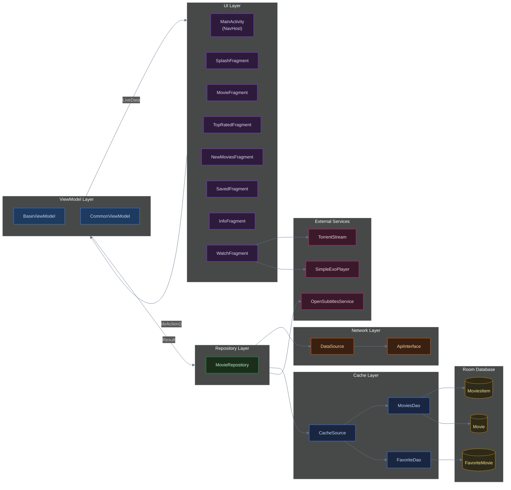
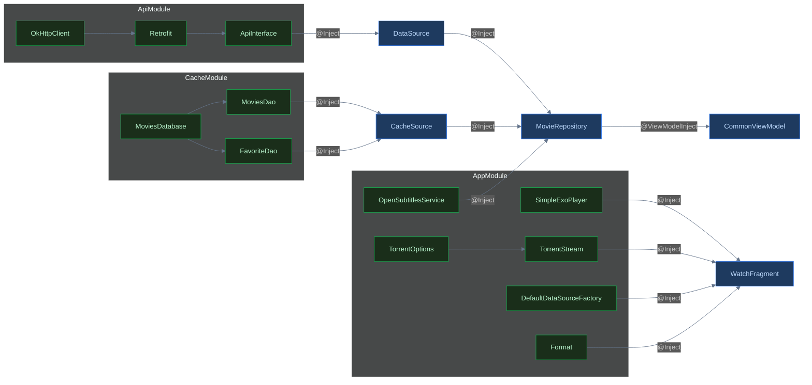

<header>

    Android Systems Deep-Dive

<h1>Engineering MyMovies: An Android Streaming Client</h1>

    <i class="far fa-calendar"></i> May 2026
    •
    <i class="far fa-clock"></i> 6 min read
    •
    Kotlin
    Offline-First MVVM
    ExoPlayer
    BitTorrent Streaming
    Dependency Injection
    •
    <a href="https://github.com/PRADEEPERIYASAMY/MyMovies" target="_blank">
        <i class="fab fa-github"></i> View Source
    </a>

</header>

**MyMovies** is a Kotlin Android client for discovering, streaming, and downloading movies. It includes local subtitle search via OpenSubtitles, an offline favorites and browse cache backed by Room, and BitTorrent-based playback via ExoPlayer and TorrentStream, all wired through a single-Activity, Hilt-driven MVVM pipeline.

A magnet link has zero bytes at the moment you tap play. The obvious integration is `torrentStream.download()` then `player.play()` — wait for the full file, then hand it to ExoPlayer. On a two-hour movie with a modest swarm, that's not a minor delay; it's several minutes of a spinner before a single frame renders, on an app whose entire value proposition is "watch this now." That gap between "the naive approach works in a demo" and "the naive approach is unusable in practice" is what shaped every decision in `WatchFragment`.

Here are the three engineering stories that define this architecture.

## Cache-as-Source-of-Truth, Not Optimization

A movie catalog client has a critical property: the upstream API is a public, rate-limited, occasionally-flaky third-party service. Every screen that hits it directly inherits its latency and its outages.

The naive pattern, where a network call fills a list and that list renders directly, is absent here on purpose. 

The first version of `fetchTypeMovies` cleared the `MoviesItem` table on every category fetch, not just the first one of a session. That seemed harmless until testing tab-switching: selecting "Comedy" after "Action" wiped the entire cache table before the new network call resolved, so the RecyclerView briefly rendered empty between requests — a visible flash on every single tab change. The fix was the `firstLoad` companion flag: clear the cache exactly once per cold app session, and let subsequent category switches accumulate in the same table without wiping each other.

The Fragment never sees the network response shape directly for the browse lists. It sees whatever Room hands back, paginated with limit/offset semantics that are independent of whatever page size the upstream API happens to return. This buys decoupling of UI pagination from API pagination, natural cache invalidation points, and graceful degradation when the live network result is empty.

*Treat the network as a cache-filler, not a renderer — the moment a UI element binds directly to a network response, your offline experience inherits someone else's uptime.*

## Torrent Playback: Magnet URI to ExoPlayer Frame

I initially prototyped playback against `torrentStream.download()`, which pulls the complete file before returning. Switching to `startStream()` — TorrentStream's sequential mode, which prioritizes the pieces needed for playback order first — meant `onStreamReady` could fire once enough of the *beginning* of the file existed, not once the entire multi-GB file existed. (This uses a sequential-priority strategy, as opposed to BitTorrent's default rarest-first strategy which optimizes swarm health over playback order). The trade-off: sequential mode does nothing to help scrubbing forward past what's downloaded yet, which is why seeking ahead of the buffer still stalls — a limitation worth stating plainly rather than hiding.

`WatchFragment` is the most operationally interesting piece of this codebase, bridging two systems that were never designed to talk to each other.

The bridge is: TorrentStream is pointed at a magnet URI. Once the `onStreamReady` callback fires, the absolute path of the downloading video file is passed to ExoPlayer as a local file URI via `ExtractorMediaSource`. The player starts consuming a file that TorrentStream is still actively writing to. 

To prevent disk bloat, `removeFilesAfterStop(true)` ensures the local file is cleaned up when the stream stops, so the Downloads folder does not accumulate partially-downloaded videos.

## Subtitle Retrieval as an Independent Client

Subtitles are sourced from a different provider than the video (OpenSubtitles, via a bespoke `OpenSubtitlesService`, not the movie API), so the subtitle fetch is architecturally a second, parallel repository dependency, not a field on the movie response.

Keeping this on the same repository (rather than a `SubtitleRepository`) was a deliberate simplification: from the ViewModel's perspective, "get me artifacts related to this movie" is one concern. 

```mermaid
%%{init: {'theme': 'dark', 'themeVariables': {'primaryColor': '#1e3a5f', 'primaryBorderColor': '#3b82f6', 'primaryTextColor': '#e2e8f0', 'secondaryColor': '#1a2e1a', 'tertiaryColor': '#2d2a1a', 'lineColor': '#64748b', 'fontSize': '14px'}}}%%
sequenceDiagram
    participant WF as WatchFragment
    participant CV as CommonViewModel
    participant MR as MovieRepository
    participant OSS as OpenSubtitlesService
    participant EXT as External Files Dir

    note over WF: User taps subtitle button during playback
    WF->>WF: simplePlayer.stopPlayer()
    WF->>CV: doAction(FetchMovieSubTitle)

    rect rgb(30, 58, 95)
        note over CV,OSS: OpenSubtitles search
        CV->>MR: fetchMovieSubTitle
        MR->>OSS: search
        OSS-->>MR: Array of OpenSubtitleItem
        MR-->>CV: Result.Value
    end

    CV->>CV: postValue(subtitles)
    CV-->>WF: LiveData fires

    note over WF: User selects a subtitle from the list

    rect rgb(26, 46, 26)
        WF->>CV: doAction(DownloadMovieSubTitle)
        CV->>MR: downloadMovieSubTitle
        MR->>OSS: downloadSubtitle
        OSS-->>EXT: writes .srt file
        MR-->>CV: Result.Value
        CV->>CV: postValue(filePath)
        CV-->>WF: LiveData fires
    end

    WF->>WF: addSubtitleToPlayer(filePath)
    note over WF: MergingMediaSource(videoSource, textSource)
    WF->>WF: simplePlayer.addingSubtitle
    note over WF: Player resumes
```

`Result<T>` is a lightweight version of the `Result`/`Either` pattern used in Rust and functional languages generally — a return type that forces the caller to handle failure explicitly rather than letting an exception cross a layer boundary unannounced. The addition here is `Result.build {}`, a single choke point that converts any thrown exception from three independently-failing systems (the movie API, Room, OpenSubtitles) into the same shape, so `CommonViewModel` never needs source-specific catch blocks.

The seam is at the DI boundary (`OpenSubtitlesService` is its own Hilt-provided singleton in `AppModule`), so the subtitle provider can be swapped without touching any other code. 

## Honest Trade-offs & What's Next

While this architecture establishes a resilient streaming setup, it has several known gaps:
1. **Sequential download, not seek-adaptive.** Piece priority is fixed at stream start; scrubbing forward past the current buffer stalls rather than re-prioritizing the pieces the new position needs. Re-prioritizing on seek is the correct fix, not yet implemented.
2. **`fetchNewMovies` bypasses the cache layer entirely** — it's the one list method that returns the raw network response directly instead of round-tripping through Room. Every other tab in the app survives a dropped connection by falling back to cache; the "New" tab doesn't, which is an inconsistency in an app whose entire pitch is offline-first.
3. **No idempotency check on favorite writes under concurrent taps.** `checkFavMovieExist` re-reads after `saveMovie`, but a rapid double-tap on the heart icon before the first write resolves can race — there's no debounce on the UI action itself.

Despite this, treating the database as the pure source of truth for the UI prevents endless buffering spinners on flaky networks.

    
Full source code and architecture components available on GitHub.

    

        <a href="https://github.com/PRADEEPERIYASAMY/MyMovies" target="_blank"><i class="fab fa-github"></i> View Source</a>
        <a href="../index.html#projects"><i class="fas fa-layer-group"></i> More Projects</a>
        <a href="https://linkedin.com/in/pradeep-periyasamy-b385181a0" target="_blank"><i class="fab fa-linkedin"></i> Let's Connect</a>
    

