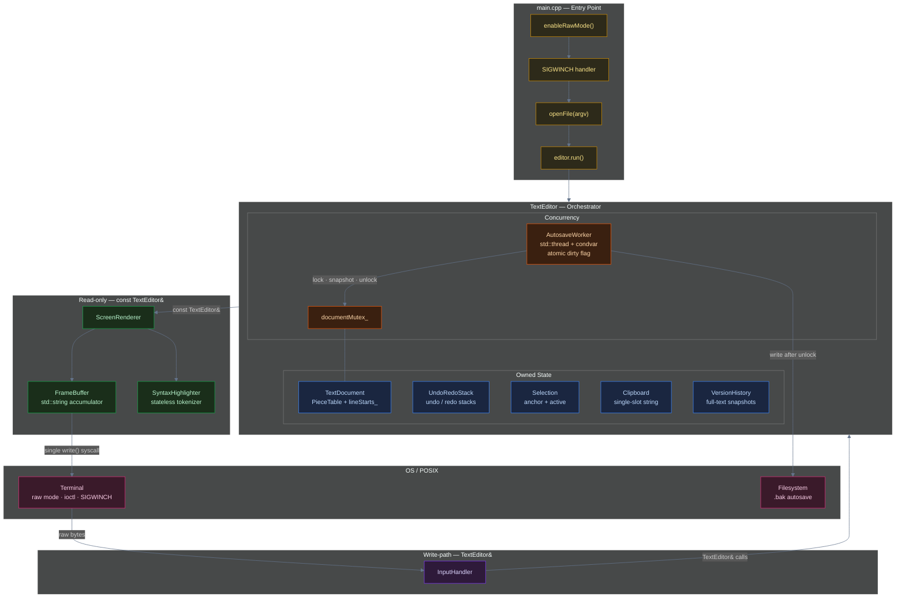
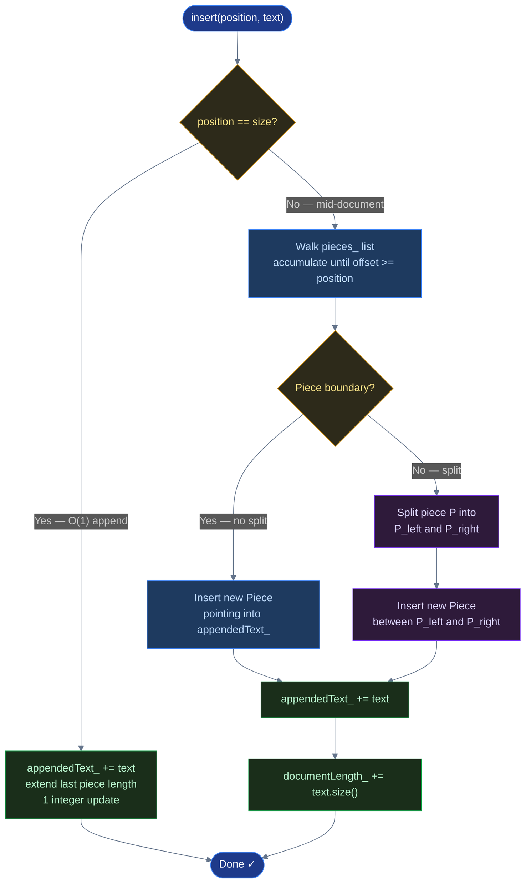
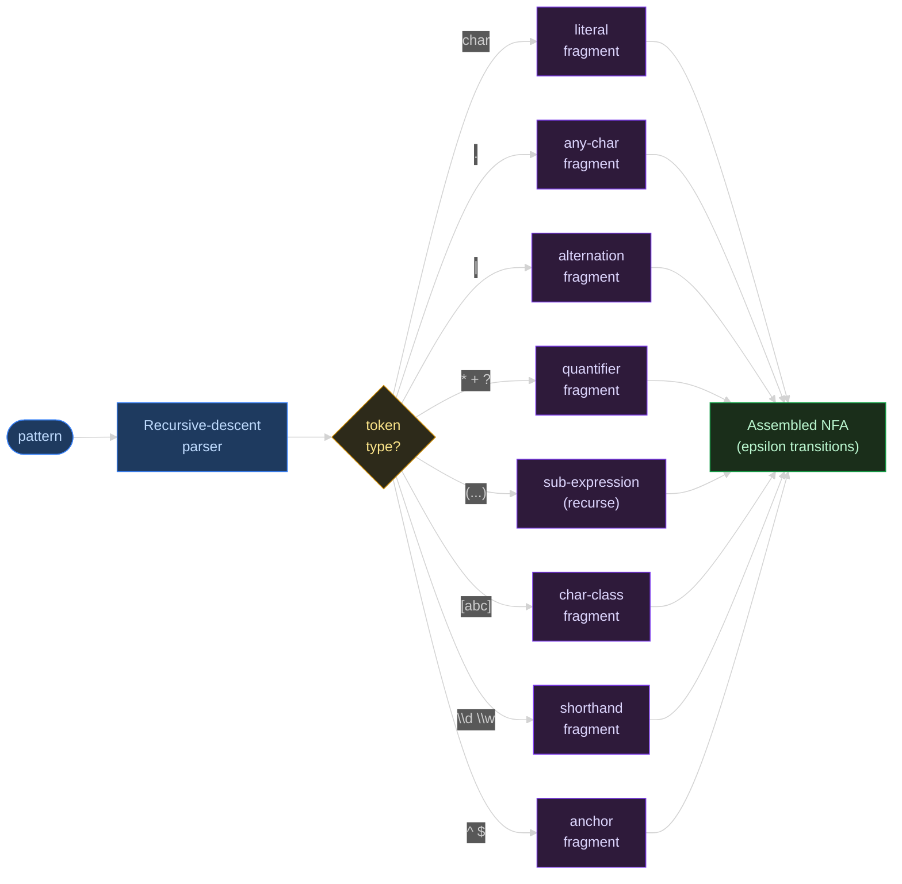
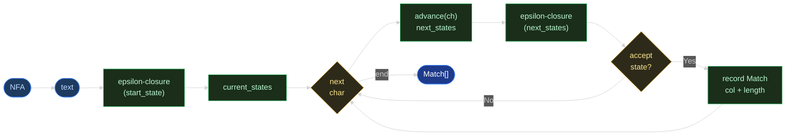
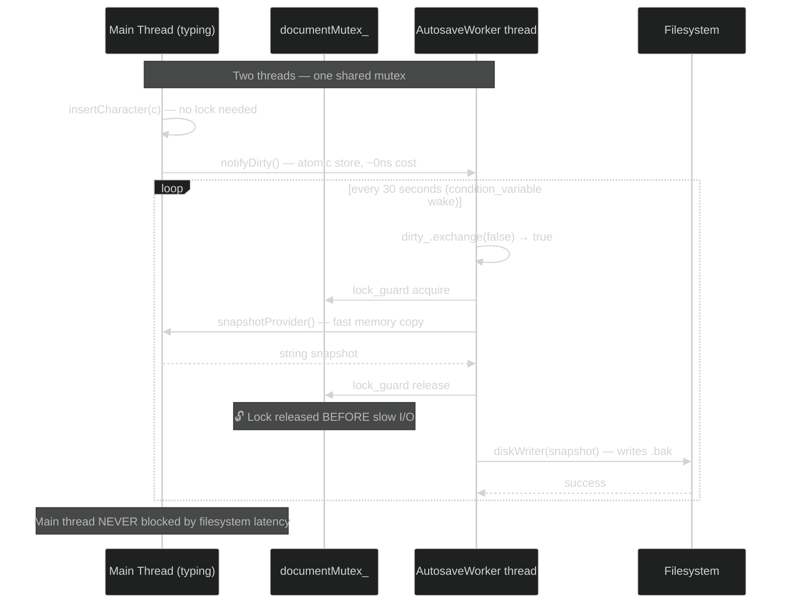

<header>
<span style="display:block; font-family:'IBM Plex Mono',monospace; font-size:0.75rem; letter-spacing:0.15em; color:#60a5fa; text-transform:uppercase; margin-bottom:0.5rem;">
    Engineering Deep-Dive
</span>
<h1>Building a Terminal Text Editor From Scratch: What a Piece Table, an NFA, and a Mutex Taught Me</h1>
<div class="article-meta">
    <span><i class="far fa-calendar"></i> Jul 2026</span>
    <span class="dot">•</span>
    <span><i class="far fa-clock"></i> 8 min read</span>
    <span class="dot">•</span>
    <span class="tag">C++17</span>
    <span class="tag">Systems Design</span>
    <span class="tag">Algorithms</span>
    <span class="tag">Data Structures</span>
    <span class="tag">Multithreading</span>
    <span class="dot">•</span>
    <a href="https://github.com/PRADEEPERIYASAMY/piecetable-editor" target="_blank">
        <i class="fab fa-github"></i> View Source
    </a>
</div>
</header>

Every text editor has to answer the same unglamorous question: when someone types a character in the middle of a million-character file, how do you insert it without copying everything after it? Get this wrong and your editor stutters on large files. Get it right, and the answer teaches you more about real systems trade-offs than most side projects do.

I built **PieceTable Editor** — a terminal-based text editor written from scratch in modern C++17, with zero external dependencies — specifically to answer that question myself instead of trusting a library to answer it for me. It supports full undo/redo, regex-powered incremental search, syntax highlighting for C/C++/Python, background autosave, and version-history diffing. All built on three deliberate engineering decisions I want to walk through here: how it stores text, how it undoes an edit, and how it searches without ever freezing.

## The Naive Approach, and Why It Fails

The obvious data structure for a text buffer is a `std::string` or `std::vector<char>`. Insert a character at position `p`, and everything after `p` shifts over — an O(n) operation on every single keystroke. For a 1 MB file, that's up to a million byte-copies per character typed. It works fine in a toy editor and falls apart the moment a file gets real.

So the real design question isn't "how do I store text" — it's "how do I store text such that editing it costs less than copying the whole document every time."

## System Architecture: 16 Components, Compiler-Enforced Boundaries

Before diving into the three engineering stories, it's worth showing the full architecture. Important boundaries here are compiler-enforced, not convention-enforced:



The three top-level boundaries here are not style guidelines — they're structural. `ScreenRenderer::render` takes a `const TextEditor&`, making any mutation from the render path a compile error. `InputHandler` has no `FrameBuffer` in scope, making accidental rendering impossible. These constraints don't require discipline to maintain; they're just the type system.

## The Piece Table: Benchmarked Honestly, Not Chosen Naively

The structure I settled on is the same one used by VS Code and Atom: a **Piece Table**. Two backing buffers — `originalText_` (the file as loaded, never mutated) and `appendedText_` (append-only, holds every character ever typed) — plus an ordered list of small `Piece` records that describe how to reconstruct the document:

```cpp
enum class SourceBuffer { Original, Appended };

struct Piece {
    SourceBuffer source;
    size_t offset;   // start offset within the source buffer
    size_t length;   // number of characters this piece contributes
};
```

Inserting text never copies a single existing character. If you're typing at the end of the file — the overwhelmingly common case — the new text is simply appended to `appendedText_` and the last piece's length is bumped by one integer. Mid-document inserts split at most one piece into two and splice a new piece between them.



To make sure this was actually the right call and not just the "textbook" answer, I built a second structure purely as a benchmark comparator: a **Gap Buffer** — a contiguous array with a movable gap of free space sitting at the last edit point. I ran both through four scenarios, 50,000 operations each:

| Scenario | PieceTable (ms) | GapBuffer (ms) | Winner |
|---|---|---|---|
| **A: Sequential append** (cursor at end) | **2.38** | 2.78 | ✅ PieceTable |
| **B: Random mid-document insert** | 2933 | **2.75** | GapBuffer (1000×) |
| **C: Sequential erase** | 2.56 | **0.33** | GapBuffer |
| **D: Ping-pong** (alternating ends) | 856 | **13.84** | GapBuffer |

The result was humbling: **the Gap Buffer wins three of the four benchmarks — one of them by a factor of 1,000×.** Contiguous memory is extremely cache-friendly for sequential copies, and every scenario involving a changed edit location plays to that strength.

But Scenario A — sequential append, cursor always at the end — is the one that actually matters, because it's the dominant real workload: someone typing. And it's the one case where the Piece Table's core promise (no text is ever copied or moved) pays off. The lesson wasn't "Piece Tables are faster." It was **benchmark your actual workload, not the operation that looks most impressive** — the theoretically elegant structure loses on paper and still wins in practice, because it wins on the case that's actually common.

*(These numbers come directly from the repo's own test harness — `make test` reruns all 50 unit tests plus this exact benchmark on your machine.)*

## Command Pattern: Undo/Redo Incapable of Breaking Anything Else

Undo/redo has two classic implementations: snapshot the whole document before every edit (simple, but O(edit × document size) memory), or record each edit as a reversible command (cheaper, but easy to let sprawl into the rest of the editor's state if you're not careful).

I went with the Command pattern, but the detail that actually matters is the *dependency boundary*:

```cpp
class CursorOwner {
public:
    virtual void setCursor(int col, int row) = 0;
};

class EditCommand {
public:
    virtual void undo() = 0;
    virtual void redo() = 0;
};
```

Every concrete command (`InsertCharCommand`, `DeleteCharCommand`, `MergeLinesCommand`, `InsertNewlineCommand`) depends on exactly two things: a `TextDocument&` to mutate, and the single-method `CursorOwner` interface to restore cursor position. That's it. A command has no path to reach into search state, clipboard, or autosave — not because of a code-review convention, but because those types simply aren't in scope.

The concrete subclasses each store precisely what they need to reverse their effect:

| Class | Records | Undo action |
|---|---|---|
| `InsertCharCommand` | `(row, col, char, before, after)` | Delete char; restore `before` cursor |
| `DeleteCharCommand` | `(row, col, deletedChar, before, after)` | Re-insert char; restore `before` cursor |
| `MergeLinesCommand` | `(row, prevLineLength, before, after)` | Re-split the merged line |
| `InsertNewlineCommand` | `(row, splitColumn, before, after)` | Merge the two lines back |

Adding a fifth command type later requires zero changes to `TextEditor` itself. The architecture makes an entire class of bugs — "undo accidentally touched the search cursor" — impossible by construction rather than by discipline.

## Thompson NFA: Regex Search With a Hard Complexity Guarantee

Regex search is the one feature I was most careful about, because `std::regex`'s recursive backtracking can go exponential on certain patterns — catastrophic backtracking, the same class of bug that's taken down production services. For a feature that re-runs on every keystroke while you type a search query, an occasional multi-second freeze isn't a tail-latency annoyance, it's a broken feature.

So `RegexEngine` uses **Thompson's construction**: compile the pattern into an NFA, then simulate it by tracking the *set* of all states the automaton could currently be in, rather than one state with a backtracking stack.



**Step 1 above** compiles the pattern. **Step 2** below simulates it — no recursion, no backtracking stack:




The guarantee: at most `O(|pattern|)` states are ever active at once. Total work is bounded at **O(|pattern| × |text|)** — no pathological inputs, no exponential blowup. (Russ Cox's [classic writeup](https://swtch.com/~rsc/regexp/regexp1.html) on this exact technique was the reference while building it.)

The `RegexEngine` public API is intentionally narrow:

```cpp
struct Match { int col; int length; };

class RegexEngine {
public:
    static std::vector<Match> findAll(const std::string& pattern,
                                      const std::string& text);
    static bool isValid(const std::string& pattern);
};
```

`isValid` lets the search UI give immediate feedback on a malformed pattern without crashing.

## Concurrency: Lock Duration Is the Design

The autosave path is where concurrency discipline matters most. The naïve design is obvious and wrong: hold the lock, copy the text, write to disk. Disk I/O on a held mutex means every keystroke blocks until the disk returns.

The right design: hold the lock only long enough to copy out the in-memory text snapshot, then release it before the disk write begins.



The worst case for the main thread is contending for a lock held for microseconds (a string copy), not milliseconds (a disk write). This is the discipline that separates concurrent code that *works* from concurrent code that *scales*.

## Honest Trade-offs & What's Next

This is a working editor — 50 passing unit tests, ASan/UBSan-clean builds, and real runtime use on Linux/WSL2. But being precise about the known limitations matters:

**In-process clipboard only.** `Clipboard` is a single-slot in-memory string. There's no `xclip`/`pbcopy` integration yet, so copy/paste doesn't cross process boundaries. The correct extension is a platform detection layer that shells out or uses X11/Wayland APIs; the class interface already isolates this change to one file.

**Multi-line paste/cut scans the full line index.** Every single-line edit gets an incremental `lineStarts_` update (O(lines after cursor)). Multi-line range operations still fall back to a full rescan (O(total lines)) — acceptable since they're rare, but the fix is to track line-delta ranges during range operations.

**GapBuffer is benchmark-only dead weight.** It's fully implemented, tested, and exists purely to make the Scenario A comparison above credible. It's never instantiated at runtime.

None of these change the core bet this project made: benchmark the real workload, not the impressive one.

<div class="article-cta">
    <p>Full source, all 50 tests, and the ASan/UBSan-clean build are on GitHub — clone it, run <code>make test</code>, and see the benchmark numbers above reproduce on your own machine.</p>
    <div class="cta-links">
        <a href="https://github.com/PRADEEPERIYASAMY/piecetable-editor" target="_blank"><i class="fab fa-github"></i> View Source</a>
        <a href="../index.html#projects"><i class="fas fa-layer-group"></i> More Projects</a>
        <a href="https://linkedin.com/in/pradeep-periyasamy-b385181a0" target="_blank"><i class="fab fa-linkedin"></i> Let's Connect</a>
    </div>
</div>
