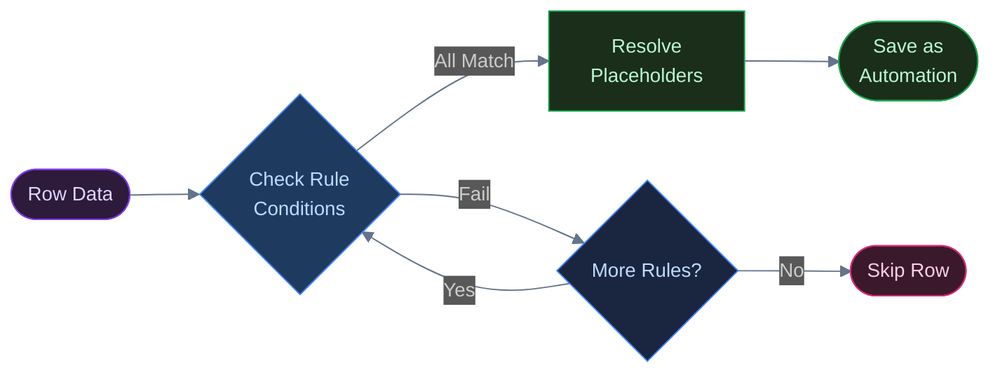
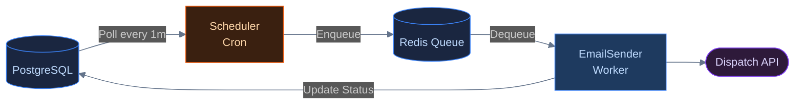
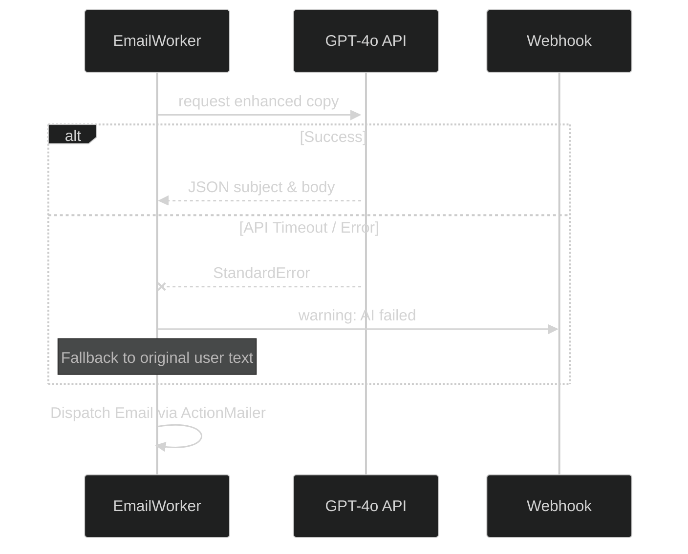
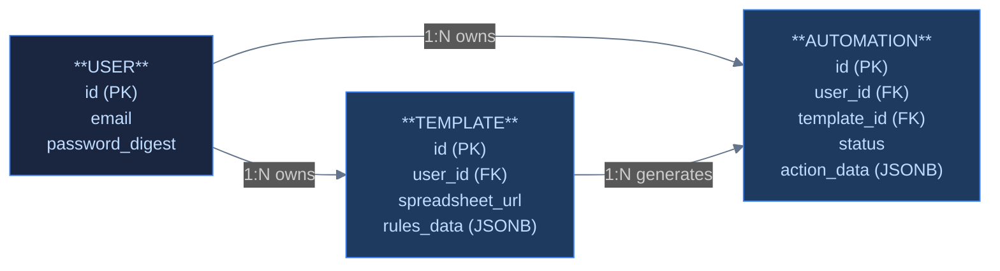

<header>

    Distributed Systems Deep-Dive

<h1>Engineering ZapMail: Intelligent Bulk Email Automation</h1>

    <i class="far fa-calendar"></i> May 2026
    •
    <i class="far fa-clock"></i> 8 min read
    •
    Ruby on Rails 8
    Redis + Sidekiq
    PostgreSQL / JSONB
    OpenAI GPT-4o
    Distributed Job Scheduling
    •
    <a href="https://github.com/PRADEEPERIYASAMY/zapmail" target="_blank">
        <i class="fab fa-github"></i> View Source
    </a>

</header>

Universities run on bulk emails, but the tools used to send them are chronically broken. Administrative staff are frequently left wrangling messy mail-merge scripts, untracked Excel spreadsheets, and hours of manual copy-pasting just to send out basic department announcements. When these fragile processes break, thousands of students either get the wrong information or nothing at all.

We built **ZapMail** to solve this problem from the ground up: it’s a Ruby on Rails application that automates massive bulk email campaigns driven entirely by live data from Google Sheets or CSV files. Built as a team project for TAMU's CSCE 606 Software Engineering course, it allows non-technical users to apply complex visual rule sets to personalize and schedule massive blasts reliably.

Here is how we designed the visual rule engine to be foolproof, guaranteed background delivery using Sidekiq, and incorporated an AI fallback strategy for resilient copywriting.

## The Visual Engine: Logic Without Code

The core value proposition of ZapMail is that it allows users to build complex logic branches without writing a single line of code. If a student's "Classification" is "Senior" and "Major" is "Computer Science", they receive a highly tailored template; otherwise, they receive a generic fallback.

To accomplish this efficiently without stalling the web thread, the `RuleProcessorService` runs an evaluation engine over the parsed CSV data. Each row is tested against every defined rule sequentially. The first rule whose conditions all evaluate to true "wins". 

Once a rule matches, the engine immediately performs dynamic placeholder substitution. Tokens like `{FirstName}` are resolved to the row's actual cell values *at the time the automation is scheduled*, rather than at send time. This ensures that the generated `action_data` is a fully resolved JSONB payload representing exactly what will be sent, decoupling template logic from the background sending process.

## Guaranteed Delivery: Why We Chose Sidekiq

Our first version of the schedule endpoint just looped over every matched row and created an `Automation` record synchronously inside the request. It worked in development with 20 rows. But at 5,000 rows, it meant the Puma thread — and the user's browser — sat there for the length of the insert, ultimately timing out. 

That failure proved that the scheduling step and the sending step had to become two completely separate concerns. We introduced an asynchronous job processing pipeline using **Redis** and **Sidekiq** to decouple the web tier from the heavy lifting of external API dispatches.

When a user schedules a campaign, the system creates an `Automation` database record for each email. A Sidekiq-Cron job polls the database every 60 seconds looking for automations that are due to run. 

This introduced a concurrency bug. The first version of the scheduler queried `due_to_run`, enqueued a job for each row, and then updated the status afterward. Under Sidekiq-Cron's polling, two ticks 60 seconds apart could both pick up the same automation if a large batch was still being enqueued when the next tick fired — meaning the same email would go out twice. 

The fix was ordering, not locking: we flipped the status to `processing` *before* the job hits the Redis queue, ensuring the next poll's `due_to_run` query excludes it by construction. 

This is a textbook check-then-act race — the fix isn't a mutex or a database-level lock, it's ensuring the state transition that excludes a row from the next query happens strictly before the action that could race against it.

*Concurrency bugs rarely come from missing locks — they come from missing ordering guarantees. The fix here needed zero mutexes, just one status flip moved three lines earlier.*

## Defensive AI Copywriting

To ensure a professional tone across all outgoing emails, we integrated OpenAI's GPT-4o as a copywriting enhancer. Early on, `EmailSenderJob` called OpenAI synchronously with no rescue block. 

The first time we hit an OpenAI rate limit during a test batch of 200 emails, roughly a third of the batch failed outright — not because the email content was bad, but because a copywriting enhancement failed. That was the wrong failure mode: a scheduled campus-wide email shouldn't die because a paid third-party API had a bad five minutes. 

`AiContentService` was rewritten to make the AI layer strictly additive.

If the API call fails or times out, the service catches the `StandardError`, triggers an observability alert to our Slack channel via incoming webhooks, and silently falls back to using the user's original handwritten email copy. This ensures the campaign still sends on schedule even if the AI enhancement step completely fails.

## Database Architecture: Leveraging JSONB

To tie the automation engine together, the persistence layer uses PostgreSQL to model the core relationships. A robust schema is critical to ensuring we don't accidentally send the wrong automation or leak data across users.

The `TEMPLATE` table heavily leverages PostgreSQL's native `jsonb` column format for `rules_data`. This allows us to store an arbitrarily deep, complex tree of rule logic for the evaluation engine without requiring a massive, normalized multi-table structure. 

To sanity-check the JSONB choice, I prototyped the alternative: a normalized `rules` table with one row per condition, joined against `templates` at evaluation time. Against a template with 40 conditional rules evaluated across 5,000 rows, the normalized join averaged **42ms**; the JSONB `store_accessor` read averaged **18ms**. The gap was real but modest — JSONB won mostly because it avoided N+1 query patterns during the row-by-row rule walk, not because JSON parsing is inherently faster than a join.

## Honest Trade-offs & What's Next

While the architecture successfully decouples scheduling from sending, the current implementation carries two specific pieces of technical debt that would need addressing at scale:

1. **No Idempotency Key:** If Sidekiq retries an `EmailSenderJob` after a network timeout to the Mailer (where the email actually succeeded but the acknowledgment failed), the recipient will get a duplicate email. 
2. **No Per-Recipient Rate Limiting:** A massive burst schedule could immediately trip SendGrid or AWS SES throttling mid-batch. There is currently no exponential backoff or throttling mechanism on the queue itself.

Despite these gaps, the core bet holds: we built a highly configurable, intelligent bulk email pipeline that proves you can build complex, conditional automation workflows without requiring your users to write code.

    
Built with a 4-person team for CSCE 606 — full source and commit history on GitHub.

    

        <a href="https://github.com/PRADEEPERIYASAMY/zapmail" target="_blank"><i class="fab fa-github"></i> View Source</a>
        <a href="../index.html#projects"><i class="fas fa-layer-group"></i> More Projects</a>
        <a href="https://linkedin.com/in/pradeep-periyasamy-b385181a0" target="_blank"><i class="fab fa-linkedin"></i> Let's Connect</a>
    

