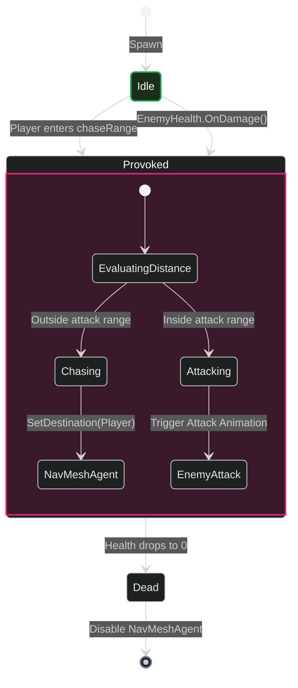
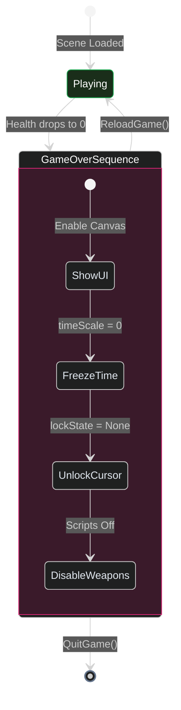

<header>

    Game Systems Deep-Dive

<h1>Engineering Zombie Shooter: Unity Systems Design</h1>

    <i class="far fa-calendar"></i> May 2026
    •
    <i class="far fa-clock"></i> 7 min read
    •
    Unity / C#
    Hitscan Combat
    State Machine AI
    Component Architecture
    •
    <a href="https://github.com/PRADEEPERIYASAMY/Zombie-Shooter" target="_blank">
        <i class="fab fa-github"></i> View Source
    </a>

</header>

**Zombie Shooter** is a first-person zombie survival shooter built in Unity. It was designed as a hands-on exercise in component-based game architecture, C# gameplay scripting, and Unity's physics, AI, and animation systems.

Fire a real gun in Unity by spawning a `Rigidbody` bullet per shot, and physics stops being free. At a modest fire rate that's a handful of new rigidbodies a second, each one entering the physics simulation, colliding, and needing cleanup. At an automatic weapon's actual fire rate, that would incur dozens of physics objects spawned and destroyed every second, purely to answer "did this shot hit something" — a question a single raycast answers in one frame with no simulation at all. That gap between "simulate the bullet" and "just ask what it would have hit" is why every weapon in this project fires a hitscan ray instead of a physical projectile.

Here is how the core systems were engineered, and the architectural trade-offs made along the way.

## The Hitscan Combat Pipeline

Hitscan is the standard approach in nearly every fast-paced shooter — Counter-Strike, Call of Duty, Overwatch's non-projectile weapons — for exactly this reason: it trades bullet travel-time and drop-off realism for deterministic, cheap-to-compute hit detection. Slower, heavier weapons (rockets, grenades) are where games typically switch back to real projectile simulation, because the player's expectation of "this took time to arrive" actually matters there.

```mermaid
%%{init: {'theme': 'dark', 'themeVariables': {'primaryColor': '#1e3a5f', 'primaryBorderColor': '#3b82f6', 'primaryTextColor': '#e2e8f0', 'secondaryColor': '#1a2e1a', 'tertiaryColor': '#2d2a1a', 'lineColor': '#64748b', 'fontSize': '14px'}}}%%
sequenceDiagram
    actor Player
    participant Weapon as Weapon.cs
    participant Ammo as Ammo.cs
    participant Physics as Unity Physics
    participant Enemy as EnemyHealth.cs
    
    Player->>Weapon: Left Click (Input)
    activate Weapon
    Weapon->>Weapon: Check canShoot == true
    Weapon->>Ammo: GetCurrentAmmo()
    alt Has Ammo
        Weapon->>Ammo: ReduceCurrentAmmo()
        Weapon->>Physics: Physics.Raycast(CameraForward)
        activate Physics
        alt Ray hits Enemy
            Physics-->>Weapon: RaycastHit (Enemy)
            
            rect rgb(78, 52, 46)
                Weapon->>Enemy: TakeDamage(amount)
                Weapon->>Weapon: Spawn Hit Impact
            end
            
        else Ray misses
            Physics-->>Weapon: RaycastHit (Env)
        end
        deactivate Physics
        Weapon->>Weapon: Play Audio & Flash
        Weapon->>Weapon: yield return WaitForSeconds
        Weapon->>Weapon: canShoot = true
    end
    deactivate Weapon
```

When the player clicks, a `Physics.Raycast` is fired directly down the camera's forward vector. If the ray intersects an object with an `EnemyHealth` component, damage is applied instantly. The fire rate is governed by a simple coroutine that yields on `WaitForSeconds(timeBetweenShots)` before resetting the `canShoot` flag. This avoids the cost of instantiating and simulating physical bullets entirely.

*A raycast doesn't need to know it's not a bullet — the player can't tell the difference between "we simulated physics" and "we asked physics a fast question," and the frame budget can.*

## Distance-Gated Enemy AI

Enemies use Unity's `NavMeshAgent` for pathfinding, but calling `NavMeshAgent.SetDestination()` every frame for every idle zombie in the level is computationally wasteful — if 50 zombies are constantly calculating paths toward the player, the CPU budget vanishes into the navigation system.

To keep idle enemies cheap, I designed a two-state behavior model (Idle vs Provoked).

Each frame, the `EnemyAI` computes a simple arithmetic `Vector3.Distance` to the player. Only if the player breaches the `chaseRange` (or if the zombie takes damage) does the zombie enter the Provoked state and begin calling the expensive `NavMeshAgent.SetDestination()` method. This effectively culls AI overhead for distant enemies.

## Reflection vs Direct Dispatch

`EnemyHealth.TakeDamage()` dispatches via `BroadcastMessage("OnDamage")` — a string-keyed message sent via reflection to every component on the GameObject. It works, and it's genuinely convenient: any script that wants to react to damage just needs a method named `OnDamage`, no interface, no registration. But reflection-based dispatch is measurably slower than a direct call or a C# event — every invocation pays a runtime lookup cost that a compiled method call doesn't. At this project's enemy count, that cost is invisible. It stops being invisible once enemy count scales past what this project's single small level ever asks of it — a threshold this project never had to find, because it was never a reasonable question at this scope.

## Game Over State via Component Mutation

`DeathHandler.cs` and `EndGame.cs` each implement the exact same five-step shutdown sequence — enable the game-over canvas, freeze `Time.timeScale`, unlock the cursor, disable the weapon scripts — written independently rather than sharing one path. That's not a hypothetical risk, it's already happened once: two entry points to "the player has stopped playing" (death vs. an explicit end-game trigger) drifted into two copies of the same logic. The fix is straightforward — extract both into a shared `GameOverController` — but the bug this kind of duplication actually causes is worse than the extra code: if one path gets a bugfix or a new step (say, a stats screen) and the other doesn't, the two "game over" experiences silently diverge.

When `PlayerHealth` hits zero, the `DeathHandler` freezes the simulation by setting `Time.timeScale = 0`, unlocks the cursor, and disables the weapon scripts. It intentionally does not reload the scene. Freezing in place avoids the cost of a reload and preserves the exact state of the world for the Game Over UI overlay.

## Honest Trade-offs & What's Next

As this was an early systems exercise, it contains a few known anti-patterns that I would not repeat in production today: 
1. **Duplicated Shutdown Logic.** `DeathHandler` and `EndGame` independently implement the identical five-step game-over sequence rather than sharing one path — the clearest refactor candidate in the codebase.
2. **`FindObjectOfType` for Cross-Script References.** Several scripts locate collaborators at runtime via a full-scene type search rather than caching a reference once at `Start()`. Harmless at this project's single-level, sparse-object scale; it does not scale to a level with many objects of the same type, since every call re-walks the scene graph.
3. **Garbage Collection Spikes:** The lack of a proper object pool for bullet impacts causes unnecessary Garbage Collection allocation during heavy firefights, which can lead to micro-stutters.

Despite these limitations, the core architectural split between decoupled component scripts remains clean.

    
Full source code and architecture components available on GitHub.

    

        <a href="https://github.com/PRADEEPERIYASAMY/Zombie-Shooter" target="_blank"><i class="fab fa-github"></i> View Source</a>
        <a href="../index.html#projects"><i class="fas fa-layer-group"></i> More Projects</a>
        <a href="https://linkedin.com/in/pradeep-periyasamy-b385181a0" target="_blank"><i class="fab fa-linkedin"></i> Let's Connect</a>
    

